## Day Planner

```mermaid
gantt
    dateFormat  HH-mm
    axisFormat %H:%M
    %% Current Time: 23:59:03
    section Tasks
    开始工作     :09-30, 15mm
    检查邮件和群信息     :09-45, 15mm
    获取Orca最新代码     :10-00, 45mm
    去食堂找钱包     :10-45, 25mm
    吃午饭🥣     :11-10, 110mm
    Coding     :13-00, 60mm
    使用Vite+Vue3.0编写Demo     :14-00, 150mm
    Prep for tomorrow's meetings     :17-20, 70mm
    END     :18-30, 0mm
    section Breaks
    BREAK     :16-30, 50mm
```

This is my plan for the day broken into 3 main sections:
1. Morning Prep
2. Working
3. Afternoon Review

### Morning Prep

This is where I get ready for work and do my usual prep.

- [x] 09:30 开始工作
- [x] 09:45 检查邮件和群信息
- [x] 10:00 获取Orca最新代码
  - [ ] 本地运行
  - [ ] 检查log
- [x] 10:45 去食堂找钱包
- [x] 11:10 吃午饭🥣

### Working

A section of the day dedicated to working:

1. Plan tasks.
2. Update and Check Code.
3. Push Code.
   
- [x] 13:00 Coding
  - [ ] 学习Reflect Metadata
  - [ ] 学习RxJS
- [x] 14:00 使用Vite+Vue3.0编写Demo
  - [ ] axios
  - [ ] mock

### Afternoon Review

I use this time to review what I have done earlier in the day and complete any tasks to prepare for the next day.

- [x] 16:30 BREAK
- [x] 17:20 Prep for tomorrow's meetings
- [ ] 18:30 END