## Day Planner

```mermaid
gantt
    dateFormat  HH-mm
    axisFormat %H:%M
    %% Current Time: 18:49:25
    section Tasks
    开始工作     :09-30, 15mm
    检查邮件和群信息     :09-45, 15mm
    编写Demo     :10-00, 30mm
    visualizer 沟通     :10-30, 40mm
    吃午饭🥣     :11-10, 110mm
    Coding     :13-00, 60mm
    发布 Demo     :14-00, 150mm
    Prep for tomorrow's meetings     :17-20, 70mm
    END     :18-30, 0mm
    section Breaks
    BREAK     :16-30, 50mm
```

This is my plan for the day broken into 3 main sections:
1. Morning Prep
2. Working
3. Afternoon Review

### Morning Prep

This is where I get ready for work and do my usual prep.

- [x] 09:30 开始工作
- [x] 09:45 检查邮件和群信息
- [x] 10:00 编写Demo
  - [ ] mock
  - [ ] env
- [x] 10:30 visualizer 沟通
- [x] 11:10 吃午饭🥣

### Working

A section of the day dedicated to working:

1. Plan tasks.
2. Update and Check Code.
3. Push Code.
   
- [x] 13:00 Coding
  - [ ] Task 1
  - [ ] Task 2
- [x] 14:00 发布 Demo
  - [ ] 仓库检查
  - [ ] 发布分享

### Afternoon Review

I use this time to review what I have done earlier in the day and complete any tasks to prepare for the next day.

- [x] 16:30 BREAK
- [x] 17:20 Prep for tomorrow's meetings
- [ ] 18:30 END