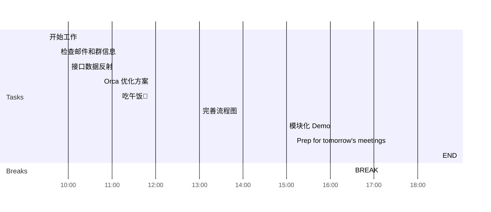

## Day Planner

This is my plan for the day broken into 3 main sections:
1. Morning Prep
2. Working
3. Afternoon Review

### Morning Prep

This is where I get ready for work and do my usual prep.

- [x] 09:30 开始工作
- [x] 09:45 检查邮件和群信息
- [x] 10:00 接口数据反射
  - [ ] Refect Metadata
  - [ ] inversifyJs
- [x] 10:45 Orca 优化方案
- [x] 11:10 吃午饭🥣

### Working

A section of the day dedicated to working:

1. Plan tasks.
2. Update and Check Code.
3. Push Code.
   
- [x] 13:00 完善流程图
  - [ ] 接口时序图
  - [ ] 流程 Check：接口调用顺序、重复调用
- [x] 15:00 模块化 Demo

### Afternoon Review

I use this time to review what I have done earlier in the day and complete any tasks to prepare for the next day.

- [x] 16:30 BREAK
- [x] 17:20 Prep for tomorrow's meetings
- [x] 18:30 END