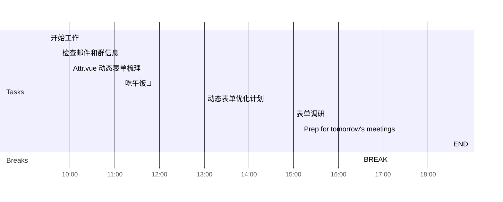

## Day Planner

This is my plan for the day broken into 3 main sections:
1. Morning Prep
2. Working
3. Afternoon Review

### Morning Prep

This is where I get ready for work and do my usual prep.

- [x] 09:30 开始工作
- [x] 09:45 检查邮件和群信息
- [x] 10:00 Attr.vue 动态表单梳理
  - [ ] 使用情况（被引用的文件关系等）
  - [ ] 逻辑流程（校验规则等）
- [x] 11:10 吃午饭🥣

### Working

A section of the day dedicated to working:

1. Plan tasks.
2. Update and Check Code.
3. Push Code.
   
- [x] 13:00 动态表单优化计划
  - [ ] 方案评估
  - [ ] 工作量评估
- [x] 15:00 表单调研
  - [ ] 校验规则
  - [ ] 表单样式
  - [ ] 调用方式

### Afternoon Review

I use this time to review what I have done earlier in the day and complete any tasks to prepare for the next day.

- [x] 16:30 BREAK
- [x] 17:20 Prep for tomorrow's meetings
- [ ] 18:30 END