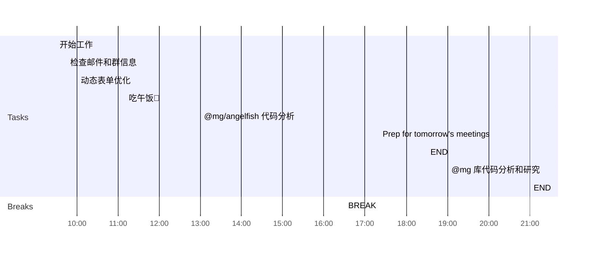

## Day Planner

This is my plan for the day broken into 3 main sections:
1. Morning Prep
2. Working
3. Afternoon Review
4. Overtime Work

### Morning Prep

This is where I get ready for work and do my usual prep.

- [x] 09:30 开始工作
- [x] 09:45 检查邮件和群信息
- [x] 10:00 动态表单优化
  - [ ] DictRender
  - [ ] Attr
- [x] 11:10 吃午饭🥣

### Working

A section of the day dedicated to working:

1. Plan tasks.
2. Update and Check Code.
3. Push Code.
   
- [x] 13:00 @mg/angelfish 代码分析
  - [ ] 使用场景
  - [ ] 引用关系

### Afternoon Review

I use this time to review what I have done earlier in the day and complete any tasks to prepare for the next day.

- [x] 16:30 BREAK
- [x] 17:20 Prep for tomorrow's meetings
- [ ] 18:30 END

### Overtime Work

Overtime hours are not fixed and are determined according to the situation.

- [x] 19:00 @mg 库代码分析和研究
  - [ ] 组件关系图
- [ ] 21:00 END