## Day Planner

```mermaid
gantt
    dateFormat  HH-mm
    axisFormat %H:%M
    %% Current Time: 18:39:29
    section Tasks
    开始工作     :09-30, 15mm
    检查邮件和群信息     :09-45, 15mm
    编写动态表单Demo     :10-00, 70mm
    吃午饭🥣     :11-10, 140mm
    编写动态表单Demo     :13-30, 90mm
    Review 动态表单Demo     :15-00, 90mm
    Prep for tomorrow's meetings     :17-20, 70mm
    END     :18-30, 30mm
    anythings     :19-00, 120mm
    END     :21-00, 0mm
    section Breaks
    BREAK     :16-30, 50mm
```

This is my plan for the day broken into 3 main sections:
1. Morning Prep
2. Working
3. Afternoon Review
4. Overtime Work

### Morning Prep

This is where I get ready for work and do my usual prep.

- [x] 09:30 开始工作
- [x] 09:45 检查邮件和群信息
- [x] 10:00 编写动态表单Demo
- [x] 11:10 吃午饭🥣

### Working

A section of the day dedicated to working:

1. Plan tasks.
2. Update and Check Code.
3. Push Code.
   
- [x] 13:30 编写动态表单Demo
  - [ ] 参数格式设计
  - [ ] 功能设计
  - [ ] 样式布局设计
  - [ ] 调用API设计
- [x] 15:00 Review 动态表单Demo

### Afternoon Review

I use this time to review what I have done earlier in the day and complete any tasks to prepare for the next day.

- [x] 16:30 BREAK
- [x] 17:20 Prep for tomorrow's meetings
- [ ] 18:30 END

### Overtime Work

Overtime hours are not fixed and are determined according to the situation.

- [ ] 19:00 anythings
- [ ] 21:00 END