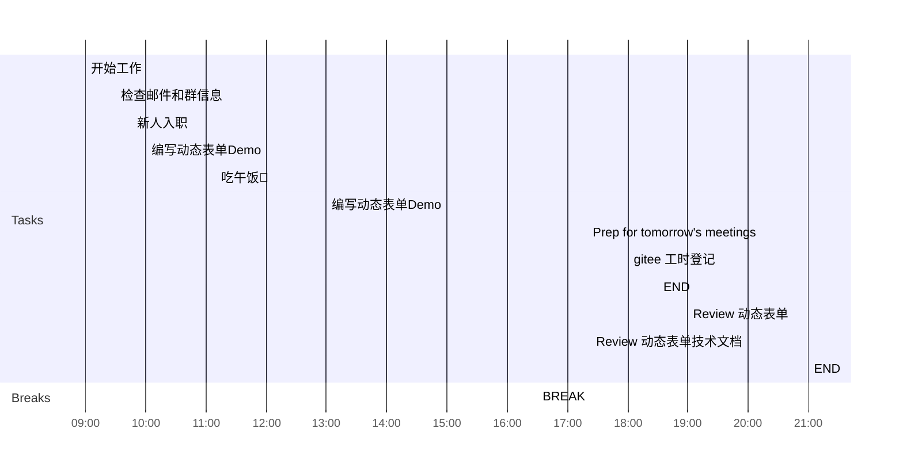

## Day Planner

This is my plan for the day broken into 3 main sections:
1. Morning Prep
2. Working
3. Afternoon Review
4. Overtime Work

### Morning Prep

This is where I get ready for work and do my usual prep.

- [x] 09:00 开始工作
- [x] 09:30 检查邮件和群信息
- [x] 09:45 新人入职
- [x] 10:00 编写动态表单Demo
- [x] 11:10 吃午饭🥣

### Working

A section of the day dedicated to working:

1. Plan tasks.
2. Update and Check Code.
3. Push Code.
   
- [x] 13:00 编写动态表单Demo
  - [ ] template 模板数据
  - [ ] template 业务逻辑
  - [ ] template 事件绑定
  - [ ] 文档说明

### Afternoon Review

I use this time to review what I have done earlier in the day and complete any tasks to prepare for the next day.

- [x] 16:30 BREAK
- [x] 17:20 Prep for tomorrow's meetings
- [x] 18:00 gitee 工时登记
- [ ] 18:30 END

### Overtime Work

Overtime hours are not fixed and are determined according to the situation.

- [ ] 19:00 Review 动态表单
- [ ] 20:00 Review 动态表单技术文档
- [ ] 21:00 END