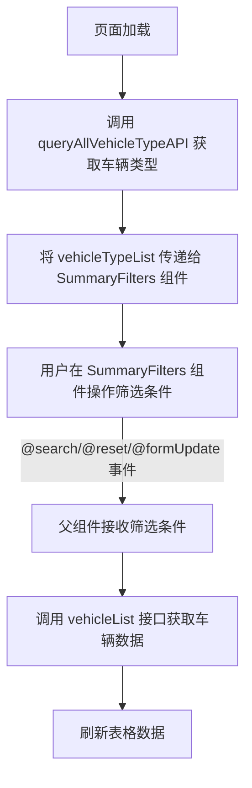
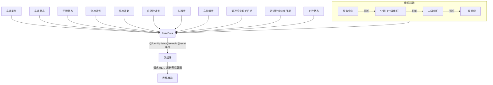

```mermaid
flowchart TD
    A[页面加载] --> B[调用 queryAllVehicleTypeAPI 获取车辆类型]
    B --> C[将 vehicleTypeList 传递给 SummaryFilters 组件]
    C --> D[用户在 SummaryFilters 组件操作筛选条件]
    D -- @search/@reset/@formUpdate 事件 --> E[父组件接收筛选条件]
    E --> F[调用 vehicleList 接口获取车辆数据]
    F --> G[刷新表格数据]
```

```mermaid
flowchart TD
    A[服务中心] -- 影响 --> B[公司（一级组织）]
    B -- 影响 --> C[二级组织]
    C -- 影响 --> D[三级组织]
    subgraph 组织联动
      A
      B
      C
      D
    end

    E[车辆类型]
    F[车辆状态]
    G[干预状态]
    H[全检计划]
    I[快检计划]
    J[自动检计划]
    K[车牌号]
    L[车队编号]
    M[最近检查起始日期]
    N[最近检查结束日期]
    O[关注状态]

    %% 组织联动和其他筛选项都汇总到formData
    组织联动 --> P(formData)
    E --> P
    F --> P
    G --> P
    H --> P
    I --> P
    J --> P
    K --> P
    L --> P
    M --> P
    N --> P
    O --> P

    P -- @formUpdate/@search/@reset事件 --> Q[父组件]
    Q -- 请求接口，刷新表格数据 --> R[表格展示]
```