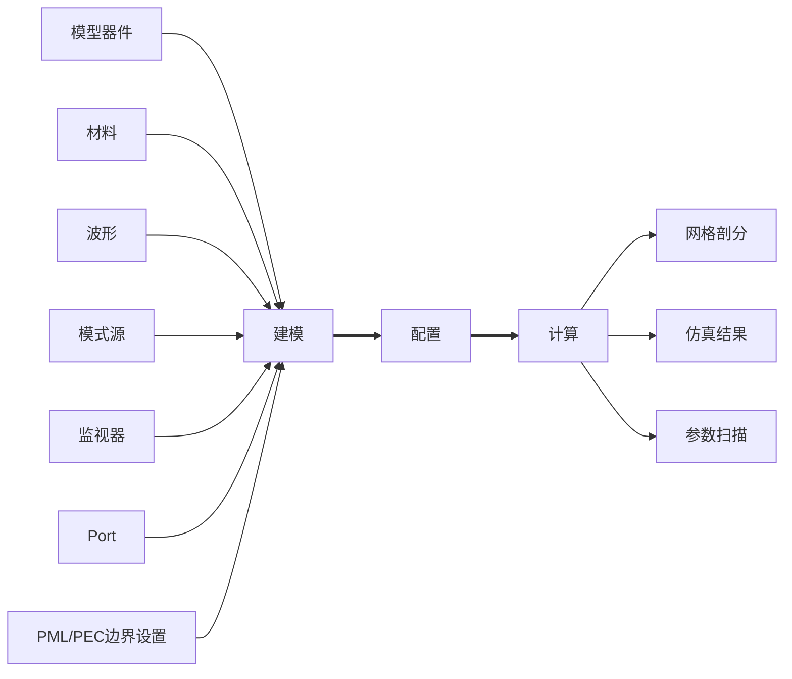
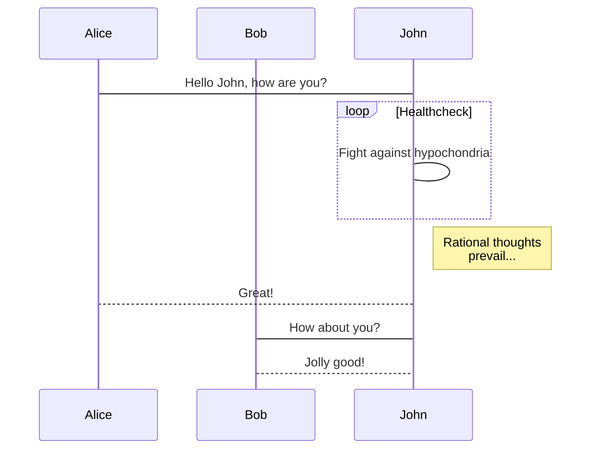

功能流程：

```mermaid
graph LR
模型器件 --> 建模
材料 --> 建模
波形 --> 建模
模式源 --> 建模
监视器 --> 建模
Port --> 建模
PML/PEC边界设置 --> 建模
建模 ==> 配置
配置 ==> 计算
计算 --> 网格剖分
计算 --> 仿真结果
计算 --> 参数扫描
```

```mermaid
sequenceDiagram
　　　participant Alice
　　　participant Bob
　　　Alice->John:Hello John, how are you?
　　　loop Healthcheck
　　　　　John->John:Fight against hypochondria
　　　end
　　　Note right of John:Rational thoughts <br/>prevail...
　　　John-->Alice:Great!
　　　John->Bob: How about you?
　　　Bob-->John: Jolly good!
```

