## Day Planner

```mermaid
gantt
    dateFormat  HH-mm
    axisFormat %H:%M
    %% Current Time: 19:28:43
    section Tasks
    开始工作     :09-30, 15mm
    检查邮件和群信息     :09-45, 45mm
    拉取 Orca 最新代码     :10-30, 40mm
    吃午饭🥣     :11-10, 110mm
    Coding     :13-00, 60mm
    找揭老师沟通回显部分的代码     :14-00, 60mm
    调试 VTable，使用 JSX 优化模板逻辑     :15-00, 90mm
    Prep for tomorrow's meetings     :17-20, 70mm
    END     :18-30, 0mm
    section Breaks
    BREAK     :16-30, 50mm
```

This is my plan for the day broken into 3 main sections:
1. Morning Prep
2. Working
3. Afternoon Review
4. Overtime Work

### Morning Prep

This is where I get ready for work and do my usual prep.

- [ ] 09:30 开始工作
- [ ] 09:45 检查邮件和群信息
- [ ] 10:00 anythings
  - [ ] Task 1
  - [ ] Task 2
- [ ] 10:15 anythings
- [ ] 10:30 anythings
- [ ] 10:45 anythings
- [ ] 11:10 吃午饭🥣
- [ ] 11:15 anythings

### Working

A section of the day dedicated to working:

1. Plan tasks.
2. Update and Check Code.
3. Push Code.
   
- [ ] 13:00 Coding
  - [ ] Task 1
  - [ ] Task 2
- [ ] 13:15 anythings
- [ ] 13:30 anythings
- [ ] 13:45 anythings
- [ ] 14:00 anythings
- [ ] 15:00 anythings

### Afternoon Review

I use this time to review what I have done earlier in the day and complete any tasks to prepare for the next day.

- [ ] 16:30 BREAK
- [ ] 17:20 Prep for tomorrow's meetings
- [ ] 18:30 END

### Overtime Work

Overtime hours are not fixed and are determined according to the situation.

- [ ] 19:00 anythings
- [ ] 20:00 anythings
- [ ] 21:00 END