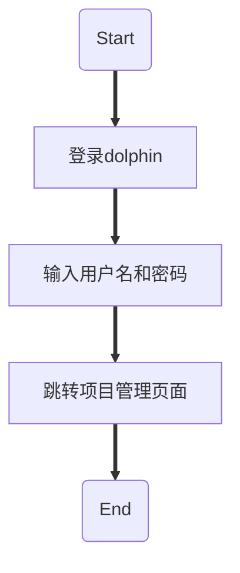
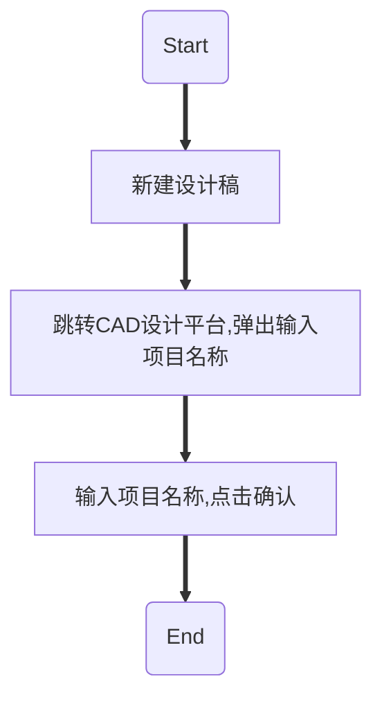
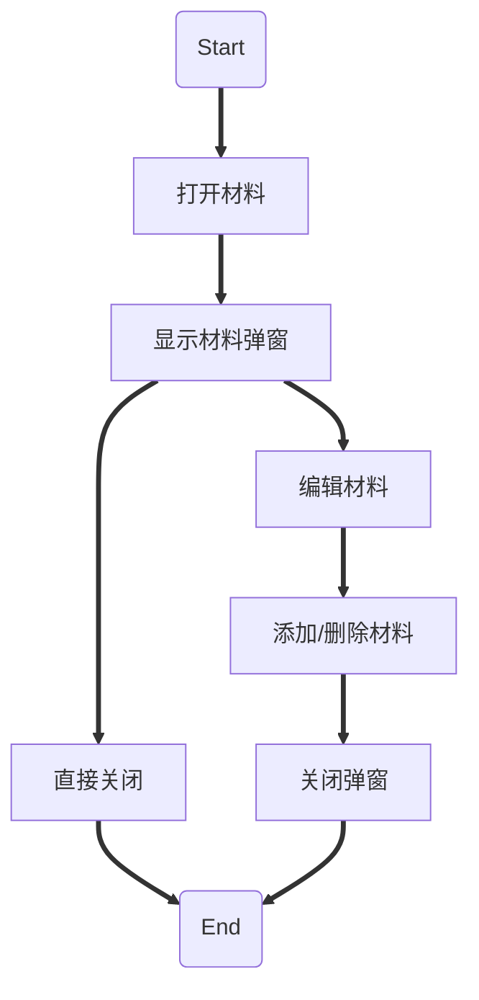
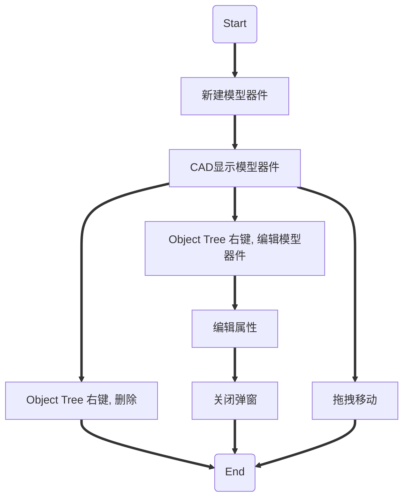
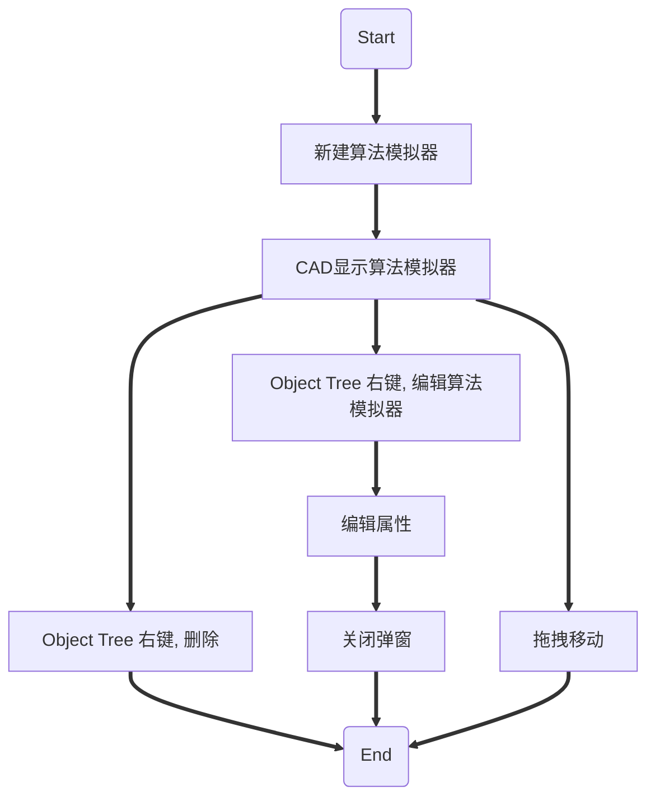
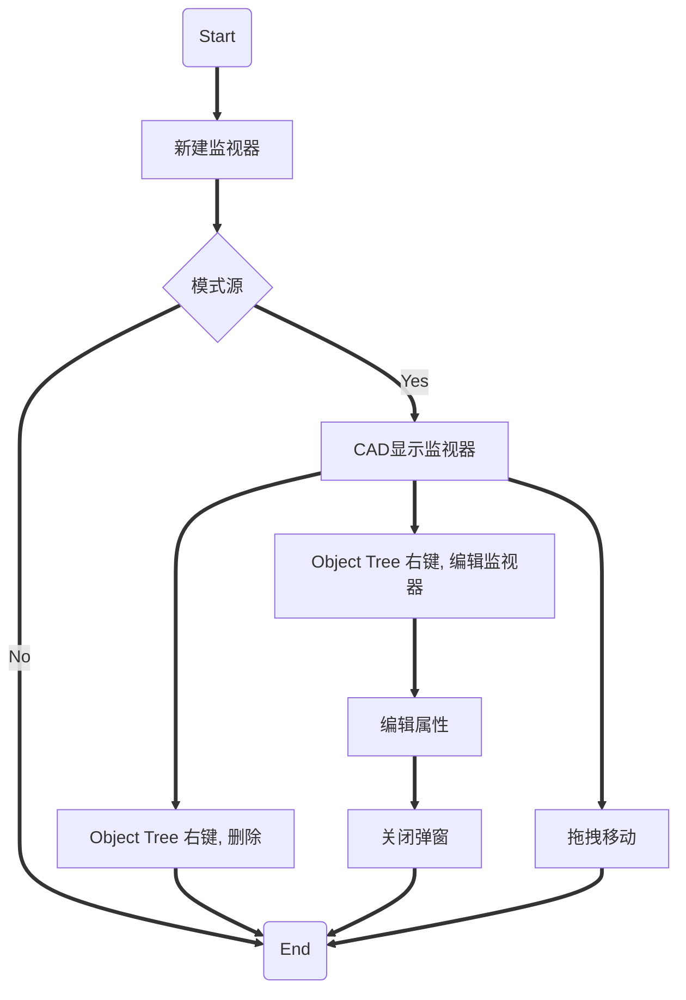
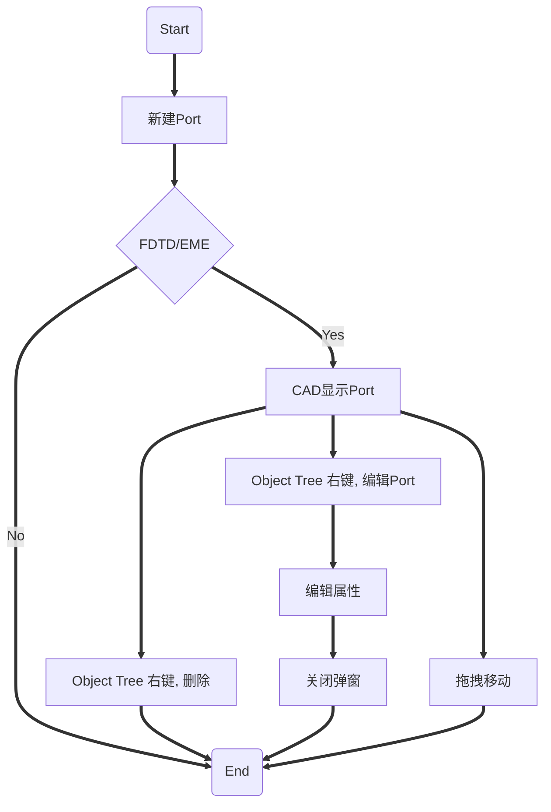
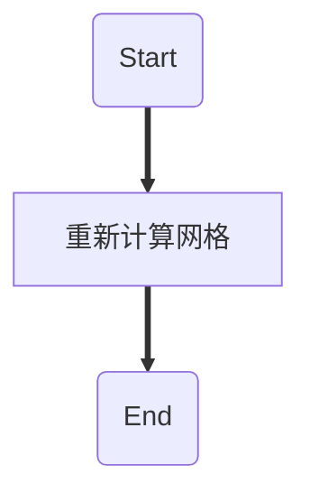
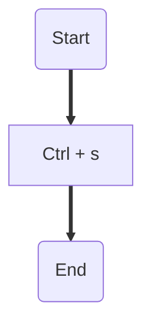

## 功能流程
### 登录流程*

![[buckets/work-experience/max-optics/assets/daily_20221017/Pasted image 20221017150236.png]]

- [API Document - login](http://192.168.91.37/api/login/)
- [API Document - get_user](http://192.168.91.37/api/get_user/)
- [API Document - search_projects_for_dolphin](http://192.168.91.37/api/search_projects_for_dolphin/)
- [API Document - circle_summary](http://192.168.91.37/api/circle_summary/)
- [API Document - circle_groups](http://192.168.91.37/api/circle_groups/)
- [API Document - circle_groups](http://192.168.91.37/api/circle_groups/)

> NOTE：circle_groups 接口重复调用

### 建模配置

![[buckets/work-experience/max-optics/assets/daily_20221017/Pasted image 20221017151356.png]]

- [API Document - circle_summary](http://192.168.91.37/api/circle_summary/)

![[buckets/work-experience/max-optics/assets/daily_20221017/Pasted image 20221017151640.png]]

- [API Document - check_token](http://192.168.91.37/api/check_token/)
- [API Document - search_waveforms](http://192.168.91.37/api/search_waveforms/)
- [192.168.91.37/socket.io/?EIO=4&transport=polling&t=OFaoeWG](http://192.168.91.37/socket.io/?EIO=4&transport=polling&t=OFaoeWG)
- [API Document - get_view_configuration](http://192.168.91.37/api/get_view_configuration/)
- [API Document - get_user](http://192.168.91.37/api/get_user/)
- [192.168.91.37/socket.io/?EIO=4&transport=polling&t=OFaoeYO&sid=Y-GfNP269nzvOcaeALOp](http://192.168.91.37/socket.io/?EIO=4&transport=polling&t=OFaoeYO&sid=Y-GfNP269nzvOcaeALOp)
- [192.168.91.37/socket.io/?EIO=4&transport=polling&t=OFaoeYP&sid=Y-GfNP269nzvOcaeALOp](http://192.168.91.37/socket.io/?EIO=4&transport=polling&t=OFaoeYP&sid=Y-GfNP269nzvOcaeALOp)
- [API Document - set_view_configuration](http://192.168.91.37/api/set_view_configuration/)
- [192.168.91.37/socket.io/?EIO=4&transport=polling&t=OFaq5zx&sid=f9RrhFyxLm8UV3NpALPZ](http://192.168.91.37/socket.io/?EIO=4&transport=polling&t=OFaq5zx&sid=f9RrhFyxLm8UV3NpALPZ)
- [API Document - get_public_materials](http://192.168.91.37/api/get_public_materials/)
- [API Document - search_materials](http://192.168.91.37/api/search_materials/)
- [API Document - search_projects](http://192.168.91.37/api/search_projects/)
- [API Document - search_projects](http://192.168.91.37/api/search_projects/)

![[buckets/work-experience/max-optics/assets/daily_20221017/Pasted image 20221017152243.png]]

- [API Document - search_projects](http://192.168.91.37/api/search_projects/)
- [API Document - search_projects](http://192.168.91.37/api/search_projects/)
- [API Document - create_project](http://192.168.91.37/api/create_project/)
- [API Document - open_project](http://192.168.91.37/api/open_project/)
- [API Document - save_project](http://192.168.91.37/api/save_project/)
- [API Document - load_project](http://192.168.91.37/api/load_project/)
- [API Document - autoSave_project](http://192.168.91.37/api/autoSave_project/)
- [API Document - set_project_configuration](http://192.168.91.37/api/set_project_configuration/)
- [API Document - set_project_configuration](http://192.168.91.37/api/set_project_configuration/)
- [API Document - get_tasks](http://192.168.91.37/api/get_tasks/)

#### 材料编辑

![[buckets/work-experience/max-optics/assets/daily_20221017/Pasted image 20221017154026.png]]

- [API Document - get_public_materials](http://192.168.91.37/api/get_public_materials/)
- [API Document - search_materials](http://192.168.91.37/api/search_materials/)

![[buckets/work-experience/max-optics/assets/daily_20221017/Pasted image 20221017154110.png]]

- [API Document - change_materials](http://192.168.91.37/api/change_materials/)

![[buckets/work-experience/max-optics/assets/daily_20221017/Pasted image 20221017162600.png]]

- [API Document - create_material](http://192.168.91.37/api/create_material/)
- [API Document - delete_material](http://192.168.91.37/api/delete_material/)

#### 波形编辑

![[buckets/work-experience/max-optics/assets/daily_20221017/Pasted image 20221017165120.png]]

- [API Document - search_waveforms](http://192.168.91.37/api/search_waveforms/)
- [API Document - change_waveforms](http://192.168.91.37/api/change_waveforms/)
- [API Document - create_waveform](http://192.168.91.37/api/create_waveform/)
- [API Document - delete_many_waveforms](http://192.168.91.37/api/delete_many_waveforms/)

#### 模型器件编辑

![[buckets/work-experience/max-optics/assets/daily_20221017/Pasted image 20221017171707.png]]

- [API Document - autoSave_project](http://192.168.91.37/api/autoSave_project/)

#### 算法模拟

![[Pasted image 20221031134349.png]]

- [API Document - save_project](http://192.168.91.37/api/save_project/)
- [API Document - recalc_mesh](http://192.168.91.37/api/recalc_mesh/)
- [API Document - load_project](http://192.168.91.37/api/load_project/)
- [API Document - autoSave_project](http://192.168.91.37/api/autoSave_project/)
- [API Document - set_project_configuration](http://192.168.91.37/api/set_project_configuration/)
- [API Document - set_project_configuration](http://192.168.91.37/api/set_project_configuration/)
- [API Document - get_tasks](http://192.168.91.37/api/get_tasks/)

#### 模式源编辑

![[buckets/work-experience/max-optics/assets/daily_20221017/Pasted image 20221017171707.png]]

- [API Document - autoSave_project](http://192.168.91.37/api/autoSave_project/)

#### 监视器编辑

> 折射率监视器的逻辑比较特殊，需要调用多个接口。

![[buckets/work-experience/max-optics/assets/daily_20221017/Pasted image 20221017171707.png]]

- [API Document - autoSave_project](http://192.168.91.37/api/autoSave_project/)

![[Pasted image 20221031142201.png]]

- [API Document - autoSave_project](http://192.168.91.37/api/autoSave_project/)
- [API Document - save_project](http://192.168.91.37/api/save_project/)
- [API Document - recalc_mesh](http://192.168.91.37/api/recalc_mesh/)
- [API Document - load_project](http://192.168.91.37/api/load_project/)
- [API Document - autoSave_project](http://192.168.91.37/api/autoSave_project/)
- [API Document - set_project_configuration](http://192.168.91.37/api/set_project_configuration/)
- [API Document - get_tasks](http://192.168.91.37/api/get_tasks/)
- [API Document - create_task](http://192.168.91.37/api/create_task/)
- [192.168.91.37/socket.io/?EIO=4&transport=polling&t=OGiiuvJ](http://192.168.91.37/socket.io/?EIO=4&transport=polling&t=OGiiuvJ)
- [192.168.91.37/socket.io/?EIO=4&transport=polling&t=OGiiuvc&sid=Kk1lIWgo4tHOvKwtAArR](http://192.168.91.37/socket.io/?EIO=4&transport=polling&t=OGiiuvc&sid=Kk1lIWgo4tHOvKwtAArR)
- [192.168.91.37/socket.io/?EIO=4&transport=polling&t=OGiiuvd&sid=Kk1lIWgo4tHOvKwtAArR](http://192.168.91.37/socket.io/?EIO=4&transport=polling&t=OGiiuvd&sid=Kk1lIWgo4tHOvKwtAArR)
- [192.168.91.37/socket.io/?EIO=4&transport=polling&t=OGiiuw8&sid=Kk1lIWgo4tHOvKwtAArR](http://192.168.91.37/socket.io/?EIO=4&transport=polling&t=OGiiuw8&sid=Kk1lIWgo4tHOvKwtAArR)
- [192.168.91.37/socket.io/?EIO=4&transport=polling&t=OGiiuw8.0&sid=Kk1lIWgo4tHOvKwtAArR](http://192.168.91.37/socket.io/?EIO=4&transport=polling&t=OGiiuw8.0&sid=Kk1lIWgo4tHOvKwtAArR)

#### Port 编辑

![[buckets/work-experience/max-optics/assets/daily_20221017/Pasted image 20221017171707.png]]

- [API Document - autoSave_project](http://192.168.91.37/api/autoSave_project/)

### 运行计算

#### 仿真计算

#### 网格剖分*

![[Pasted image 20221031145411.png]]

- [API Document - save_project](http://192.168.91.37/api/save_project/)
- [API Document - recalc_mesh](http://192.168.91.37/api/recalc_mesh/)
- [API Document - load_project](http://192.168.91.37/api/load_project/)
- [API Document - autoSave_project](http://192.168.91.37/api/autoSave_project/)
- [API Document - set_project_configuration](http://192.168.91.37/api/set_project_configuration/)
- [API Document - set_project_configuration](http://192.168.91.37/api/set_project_configuration/)
- [API Document - get_tasks](http://192.168.91.37/api/get_tasks/)

> NOTE：任何时候都可以计算，区别是 recalc_mesh 接口不一定会调用。

#### 参数扫描

略

### 快捷操作

#### Ctrl + s（保存）

![[Pasted image 20221031150806.png]]

- [API Document - save_project](http://192.168.91.37/api/save_project/)
- [API Document - load_project](http://192.168.91.37/api/load_project/)
- [API Document - autoSave_project](http://192.168.91.37/api/autoSave_project/)
- [API Document - set_project_configuration](http://192.168.91.37/api/set_project_configuration/)
- [API Document - set_project_configuration](http://192.168.91.37/api/set_project_configuration/)
- [API Document - get_tasks](http://192.168.91.37/api/get_tasks/)

#### Ctrl + z（撤回）

> 纯前端操作，无后端数据交互。

## 时序图

略