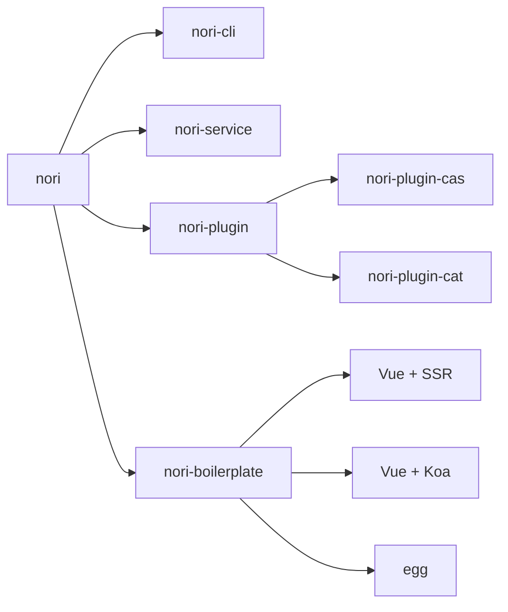
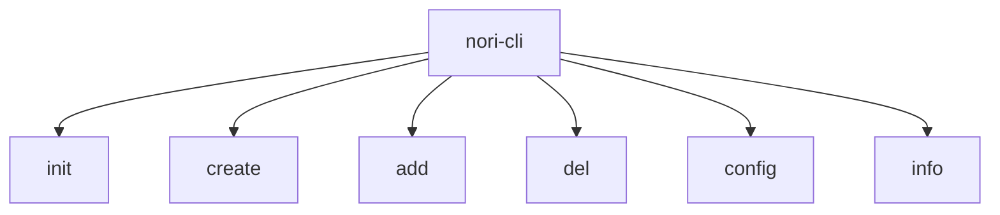
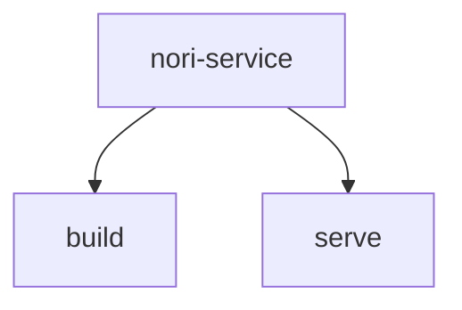
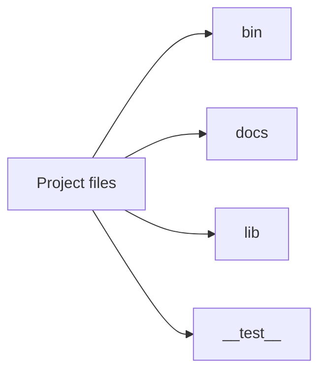

## Overview

> nori 不是 UI，不是类库，不是框架，是一套端到端的全栈研发工具。无需配置，开箱即用，提供沉浸式的开发体验。
>
> nori 简单灵活，不论是 client，或者 service 开发，均提供丰富的项目模板，减少复杂的手工配置，提高研发效率。

- \>= node v10.x
- \>= npm 5.x

**目录**

[toc]

## Design of the System

`nori` 有两套设计，分别如下：

- 1.x 基于项目模板
- 2.x 基于插件系统



---

### Nori CLI

Nori CLI (`@example/nori-cli`) 是一个全局安装的 npm 包，提供了终端里的 `nori` 命令。它可以通过 `nori create` 快速搭建一个新项目，或者直接通过 `nori serve` 构建新原型。

### Nori Service

Nori Service (`@example/nori-service`) 是一个开发环境依赖。它是一个 npm 包，局部安装在每个 `@example/nori-cli` 创建的项目中。

### Nori Plugins

Nori Plugin 为项目提供可选功能的 npm 包，例如 Babel/TypeScript 转译、ESLint 集成、单元测试和 end-to-end 测试等。Nori CLI 插件的名字以 `@example/nori-plugin-` (内建插件) 或 `@example/nori-cli-plugin-` (社区插件) 开头，非常容易使用。

### Nori Boilerplate

Nori Boilerplate 负责提供丰富的项目模板。例如，`Vue / Vue + SSR / Vue + Koa/` 等项目工程。

## Manual

`nori` 内提供的项目模板，涵盖了 client 和 service 的最佳实践。

### Install

通过 `anpm` 命令全局安装，即可使用。

```shell
anpm install -g @example/nori
```

或者使用 `npm` 命令全局安装：

```shell
npm install -g @example/nori --registry=http://repo.example.com.cn/artifactory/api/npm/npm-arch-frontend/
```

### Usage



---

**init** `<project-name>` `<repo-remote-url>` `{http|ssh}`

初始化远程仓库模板

```shell
nori init nori-demo http://gitlab.example.com.cn/GONGYUQI487/vue-admin-boilerplate.git
```

**create** `<project-name>` `[template-type]`

根据模板类型创建项目

```shell
nori create nori-demo vue-ssr
```

**add/del** `<component-name>`

添加/删除插件

```shell
nori add/del @example/nori-plugin-cas
```

**config** `{get/set}` `<key-value>`

获取/设置 config 配置

```shell
nori config get/set baseUrl
```

**info** `<project-name/component-name>`

获取插件信息

```shell
nori info @example/nori-plugin-cas
```



---

**build** `{mode}`

项目构建

```shell
nori-service build --mode fat
```

**serve**

项目调试

```shell
nori-service serve
```

### Config

1.x，`package.json`

```javascript
"scripts": {
  "build": "webpack --config ./webpack.dev.js",
  "build-prod": "webpack --config ./webpack.prod.js",
  "start": "http-server"
}
```

项目结构

```markdown
.
├── package.json
├── webpack.common.js
├── webpack.dev.js
└── webpack.prod.js
```

2.x，`package.json`

```javascript
"scripts": {
  "serve": "nori-service serve",
  "build:prd": "nori-service build",
  "build:fat": "nori-service build --mode fat",
  "build:uat": "nori-service build --mode uat",
  "lint": "nori-service lint"
}
```

项目结构

```markdown
.
├── package.json
└── nori.config.js
```

### Deploy

使用 `Dockerfile` 构建镜像文件，然后通过 `Wayne` 部署发布。

> wayne 是 K8s 的界面发布工具，具体使用方式可以在 wiki 上找到。

```dockerfile
# FROM node:12
FROM harbor.qa.example.com.cn/baseimg/node:12.13.1-alpine

# Create app directory
WORKDIR /usr/src/app
COPY  . .

# 镜像中，需按照实际需求更改时区、语言等特性部分镜像使用env设定时间(Dockerfile)
ENV TZ "Asia/Shanghai"
# 部分镜像需要添加额外包之后设定时区(Dockerfile)#  set timezone in dockerfile For Alpine
# RUN apk add -U tzdata
# RUN cp /usr/share/zoneinfo/Asia/Shanghai /etc/localtime

# 设置 npm
RUN npm config set registry http://repo.example.com.cn/artifactory/api/npm/npm-arch-frontend

# 进入 server
WORKDIR /usr/src/app/server
RUN npm install --registry=http://repo.example.com.cn/artifactory/api/npm/npm-arch-frontend/

ENV TERM xterm

EXPOSE 3000

CMD [ "npm", "run", "start"]
```

## Directory

该项目可以通过选择下载不同的项目模板，配置自己的 `package.json`，并且可以选择是否要进行安装依赖。



---

```markdown
.
├── .editorconfig
├── .eslintcache
├── .eslintignore
├── .eslintrc.js
├── .gitignore
├── CHANGELOG.md
├── README.md
├── bin // 命令入口
├── commitlint.config.js
├── config // 配置文件
├── docs
├── lib // 公共方法
├── node_modules
├── package-lock.json
└── package.json
```

## Features & Compared

表格是目前比较流行的构建工具，针对性列出了几项来对比。

|              | **nori** |                                     **Vue CLI**                                      |                                                                        **create-react-app**                                                                         |                                   **Parcel**                                   |
| ------------ | :------: | :----------------------------------------------------------------------------------: | :-----------------------------------------------------------------------------------------------------------------------------------------------------------------: | :----------------------------------------------------------------------------: |
| 快速原型开发 |    ✔︎    |                                         支持                                         |                                                                                  -                                                                                  |                                      支持                                      |
| 全局模式     |    ✔︎    |                               零配置原型开发就是全局的                               |                                                                                  -                                                                                  |                                      支持                                      |
| 插件         |    ✔︎    |                                         支持                                         |                                                                                  -                                                                                  |                          支持，扩展文件类型和文件输出                          |
| 扩展性       |    ✔︎    |                            强，通过插件扩展 webpack 配置                             | 弱, 强约定, 无法配置 webpack，可以 eject, 然后手工配置；支持 babel-macro;(严格说可以通过[react-app-rewired](https://github.com/timarney/react-app-rewired)进行扩展) | 中(可以配置 babel，postcss，Typescript); 提供了 Node API; 支持插件扩展文件类型 |
| 多页面       |    ✔︎    |                                         支持                                         |                                                                                  -                                                                                  |                                      支持                                      |
| 适用范围     |    ✔︎    |                   Vue 组件的第一公民。通过扩展可以支持任意前端框架                   |                                                                   针对 React 开发，不支持其他框架                                                                   |              parcel 是一个通用的打包工具，它的竞争对手是 webpack               |
| 编译速度     |    ✔︎    |                   cache-loader,thread-loader 来加速 JS 和 TS 编译                    |                                                                      babel-loader 开启了 cache                                                                      |                         编译速度号称是 webpack 的两倍                          |
| 可升级性     |    ✔︎    | 支持升级 cli-service, 插件需要单独升级, 插件需要遵循语义化版本. 太多插件存在升级风险 |                                                    支持升级 react-script, 官方维护，且强约定基本可以保障向下兼容                                                    |                            支持升级 parcel-bundler                             |
| UI           |    ✔︎    |                             图形化管理是 CLI 的特色之一                              |                                                                                  -                                                                                  |                                       -                                        |

## Release

```shell
// 生成版本号
# npm run script
npm run release -- --release-as major/minor/patch
# Or
npm run release -- --release-as 1.1.0

// 生成changelog
npm run log

// 发布
anpm publish --registry=http://repo.example.com.cn/artifactory/api/npm/npm-arch-frontend/
```

**如何安装 anpm(1.1.0)**

命令如下：

```bash
npm i -g @example/anpm --registry=http://repo.example.com.cn/artifactory/api/npm/npm-arch-frontend/

anpm login --registry=http://repo.example.com.cn/artifactory/api/npm/npm-arch-frontend/

anpm publish --registry=http://repo.example.com.cn/artifactory/api/npm/npm-arch-frontend/
```

Windows 安装参考如下教程

http://wiki.example.com.cn/pages/viewpage.action?pageId=126583004

## Development Plan

- [ ] 1.x 版本计划于 2020/12/7 完成

- [ ] 2.x 版本还在设计调研中，预计 2021 年初完成核心功能

## Milestone

- [ ] nori 基础工具和通用组件
- [ ] nori 公共服务
- [ ] nori 业务方接入
- [ ] 基于 nori 的 UI 组件库开发
- [ ] 基于 nori 的 admin 模板开发
