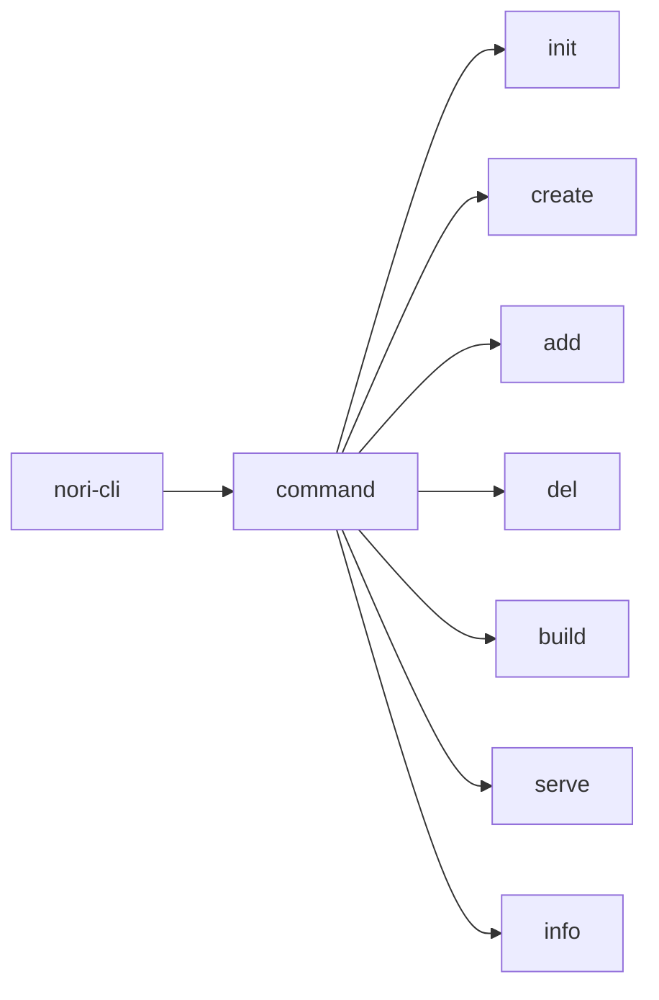
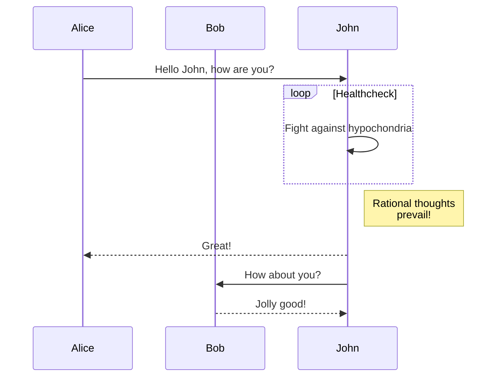
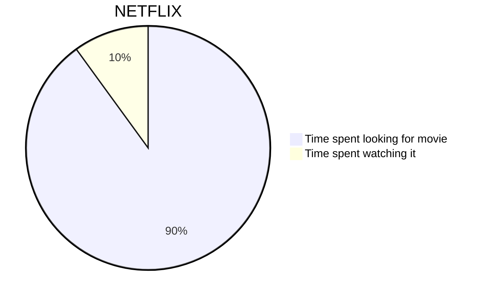
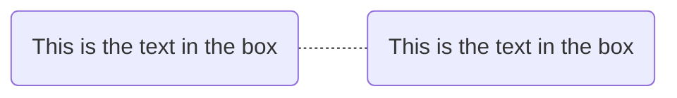
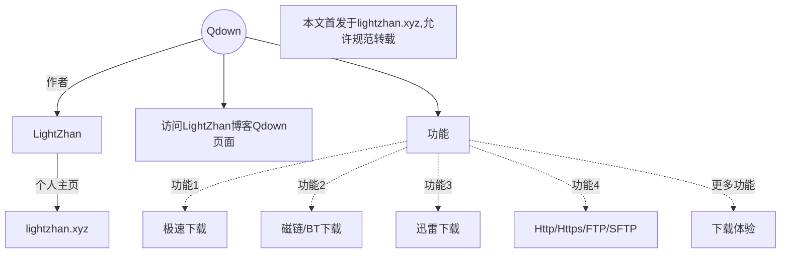

```Mermaid
graph TD
A(起床) --> B[洗漱]
B --> C{扔硬币}
C -->|正面朝上| D[喝牛奶]
C -->|反面朝上| E[喝果汁]
```


```Mermaid
sequenceDiagram 
客户->>银行柜台: 我要存钱  
银行柜台->>后台: 改一下这个账户数字哦  
后台->>银行柜台: 账户的数字改完了，明天起息  
银行柜台->>客户: 好了，给你回单 ，下一位
```









