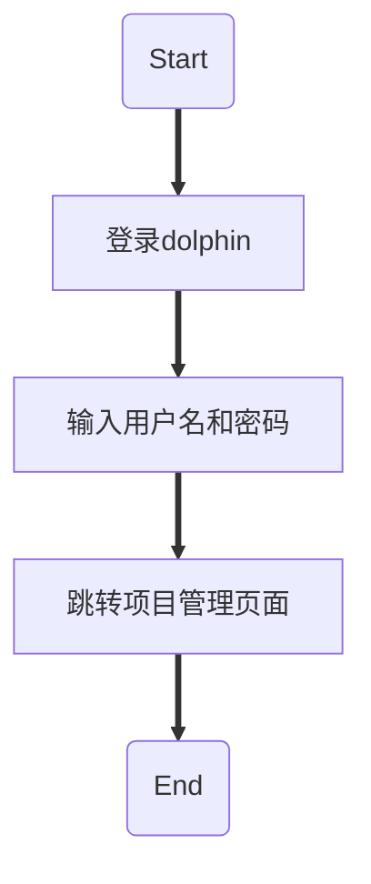
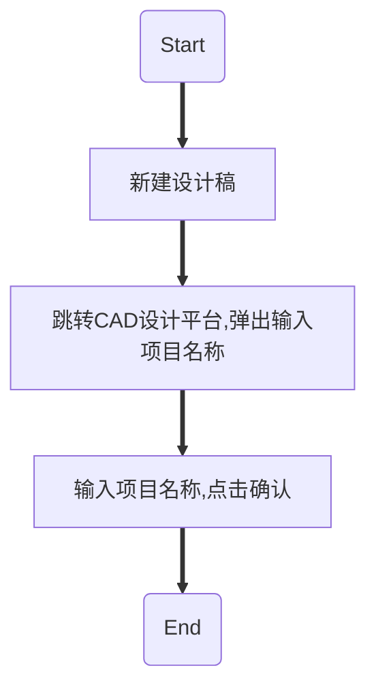
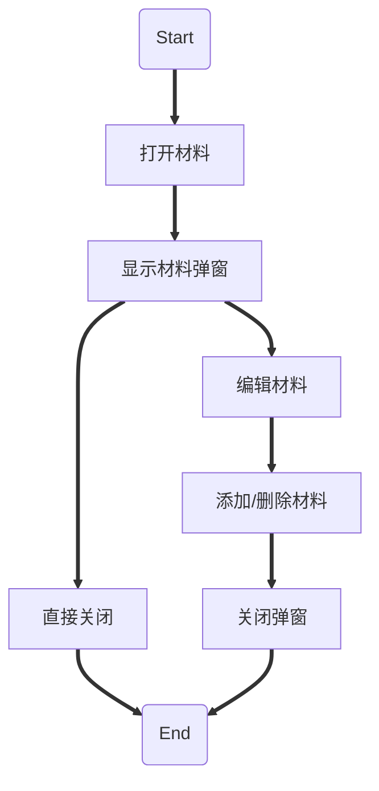
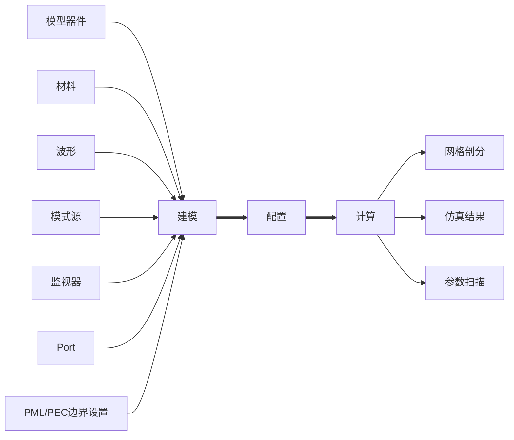
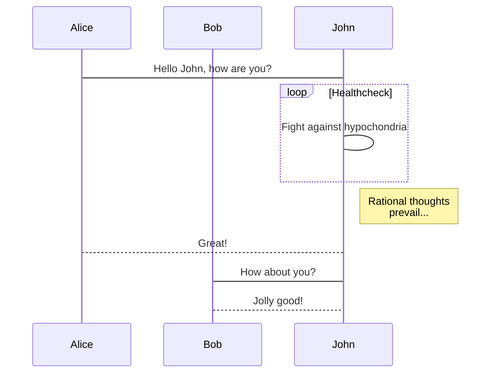

## 20221019

- [[RxJS]]
- [[Reflect Metadata]]

## 20221018

[[Max-Optics Api]]

- 接口文档不够详细：缺少业务场景和功能描述；
- 接口缺少域名、协议、路径，调用环境不完整；
- 接口字段缺少类型、描述，以及字段的长度限制；

如何使用 [[Javascrip 装饰器]]？

## 20221017

### 登录流程*



![[Pasted image 20221017150236.png]]

- [API Document - login](http://192.168.91.37/api/login/)
- [API Document - get_user](http://192.168.91.37/api/get_user/)
- [API Document - search_projects_for_dolphin](http://192.168.91.37/api/search_projects_for_dolphin/)
- [API Document - circle_summary](http://192.168.91.37/api/circle_summary/)
- [API Document - circle_groups](http://192.168.91.37/api/circle_groups/)
- [API Document - circle_groups](http://192.168.91.37/api/circle_groups/)

> NOTE：circle_groups 接口重复调用

### 建模配置



![[Pasted image 20221017151356.png]]

- [API Document - circle_summary](http://192.168.91.37/api/circle_summary/) 

![[Pasted image 20221017151640.png]]

- [API Document - check_token](http://192.168.91.37/api/check_token/)
- [API Document - search_waveforms](http://192.168.91.37/api/search_waveforms/)
- [192.168.91.37/socket.io/?EIO=4&transport=polling&t=OFaoeWG](http://192.168.91.37/socket.io/?EIO=4&transport=polling&t=OFaoeWG)
- [API Document - get_view_configuration](http://192.168.91.37/api/get_view_configuration/)
- [API Document - get_user](http://192.168.91.37/api/get_user/)
- [192.168.91.37/socket.io/?EIO=4&transport=polling&t=OFaoeYO&sid=Y-GfNP269nzvOcaeALOp](http://192.168.91.37/socket.io/?EIO=4&transport=polling&t=OFaoeYO&sid=Y-GfNP269nzvOcaeALOp)
- [192.168.91.37/socket.io/?EIO=4&transport=polling&t=OFaoeYP&sid=Y-GfNP269nzvOcaeALOp](http://192.168.91.37/socket.io/?EIO=4&transport=polling&t=OFaoeYP&sid=Y-GfNP269nzvOcaeALOp)
- [API Document - set_view_configuration](http://192.168.91.37/api/set_view_configuration/)
- [192.168.91.37/socket.io/?EIO=4&transport=polling&t=OFaq5zx&sid=f9RrhFyxLm8UV3NpALPZ](http://192.168.91.37/socket.io/?EIO=4&transport=polling&t=OFaq5zx&sid=f9RrhFyxLm8UV3NpALPZ)
- [API Document - get_public_materials](http://192.168.91.37/api/get_public_materials/)
- [API Document - search_materials](http://192.168.91.37/api/search_materials/)
- [API Document - search_projects](http://192.168.91.37/api/search_projects/)
- [API Document - search_projects](http://192.168.91.37/api/search_projects/)

![[Pasted image 20221017152243.png]]

- [API Document - search_projects](http://192.168.91.37/api/search_projects/)
- [API Document - search_projects](http://192.168.91.37/api/search_projects/)
- [API Document - create_project](http://192.168.91.37/api/create_project/)
- [API Document - open_project](http://192.168.91.37/api/open_project/)
- [API Document - save_project](http://192.168.91.37/api/save_project/)
- [API Document - load_project](http://192.168.91.37/api/load_project/)
- [API Document - autoSave_project](http://192.168.91.37/api/autoSave_project/)
- [API Document - set_project_configuration](http://192.168.91.37/api/set_project_configuration/)
- [API Document - set_project_configuration](http://192.168.91.37/api/set_project_configuration/)
- [API Document - get_tasks](http://192.168.91.37/api/get_tasks/)

#### 材料编辑



![[Pasted image 20221017154026.png]]

- [API Document - get_public_materials](http://192.168.91.37/api/get_public_materials/)
- [API Document - search_materials](http://192.168.91.37/api/search_materials/)

![[Pasted image 20221017154110.png]]

- [API Document - change_materials](http://192.168.91.37/api/change_materials/)

![[Pasted image 20221017162600.png]]

- [API Document - create_material](http://192.168.91.37/api/create_material/)
- [API Document - delete_material](http://192.168.91.37/api/delete_material/)

#### 波形编辑


![[Pasted image 20221017165120.png]]

- [API Document - search_waveforms](http://192.168.91.37/api/search_waveforms/)
- [API Document - change_waveforms](http://192.168.91.37/api/change_waveforms/)
- [API Document - create_waveform](http://192.168.91.37/api/create_waveform/)
- [API Document - delete_many_waveforms](http://192.168.91.37/api/delete_many_waveforms/)

#### 模型器件编辑

![[Pasted image 20221017171707.png]]
#### 算法模拟

![[Pasted image 20221017165941.png]]

#### 模式源编辑

#### 监视器编辑

#### Port 编辑

### 运行计算

#### 仿真计算

#### 网格剖分

#### 参数扫描

### 快捷操作

#### Ctrl + s（保存）

#### Ctrl + z（撤回）

## 20221014

Orca 插件化思考？
- [大型 Web 应用插件化架构探索 - 掘金](https://juejin.cn/post/6916863150872592392)
- [前端进阶：跟着开源项目学习插件化架构 - 掘金](https://juejin.cn/post/6844904196689379335)
- [前端插件化架构的探索和实践（上篇） - 掘金](https://juejin.cn/post/6867718721348042765)
- [前端插件化架构的思考 - 掘金](https://juejin.cn/post/6844904090275676168)
- [实现前端插件化架构设计，将需求开发「交给别人」 - 掘金](https://juejin.cn/post/7118929960038842381)
- [插件化设计模式在前端领域的应用](https://webfe.kujiale.com/cha-jian-hua-she-ji-mo-shi-zai-qian-duan-ling-yu-de-ying-yong/)

![[Pasted image 20221016185201.png]]


```markdown
https://wangxiao.xisaiwang.com/tiku2/report505792958.html?isSubPaper=Y
https://wangxiao.xisaiwang.com/tiku2/ctjx505792958.html
```

## 20221013

功能流程：







## 20221012
 
10 月工作任务：
- Orca 业务功能流程图和依赖接口时序图
- visualizer 组件优化：VTable.vue、VController.vue
- Orca 功能检查和优化建议

Orca 功能模块：
- CAD 建模
	- 模型器件（Structures）
	- 模式源（Source）
	- 监视器（Monitor）
	- 解算器（Port）
	- 网格剖分（Remesh）
	- 材料管理（Material）
	- 波形（Waveforms）
- 算法模拟器（Simulation）
	- FDTD
	- EME
	- FDE
- 栏目/视窗
	- 菜单栏
	- 快捷栏
	- 工具栏
	- 状态栏
	- objects展示列表（Objects Tree）
	- 仿真结果（Results View）
	- 参数扫描（Optimizations and Sweeps）
	- 任务树（Task Tree）


## 20221011
整体优化方案

-   项目工程结构优化
-   visualizer 组件优化
-   Angelfish 组件迁移
-   计算公式封装
-   补充 Typescript 类型定义
-   补充代码注释

第一期改造点：

1.  visualizer 组件优化：VTable.vue、VController.vue
2. Angelfish 组件迁移：draw 和 modules 文件夹下的部分组件使用 Angelfish 重写

> 主要是2方面的优化：1) Typescript 改造和补充类型定义; 2) template 逻辑优化；

## 20221010

- 代码追溯大会
- 熟悉 orca 代码

## 20221009

- 电脑环境配置
- 获取代码，并启动项目
- 新人培训：光电芯片知识

## 20221008

- 公司入职
- 新人入职材料
- 门禁卡
- 开通 IT 权限：电脑密码，代码仓库访问权限
