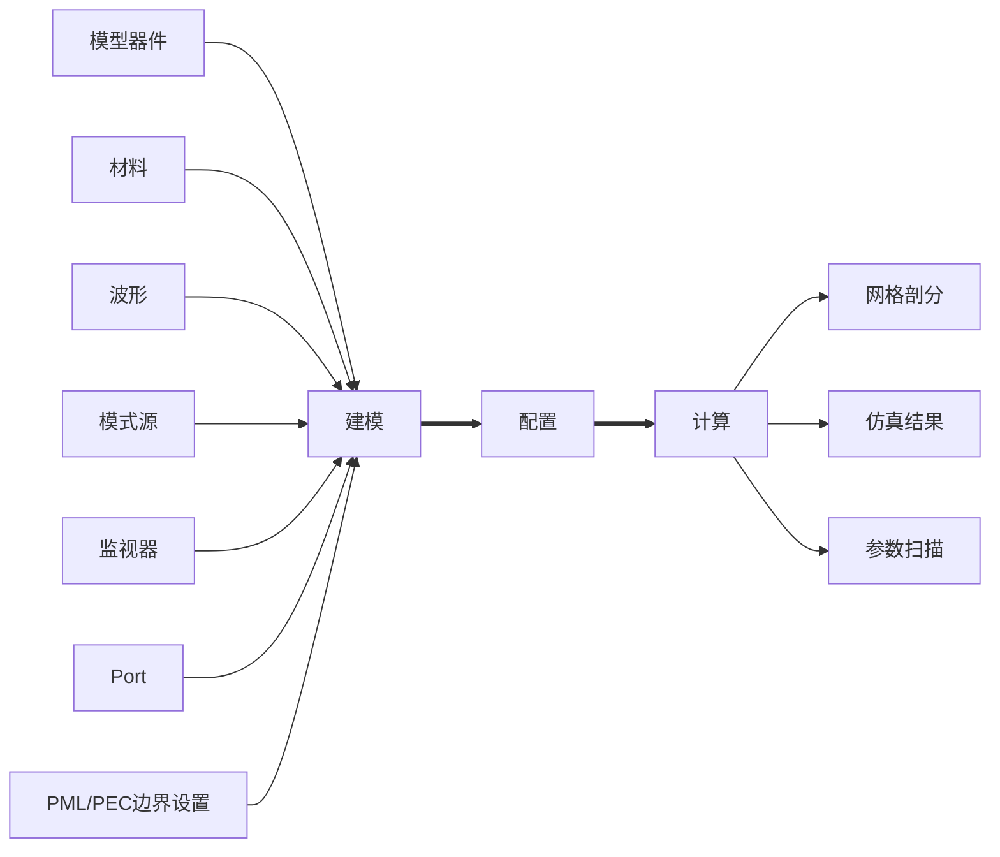
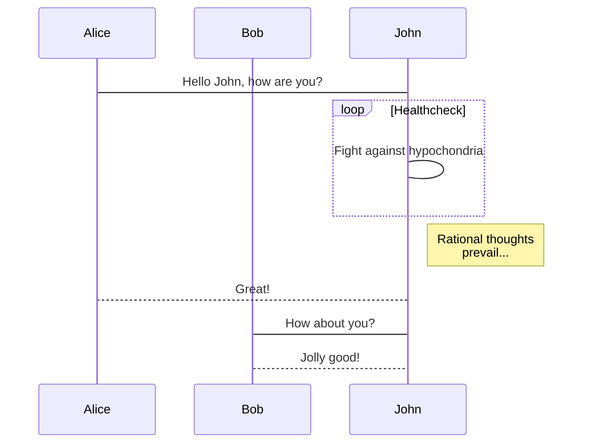

> Just keep doing.

##  20221216 

- addModeExpansion.vue(Attr)
- modals.ts(ModeExpansion)
- 支持全局变量

![[Pasted image 20221216180139.png]]

##  20221215 

```ad-note
title: 每日一读 20221215

[盘点阿里巴巴 15 个顶级前端开源项目 - 掘金](https://juejin.cn/post/7135382523672002590)
[案例+图解带你一文读懂Canvas🔥🔥（2W+字） - 掘金](https://juejin.cn/post/7119495608938790942)
[老板让你做性能优化，第一步你应该做什么？🔥🔥 - 掘金](https://juejin.cn/post/7121323745980973070)
[这样封装列表 hooks,一天可以开发 20 个页面 - 掘金](https://juejin.cn/post/7165467345648320520)
[Hooks时代，如何写出高质量的react和vue组件？ - 掘金](https://juejin.cn/post/7123961170188304391)
[花1块钱让你的网站支持 ChatGPT - 掘金](https://juejin.cn/post/7176539666210881592)
[Using server-sent events - Web APIs | MDN](https://developer.mozilla.org/en-US/docs/Web/API/Server-sent_events/Using_server-sent_events#event_stream_format)

```

```ad-note
title: WebGL & WebGPU & Shaders

[淘系前端团队](https://fed.taobao.org/blog/taofed/do71ct/optimizing-page-performance-with-shader/)
[【译】WebGL With Three.js: Shaders - 掘金](https://juejin.cn/post/7141402665669378062)
[Diana Smith | UI Engineer / Web Developer / Frontend Specialist | cyanharlow @ GitHub](https://diana-adrianne.com/)
[HTML5 Canvas,WebGL,CSS Shaders,GLSL的暧昧关系 « 张鑫旭-鑫空间-鑫生活](https://www.zhangxinxu.com/wordpress/2011/10/html5-canvas-webgl-css-shaders-glsl%E7%9A%84%E6%9A%A7%E6%98%A7%E5%85%B3%E7%B3%BB/)
[高冷的 WebGL - 掘金](https://juejin.cn/post/6844903478456745997)
[用Three.js打造酷炫3D个人网站（含源码） - 掘金](https://juejin.cn/post/6985033373857579045)
[0xFloyd/Portfolio_2020: 3D Interactive World, built using Three.js and Ammo.js](https://github.com/0xFloyd/Portfolio_2020)
[不懂就问系列-Canvas和WebGL是啥关系？ · Cooper's Blog](https://cooperhu.com/2019/10/15/canvas/)
[huguobo/One-Take: 一镜到底demo](https://github.com/huguobo/One-Take)
[html5 - 从零到一：实现通用一镜到底H5 - 从零到一 - SegmentFault 思否](https://segmentfault.com/a/1190000017848401?utm_source=tag-newest)
[一镜到底H5大合集：一口气看尽一个H5的套路 - 数英](https://www.digitaling.com/articles/40228.html)

```

##  20221214 

table 分页

```html
<an-table
  size="mini"
  :data="viewTableData.slice((page.currentPage - 1) * page.pageSize, page.currentPage * page.pageSize)"
  border
  highlight-current-row
  height="30vh"
  :deep-ref="
  (ref) => {
    editTable = ref;
  }
  "
  @selection-change="handleSelectionChange"
  @row-click="handleCurrentChange"
/>  

<!-- 分页1 -->

<div class="pagination">
  <el-pagination
    v-model:currentPage="page.currentPage"
    v-model:page-size="page.pageSize"
    background
    layout="total, sizes, prev,pager, next"
    :total="viewTableData.length"
    class="mt-4"
    :page-sizes="[100]"
    @current-change="handlePageCurrentChange"
    @page-size="handlePageSize"
  />
</div>

```

##  20221213 

- object Tree 样式修改
- project中的参数设定, 现有界面保持不变, 另在Message中加一个Tab页, 可进行参数的查看和操作
- objectTree与Sweep做成两个Tab, 打开默认显示ObjectTree

[分享7 个VUE项目用得上的JavaScript库 - 掘金](https://juejin.cn/post/7175905647018377277)
[等级用户专属活动上线啦丨写好文，瓜分6万元现金大奖 - 掘金](https://juejin.cn/post/7162096952883019783)
[naver/egjs-infinitegrid: A module used to arrange card elements including content infinitely on a grid layout.](https://github.com/naver/egjs-infinitegrid)
[x-extends/vxe-table: vxe-table vue 表格解决方案](https://github.com/x-extends/vxe-table)
[xuliangzhan/vxe-table-demo: 💧 vxe-table 使用示例](https://github.com/xuliangzhan/vxe-table-demo)
[TanStack/table: 🤖 Headless UI for building powerful tables & datagrids for TS/JS - React-Table, Vue-Table, Solid-Table, Svelte-Table](https://github.com/TanStack/table)


##  20221212 

单机版修改：
1. Message未填充满
2. ObjectTree与Sweep做成两个Tab, 打开默认显示ObjectTree
3. Project中的参数设定, 现有界面保持不变, 另在Message中加一个Tab页, 可进行参数的查看和操作
4. 按钮填充色为底色, 不要白色, 鼠标悬停时高亮显示


![[Pasted image 20221212105241.png]]

![[Pasted image 20221212105404.png]]

![[Pasted image 20221212105511.png]]

![[Pasted image 20221212105601.png]]

[Remove all stylings (border, glow) from textarea](https://stackoverflow.com/questions/17109702/remove-all-stylings-border-glow-from-textarea)

```
project.document.attrs.configGlobleParam
src/engine/types/index.ts
```

##  20221209 

```ad-note
title: pnpm

https://pnpm.io/zh/using-changesets
https://juejin.cn/post/7053340250210795557#heading-21
https://zhuanlan.zhihu.com/p/419399115
https://juejin.cn/post/7055281852789047304
https://juejin.cn/post/6950082433647640612#heading-7
https://kuizuo.cn/pnpm-monorepo-practice/#%E5%90%AF%E5%8A%A8%E9%A1%B9%E7%9B%AE
https://juejin.cn/post/7143848867438526501
https://github.com/qmhc/vite-plugin-dts/issues/155
https://www.npmjs.com/settings/rich1e/packages
https://www.51cto.com/article/715946.html
https://juejin.cn/post/7091956084092436494
https://developer.aliyun.com/article/998772?userCode=okjhlpr5#slide-3
https://juejin.cn/search?query=pnpm%20changesets&type=0
https://juejin.cn/post/7098609682519949325
https://blog.csdn.net/it_xcr/article/details/114655778
https://www.linsizao.site/%E5%B0%81%E8%A3%85vue3%E6%8F%92%E4%BB%B6install%E6%96%B9%E6%B3%95/
https://juejin.cn/post/7021430391957372942
https://gitee.com/WangQingGiteeA/w-plus/blob/master/packages/components/button/src/button.ts
https://juejin.cn/post/7021430391957372942
https://juejin.cn/post/7101117617233985566
https://juejin.cn/post/7070379360162676749
https://juejin.cn/post/7117886038126624805#heading-28
https://juejin.cn/post/7121381989864701982#heading-5
https://juejin.cn/post/7157634070615162893#heading-0
https://donaldxdonald.xyz/blog/monorepopart2
https://github.com/rich1e
https://zhuanlan.zhihu.com/p/423860019

```

[npm script 命令补全的实现 - 掘金](https://juejin.cn/post/6844903858695569415)

##  20221208 

11月考核
- slots 设计

##  20221207

`.d.ts` 类型文件调试
- vite-plug-dts
- ts-morph
- vue-tsc
- rollup-plugin-typescript / rollup-plugin-typescript2

```ad-note
title: dts

https://juejin.cn/column/7118932817119019015
https://juejin.cn/post/7158043921895915557
https://juejin.cn/post/7156904103438712846
https://juejin.cn/post/7117886038126624805#heading-21
https://github.com/qmhc/vite-plugin-dts/issues/42
https://github.com/JobinJia/ant-design-vue-components/blob/main/scripts/build.js
https://gitee.com/naturefw-code/nf-rollup-ui-element-plus/blob/master/vite.config.ts
https://juejin.cn/post/7124967210749001765#heading-6
https://github.com/flingyp/vue-admire-plus
https://juejin.cn/post/7159903067339489310#heading-3
https://juejin.cn/post/6844903918414102535#heading-2
https://github.com/HeroCloudy/vue3-component-library-archetype/blob/main/package.json
https://github.com/Swatinem/rollup-plugin-dts
https://github.com/qmhc/vite-plugin-dts
https://segmentfault.com/a/1190000040127796
https://juejin.cn/post/7098258164138639368
https://juejin.cn/post/7094137506152595492
https://juejin.cn/post/7075988604224274446
https://juejin.cn/post/7040655239849967652
https://www.jianshu.com/p/dcdd48b81529
https://cn.vuejs.org/guide/scaling-up/tooling.html#typescript
https://github.com/johnsoncodehk/volar/tree/master/vue-language-tools/vue-tsc
https://github.com/johnsoncodehk/volar/discussions/640#discussioncomment-1555479
https://github.com/johnsoncodehk/volar/blob/master/packages/vue-tsc/README.md?plain=1#L24
https://github.com/sethidden/vue-tsc-component-library-example
https://segmentfault.com/q/1010000040358767
https://blog.sxzz.moe/element-plus/#src-type-safe-json
https://github.com/egoist/vue-dts-gen
https://juejin.cn/post/6970511566525448199
https://juejin.cn/post/7013003475608928286
https://www.jianshu.com/p/3fff3be52395
https://github.com/chenjing0823/xbb-plus/blob/master/build/gen-types.ts
https://cnodejs.org/topic/6130bb67fe0c511308ae86de
https://www.cnblogs.com/sexintercourse/p/16786524.html
https://www.banyudu.com/posts/frontend-ast-parse-practice.cf5a6c
https://ts-morph.com/setup/adding-source-files
https://dev.to/imomaliev/til-fix-ts2307-cannot-find-module-src-or-its-corresponding-type-declarations-40n9
http://127.0.0.1:5173/
https://github.com/ezolenko/rollup-plugin-typescript2
https://www.npmjs.com/package/ts-node#command-line

```

##  20221206 

npm 打包调试

```sh
pnpm pack
pnpm add ./mg-dynamic-form-1.0.3.tgz
pnpm remove @mg/dynamic-form
```

[npm 命令高级指南 | wangzengdi's Blog](https://adispring.github.io/2021/04/30/npm-cli-advance-guide/)

- **vite-plugin-libcss**

##  20221205 

动态表单 Demo
- npm 发布
- 打包调试

![[Pasted image 20221205162327.png]]

```shell
# uname/pwd yuqigong/qwer 
# email gongyuqi@max-optics.com
# 注册
npm adduser --registry http://192.168.91.62/
# 登录
npm login
# 发布
npm publish --registry http://192.168.91.62/

# nrm ls
# nrm add mg http://192.168.91.62/
# nrm use mg
```

[verdaccio发布私有库 - 简书](https://www.jianshu.com/p/92f9c90d2d10)
[【RN】verdaccio+ngrok发布npm私有仓库 - 简书](https://www.jianshu.com/p/9b5837800eee)


##  20221202 

动态表单 Demo
- tab 支持多个自定义组件
- 性能提升（wasm）

##  20221201 

动态表单 Demo
- `Provide / Inject`  优化 dynamicModel，减少参数层层传递

##  20221130 

动态表单 Demo
-   `slots` 支持多个自定义组件

##  20221129 

动态表单Demo
- `slots` 嵌套自定义组件

##  20221128 

动态表单Demo
- 使用 JSX 封装 slots
- node package 打包构建

##  20221125 

动态表单Demo
- 使用JSX封装基础输入框 - jsxForm

##  20221124 

动态表单Demo
- Slots & JSX

##  20221123

动态表单Demo
- Slots & h() & components

##  20221122 

研读cachalot项目源码

动态表单Demo
- Input
- Select
- Radio
- Checkbox
- Switch

##  20221121 

动态表单Demo
- Typescript 完善（AttrDialog.vue）

##  20221118

动态表单Demo
- getCurrentInstance 调研

##  20221117 

![[Pasted image 20221117111311.png]]

```md
M3PW-TFPC-HNVD-QWFC-2MJ8-57JQ
```

动态表单Demo
- 动态表单代码分析
- AttrDialog.vue 代码优化
- slot 功能设计

##  20221116

动态表单Demo
- tab 功能完善
- bind 数据回显功能设计
- 动态表单需求沟通

需求沟通（小吴）：
- 带单位的输入框
- 分组带标题
- 组件数据联动 - 波长&频率
- 重置时，显示默认值或者上一次内容

##  20221115

动态表单Demo
- 演示Demo
- 演示文档
- 功能参数优化
- 模板逻辑封装

需求沟通（李老师）：
- AttrDialog.vue -> updateContent 逻辑梳理

##  20221114

居家办公 - 动态表单Demo
- Group 模板功能优化
- Biserial 模板功能优化

##  20221111 

动态表单Demo
- template 模板数据
- template 业务逻辑
- template 事件绑定

[javascript - 一个基于Vue3+element-plus 的 可编程动态表单_个人文章 - SegmentFault 思否](https://segmentfault.com/a/1190000042081228)

[git导出代码的方法~archive - 简书](https://www.jianshu.com/p/98fa58073554)

```ad-note
title: 动态表单资料

[jjxliu306/ng-form-elementplus: 动态表单，VUE动态表单。基于vue+element-plus实现动态表单组件，通过拖拽组件到面板即可实现一个表单。支持各个组件的动态隐藏显示，动态表格弹窗式维护。致力打造开源最强vue动态表单组件，持续维护](https://github.com/jjxliu306/ng-form-elementplus)
[xForm/util.ts at master · dongls/xForm](https://github.com/dongls/xForm/blob/master/packages/common/util.ts)
[el-form-model/ElFormModel.vue at master · wd3322/el-form-model](https://github.com/wd3322/el-form-model/blob/master/src/ElFormModel.vue)
[vform666/variant-form: A powerful form designer for Vue.](https://github.com/vform666/variant-form)
[(1条消息) element-plus表单验证使用 个人总结_ymzhaoUSTB的博客-CSDN博客_element plus 表单验证](https://blog.csdn.net/ymzhaobth/article/details/120820053)
[Element Form to Json，快速构建表单应用，支持表单分组 - 掘金](https://juejin.cn/post/6993907898371801118)
[Vue3组件（九）Vue + element-Plus + json = 动态渲染的表单控件 单列多列 - 腾讯云开发者社区-腾讯云](https://cloud.tencent.com/developer/article/1795996?cps_key=1d358d18a7a17b4a6df8d67a62fd3d3d)
[Vue3+Vite+TypeScript基于Element plus 二次封装【表单】组件(含Vue3知识点) - 首席CTO笔记](https://www.shouxicto.com/article/3992.html)
[Form 表单 | Element Plus](https://element-plus.org/zh-CN/component/form.html#%E8%A1%A8%E5%8D%95%E6%A0%A1%E9%AA%8C)
[(2条消息) Vue3.0 — element-plus 表单嵌套表格实现动态表单验证【实战】_Z.Dragon的博客-CSDN博客](https://blog.csdn.net/weixin_45295253/article/details/115582504)
[Vue3+Vite+TypeScript基于Element plus 二次封装【表单】组件(含Vue3知识点) - 首席CTO笔记](https://www.shouxicto.com/article/3992.html)
```

##  202211110

动态表单Demo
- modelValue
- update:modelValue

##  20221109 

动态表单Demo
- JXS 调研
- withModifiers 事件处理修饰符

```ad-note
title: 构建组件库

[vue3 jsx接收组件事件绑定 - 简书](https://www.jianshu.com/p/0464d573fc84)
[从零搭建基于 Vue 3.x + ElementPlus 的组件库 - c-137Summer - 博客园](https://www.cnblogs.com/leiting/p/15213831.html)
[Vue3核心Typescript类解析 - 掘金](https://juejin.cn/post/7005802610997329933)
[使用Vite和TypeScript带你从零打造一个属于自己的Vue3组件库 - 掘金](https://juejin.cn/post/7117886038126624805)
[完整的Axios封装-单独API管理层、参数序列化、取消重复请求、Loading、状态码... - 掘金](https://juejin.cn/post/6968630178163458084)
```

```ad-note
title: Vue & JSX 组件封装

[[ElementPlus]组件封装与设定默认值 - 掘金](https://juejin.cn/post/7152554100884766734)
[Vue3 封装 Element Plus Menu 无限级菜单组件 - 程序员优雅哥（\/同） - 博客园](https://www.cnblogs.com/youyacoder/p/16701222.html)
[渲染函数 & JSX — Vue.js](https://v2.cn.vuejs.org/v2/guide/render-function.html)
[element-ui 通用表单封装及VUE JSX应用 - 掘金](https://juejin.cn/post/6844903815884308493)
[advanced-vue-component-design 之受控组件 | Jack 的博客](https://jackchoumine.github.io/vue3/%E7%BB%84%E4%BB%B6%E8%AE%BE%E8%AE%A1%E4%B9%8B%E5%8F%97%E6%8E%A7%E7%BB%84%E4%BB%B6.html#%E5%8F%97%E6%8E%A7%E7%BB%84%E4%BB%B6-controlled-component)
[Element-plus组件二次封装项目实现过程 - 简书](https://www.jianshu.com/p/2ad8835b2e8b)
[当我们对组件二次封装时我们在封装什么 - 掘金](https://juejin.cn/post/7127925414885851144)
[vue.js 组件事件 - 掘金](https://juejin.cn/post/7120480077791363085)
[[译] Vue 3: Data 江河日下，Events 拔犀擢象 | Vue.js 技术论坛](https://learnku.com/articles/45571)
[Vue 3: Data down, Events up | Vue Mastery](https://www.vuemastery.com/blog/vue-3-data-down-events-up/)
```

##  20221108 

动态表单Demo
- 表单字段绑定逻辑与关系
- 动态导入表单字段组件

##  20221107 

10月考核：
- Orca 业务功能流程梳理；
- Orca 功能检查和优化建议

[[Orca - 功能流程图和时序图]]

##  20221104

动态表单Demo
- 创建项目
- 评估时间

##  20221103 

动态表单Demo
- 功能设计
- 技术调研

## 20221102

- Attr.vue 代码分析
- Orca 全链路代码分析
  1. registerModule
  2. runCommandAsync

##  20221101 

- 工作任务调整
- 动态表单优化

[Learning JavaScript Design Patterns](https://www.patterns.dev/posts/classic-design-patterns/)
[JavaScript Design Patterns – Explained with Examples](https://www.freecodecamp.org/news/javascript-design-patterns-explained/)

-   Nicholas Zakas ([Human Who Codes - The official website of Nicholas C. Zakas](http://nczonline.net/), [@slicknet](http://twitter.com/slicknet))
-   Andrée Hansson ([http://andreehansson.se](http://andreehansson.se/), [@peolanha](http://twitter.com/peolanha))
-   Luke Smith ([http://lucassmith.name](http://lucassmith.name/), [@ls_n](http://twitter.com/ls_n))
-   Eric Ferraiuolo ([http://ericf.me/](http://ericf.me/), [@ericf](https://twitter.com/ericf))
-   Peter Michaux ([http://michaux.ca](http://michaux.ca/), [@petermichaux](http://twitter.com/petermichaux))
-   Alex Sexton ([http://alexsexton.com](http://alexsexton.com/), [@slexaxton](http://twitter.com/slexaxton))
- Stoyan Stefanov ([Stoyan's web dev blog: phpied.com](http://www.phpied.com/)

##  20221031 

[[Orca - 功能流程图和时序图]]

> 更新

![[Pasted image 20221031144114.png]]

监视器的全局设置建议移出来

```ad-note
title: Markdown 符号 & 表情包 & 颜色 & 字体


- &#9744; x &cross; 
- &#9745; &#10004; &check; 

| Unchecked | Unchecked | Checked | Checked |    
| --------- | :-------: | ---------- | :------: |    
| `&#9744;` | &#9744; | `&#9745;` | &#9745; |   
| `x` | x   | `&#10004;` | &#10004; |  
| `&cross;` | &cross; | `&check;` | &check; |

Ref:

[Markdown中输出对勾符号和表情包](http://wfeii.com/2021/10/14/markdown-code.html)

[markdown编辑器语法——字体、字号与颜色](https://mbzx.github.io/2015/09/21/md-light/)
```

##  20221028 

[[Attr - 动态表单优化]]
[[mind - Attr 动态表单组件关系图]]
##  20221027

```ad-note
title: axios 使用 IoC 方式重构

1. 封装基础配置（baseURL，headers，withCredentials，timeout等）
2. 重写拦截器（request，response）
3. 重写错误处理逻辑（规范错误code，统一响应数据格式）
4. 通过适配器扩展功能（cache，请求token，超时重试等）

> 尽量保持 axios 原有的使用方式，即传参和返回格式保持一致，不会阉割原有功能。

[真没必要再对 axios 进行过度的封装 - 掘金](https://juejin.cn/post/7103743662315536392)
[vue3 axios全局配置封装 - 掘金](https://juejin.cn/post/7119334793854058532)

[Site Unreachable](https://github.com/axios/axios/issues/164#issuecomment-327837467)

```

```ad-info
title: axios 实现超时重试

[77.9K Star 的 Axios 项目如何优雅实现请求重试 - 腾讯云开发者社区-腾讯云](https://cloud.tencent.com/developer/article/1751882?cps_key=1d358d18a7a17b4a6df8d67a62fd3d3d)
[axios完美解决自动重试 | Node.js | 张文兵博客](https://www.zhangwenbing.com/blog/nodejs/rka_kpVlX)
```

```ad-info
title: axios & IoC 参考资料

[Dependency injection: setting up InversifyJS IoC for Typescript Apps | by @tkssharma | @tkssharma | Medium](https://medium.com/tkssharma/dependency-injection-setting-up-inversifyjs-ioc-for-typescript-apps-da65edfb1ea8)
[A simple introduction to IOC in Typescript with InversifyJS - Tech Imperialist](https://techimperialist.com/nodejs/a-simple-introduction-to-ioc-in-typescript-with-inversifyjs/)
[theia中的inversifyJS(上)：inversifyJs详解 - 掘金](https://juejin.cn/post/7049717544109752350)
[inversify/InversifyJS: A powerful and lightweight inversion of control container for JavaScript & Node.js apps powered by TypeScript.](https://github.com/inversify/InversifyJS)
[InversifyJS a powerful IoC container for JavaScript apps powered by TypeScript](https://inversify.io/)
[Theia - Cloud and Desktop IDE Platform](https://theia-ide.org/)
[theia/packages/core at master · eclipse-theia/theia](https://github.com/eclipse-theia/theia/tree/master/packages/core)
[应用前端的IoC框架——InversifyJS - 掘金](https://juejin.cn/post/6951269906629427236)
[Introduction · GitBook](https://doc.inversify.cloud/zh_cn/)
[真没必要再对 axios 进行过度的封装 - 掘金](https://juejin.cn/post/7103743662315536392#heading-4)
[vue3 axios全局配置封装 - 掘金](https://juejin.cn/post/7119334793854058532#heading-7)
[前端 - 使用 TypeScript 和依赖注入实现一个聊天机器人_个人文章 - SegmentFault 思否](https://segmentfault.com/a/1190000019315544)
[Daruk](https://darukjs.com/)
[daruk/inversify.config.ts at 977a6082966d92ef66048bca90ddcfd68f2e1d44 · darukjs/daruk](https://github.com/darukjs/daruk/blob/977a6082966d92ef66048bca90ddcfd68f2e1d44/src/core/inversify.config.ts)
[带你学习inversify.js系列 - inversify基础知识学习 - 知乎](https://zhuanlan.zhihu.com/p/137542149)
[了不起的 IoC 与 DI-51CTO.COM](https://www.51cto.com/article/623960.html)
[DI 、 IOC 和 DIP 的理解 - 掘金](https://juejin.cn/post/7074050629072584741)
[从前端角度彻底搞懂 DIP、IoC、DI、JS - 知乎](https://zhuanlan.zhihu.com/p/61018434)
[如何利用AOP+IOC思想解构前端项目开发 - 知乎](https://zhuanlan.zhihu.com/p/269624976)
[浅析前端开发中的 MVC/MVP/MVVM 模式 - 知乎](https://zhuanlan.zhihu.com/p/27302766)
```

##  20221026 

```ad-note
title: Vue & inversifyJS & Decorator

Ref:

[VanRoey/vue-inversify-plugin: A plugin for using inversify-js along with Vue.js](https://github.com/VanRoey/vue-inversify-plugin#readme)
[yogurt1/vue3-inversify: Vue3 + Class-style components + Inversify.JS for DI/IoC](https://github.com/yogurt1/vue3-inversify)
[Overview | Vue Class Component](https://class-component.vuejs.org/)
[kaorun343/vue-property-decorator: Vue.js and Property Decorator](https://github.com/kaorun343/vue-property-decorator)

```

##  20221025 

```ad-note
title: Chrome 内存分析

[使用 Chrome Devtools 分析内存问题 - OKKI前端团队](https://fe.okki.com/post/62cbfea7136f570343d89416/)
[Vue系列之常见内存泄漏定位与解决_51CTO博客_vue内存泄漏](https://blog.51cto.com/u_15127679/3763626)
[Chrome开发者工具之JavaScript内存分析 - 苍青浪 - 博客园](https://www.cnblogs.com/cangqinglang/p/10580297.html)
[CN-Chrome-DevTools/CN-Chrome-DevTools: Chrome开发者工具中文手册](https://github.com/CN-Chrome-DevTools/CN-Chrome-DevTools)
[Chrome开发工具 JavaScript 内存分析-腾讯课堂](https://ke.qq.com/itdoc/chromedevtools/8ko91oeg.html)
[【chrome devtools】前端性能分析之chrome devtools的使用 前端项目内存性能优化的建议 前端浏览器崩溃卡死 前端性能分析实战_ws_code_csdn的博客-CSDN博客_chrome devtools 内存](https://blog.csdn.net/jmszl1991/article/details/116016781)
```

##  20221024 

```ad-note
title: IOC & DI & 前端应用

Ref：

[The Implementation of Inversion of Control based on TypeScript - Jeff Tian](https://jeff-tian.jiwai.win/posts/inversion-of-control-implementation-based-on-typescript-3fl6/)
[theia中的inversifyJS(上)：inversifyJs详解 - 掘金](https://juejin.cn/post/7049717544109752350)
[一统江湖的大前端（10）——inversify.js控制反转 - 掘金](https://juejin.cn/post/6925977528397987847)
[应用前端的IoC框架——InversifyJS - 掘金](https://juejin.cn/post/6951269906629427236)
[前端也要懂的解耦思想：从面向对象到面向接口 - 掘金](https://juejin.cn/post/6938702674476941349)
[前端也要懂的解耦思想：从面向接口到IoC容器 - 掘金](https://juejin.cn/post/6940197570769600525)
[前端也要懂的解耦思想：从IoC容器到DI实现 - 掘金](https://juejin.cn/post/6940990486110797855)
[inversify/InversifyJS: A powerful and lightweight inversion of control container for JavaScript & Node.js apps powered by TypeScript.](https://github.com/inversify/InversifyJS)
[InversifyJS a powerful IoC container for JavaScript apps powered by TypeScript](https://inversify.io/)
[InversifyJS |](https://www.inversify.cn/index.html)
[Introduction · GitBook](https://doc.inversify.cloud/zh_cn/)
[Decorator & Reflect Metadata & InversifyJS | Chenng's Home](https://chenng.cn/posts/Decorator-&-Reflect-Metadata-&-InversifyJS/)
[JavaScript Reflect Metadata 详解 - 简书](https://www.jianshu.com/p/653bce04db0b)
[TypeScript中的装饰器&元数据反射：从新手到专家四 - 知乎](https://zhuanlan.zhihu.com/p/42220487)
[解读 IoC 框架 InversifyJS - 掘金](https://juejin.cn/post/6844903705871925255)
[vuejs/vue-class-component: ES / TypeScript decorator for class-style Vue components.](https://github.com/vuejs/vue-class-component)
[kaorun343/vue-property-decorator: Vue.js and Property Decorator](https://github.com/kaorun343/vue-property-decorator)
[Using InversifyJS in NuxtJS | Damir's Corner](https://www.damirscorner.com/blog/posts/20200724-UsingInversifyjsInNuxtjs.html)
[IoC 在 TypeScript 中的實作 | Goofy](https://blog.cptsai.com/2022/05/21/ioc-implementation/)
[使用IOC解耦React组件 - 简书](https://www.jianshu.com/p/3c9371e180e7)
[从 InversifyJS 学习 IoC 的概念、实现以及在 JS 中的应用 · Issue #86 · Pines-Cheng/blog](https://github.com/Pines-Cheng/blog/issues/86)
[IoC和DI的基本概念及InversifyJS入门 - 掘金](https://juejin.cn/post/6844904119392534535)
[使用 TypeScript 和依赖注入实现一个聊天机器人[每日前端夜话0x76] - 腾讯云开发者社区-腾讯云](https://cloud.tencent.com/developer/article/1440569?from=15425&cps_key=1d358d18a7a17b4a6df8d67a62fd3d3d)
[Better JavaScript? Use TypeScript and Dependency Injection | Toptal](https://www.toptal.com/typescript/dependency-injection-discord-bot-tutorial)
[Ramda Documentation](https://ramdajs.com/)
[Ramda Documentation 中文](https://ramda.cn/)
[2022年国内外前端发展态势 - 掘金](https://juejin.cn/post/7126869314572910600)
[Theia - Cloud and Desktop IDE Platform](https://theia-ide.org/)
```

##  20221021 

Orca 已知问题：

- 目录结构缺乏组织，代码零散，没有实现“低耦合高内聚”
- store 过于杂乱，耦合 API 和视图更新逻辑
- 没有统一规范组织的 API 层
- 业务逻辑、用户交互、计算算法耦合，难以复用和维护
- 环境变量没有统一维护和规范组织，随地引用难以维护
- Typescript 类型定义缺少约定和规范组织
- js 和 ts 共存，ESLint 没有发挥功能
- 整个工程，缺乏页面性能优化。比如预加载、PWA等

```ad-note
title: 每一步操作都需要同步后端服务，这个是否可以优化？

使用PouchDB在客户端存储操作数据，改善服务端压力。

Ref: [淘系前端架构 - 周刊 - 210719 期 - 知乎](https://zhuanlan.zhihu.com/p/390985804)

```

```ad-note
title: Vue & React & rx.js & hook

现代框架 & Hook 使用 rx.js 

Ref:
[useRxState | vuse-rx](https://vuse-rx.raiondesu.rocks/api/use-rx-state.html)
[Update of Vue Rx to Vue Next Rx - DEV Community 👩‍💻👨‍💻](https://dev.to/noprod/update-of-vue-rx-to-rx-vue-next-264g)
[mylabz-xyz/vue-next-rx: RxJS integration for Vue next](https://github.com/mylabz-xyz/vue-next-rx#readme)
[揭秘 Vue 3.0 最具潜力的 API_技术管理_古映杰_InfoQ精选文章](https://www.infoq.cn/article/k2a5yihgxodl3wdujheg)
[vuejs/vue-rx: 👁️ RxJS integration for Vue.js.](https://github.com/vuejs/vue-rx)
[前端框架 Rxjs 实践指北 - 腾讯云开发者社区-腾讯云](https://cloud.tencent.com/developer/article/1830311?cps_key=1d358d18a7a17b4a6df8d67a62fd3d3d)
[更好用的 RxJS+React hooks 集成方案 - 知乎](https://zhuanlan.zhihu.com/p/92248348)
[安装 | Observable Hooks](https://observable-hooks.js.org/zh-cn/guide/#%E4%BD%BF%E7%94%A8)
[frontend-record/与rxjs结合的常用hooks.md at master · yangfan-p/frontend-record](https://github.com/yangfan-p/frontend-record/blob/master/note/%E4%B8%8Erxjs%E7%BB%93%E5%90%88%E7%9A%84%E5%B8%B8%E7%94%A8hooks.md)
[LeetCode-OpenSource/rxjs-hooks: React hooks for RxJS](https://github.com/LeetCode-OpenSource/rxjs-hooks#apis)
[React 中使用 RxJS 优化数据流的处理 - 掘金](https://juejin.cn/post/7105034623431737357)
[你可能不知道的流式 React Hooks（关于组织代码的最佳实践） - 掘金](https://juejin.cn/post/6933018383961194509#heading-23)
[像呼吸一样自然：React hooks + RxJS - 掘金](https://juejin.cn/post/6844903726084259848)
```

```ad-note
title: axios & rx.js

Ref:

[vue axios Reflect Metadata 反射 - Google 搜索](https://www.google.com/search?q=vue+axios+Reflect+Metadata+%E5%8F%8D%E5%B0%84&newwindow=1&sxsrf=ALiCzsbXtPQpJaCC9YIEksrU8r3boeTAMg:1666348002931&ei=4nNSY7HGOLvekPIP9oyEmAs&start=20&sa=N&ved=2ahUKEwixv6WGjvH6AhU7L0QIHXYGAbM4ChDw0wN6BAgEEAk&biw=1920&bih=867&dpr=1)
[如何在React或Vue中使用Angular 的 Rxjs API服务 - 墨天轮](https://www.modb.pro/db/413319)
[抛弃Promise，Nestjs 使用 Rxjs 来处理异步请求 - 来去匆匆](https://blog.ezcomezgo.com/?p=301)
[使用 @ngify/http 响应式 HTTP 客户端处理常见的请求场景 - 掘金](https://juejin.cn/post/7121049508485529614#heading-16)
[这一次，放下 axios，使用基于 rxjs 的响应式 HTTP 客户端 - 掘金](https://juejin.cn/post/7079724273929027597)
[Nest - Rx.js在http请求中的应用 - 简书](https://www.jianshu.com/p/7b9651511a70)
[ReactiveX 学习笔记（25）使用 RxJS + Vue.js 调用 REST API - zwvista - 博客园](https://www.cnblogs.com/zwvista/p/9974653.html)
[JavaScript网络请求(一)：处理race condition竞态问题 | This Js](https://mrxf.github.io/2020/11/04/javascript-web-request-a-race-condition-problem/)
[聊聊RxJS中的错误重试 - Black-Hole's Blog](https://www.bugs.cc/p/rxjs-error-retry/)
[😈换一种方式对工程中的Api进行封装吧（fashion-axios） - 掘金](https://juejin.cn/post/7142653628904701988)
[theia中的inversifyJS(上)：inversifyJs詳解](https://qdmana.com/2022/01/202201061407334259.html)
[Typescript IOC控制反转 101 (2): 基於reflect-metadata的IOC容器 - 掘金](https://juejin.cn/post/7073361691609661453#heading-4)
[Nest - Rx.js在http请求中的应用 - 简书](https://www.jianshu.com/p/7b9651511a70)
[RxJS - Observable](https://rxjs.dev/guide/observable)
[fromPromise · 学习 RxJS 操作符](https://rxjs-cn.github.io/learn-rxjs-operators/operators/creation/frompromise.html)
[【前端】rxjs从入门到灵活使用 - 掘金](https://juejin.cn/post/6844904175231303693#heading-2)
[RxMarbles: Interactive diagrams of Rx Observables](https://rxmarbles.com/#every)
[SubscribableOrPromise | RxJS 中文文档](https://cn.rx.js.org/class/es6/MiscJSDoc.js~SubscribableOrPromiseDoc.html)
[30 天精通 RxJS :: 2017 iT 邦幫忙鐵人賽](https://ithelp.ithome.com.tw/users/20103367/ironman/1199)
[rxjs - RxJS: 简单入门_个人文章 - SegmentFault 思否](https://segmentfault.com/a/1190000012252368)
[RxJS之于异步，就像JQuery之于dom - 董川民](https://www.dongchuanmin.com/xhtml/1512.html)
[面向未来编程（Future-Oriented Programming），建设未来 Vue 生态 - V2EX](https://www.v2ex.com/t/575788)
[@ignorance/vuex-observable | Yarn - Package Manager](https://yarnpkg.com/package/@ignorance/vuex-observable)
[vuex-observable - CodeSandbox](https://codesandbox.io/embed/black-architecture-sb4g8?fontsize=14&hidenavigation=1&theme=dark)
[yesixuan/libs](https://github.com/yesixuan/libs)
[竞态问题与RxJs - WindrunnerMax - 博客园](https://www.cnblogs.com/WindrunnerMax/p/16340215.html)
[RxJS实践，Vue如何集成RxJS - CodeAntenna](https://codeantenna.com/a/sLYdLIuP92)
[认识认识RxJS - OKKI前端团队](https://fe.okki.com/post/622d8d4b4749766fa46f3fab/)
[vue-rxjs-starter，我完全放弃vuex了，用RxJS抽象出一个service，简直不要太爽 - CNode技术社区](https://cnodejs.org/topic/5924f2c0d371b6372a8afce9)
[JavaScript Theory: Promise vs Observable | by Wojciech Trawiński | JavaScript everyday | Medium](https://medium.com/javascript-everyday/javascript-theory-promise-vs-observable-d3087bc1239a)
[使用rxjs和webRTC和vue实现视频流在本地网络上的传输Demo_剑玄录的博客-CSDN博客_vue中使用rxjs](https://blog.csdn.net/yc454477405/article/details/120867889)
```
##  20221020 

创建 Vite + Vue 项目

- mock
- 使用Reflect Metadata & axios 反射接口数据

## 20221019

- [[RxJS]]
- [[Reflect Metadata]]

## 20221018

[[Max-Optics Api]]

- 接口文档不够详细：缺少业务场景和功能描述；
- 接口缺少域名、协议、路径，调用环境不完整；
- 接口字段缺少类型、描述，以及字段的长度限制；

如何使用 [[Javascrip 装饰器]]？

## 20221017

[[Orca - 功能流程图和时序图]]

## 20221014

Orca 插件化思考？
- [大型 Web 应用插件化架构探索 - 掘金](https://juejin.cn/post/6916863150872592392)
- [前端进阶：跟着开源项目学习插件化架构 - 掘金](https://juejin.cn/post/6844904196689379335)
- [前端插件化架构的探索和实践（上篇） - 掘金](https://juejin.cn/post/6867718721348042765)
- [前端插件化架构的思考 - 掘金](https://juejin.cn/post/6844904090275676168)
- [实现前端插件化架构设计，将需求开发「交给别人」 - 掘金](https://juejin.cn/post/7118929960038842381)
- [插件化设计模式在前端领域的应用](https://webfe.kujiale.com/cha-jian-hua-she-ji-mo-shi-zai-qian-duan-ling-yu-de-ying-yong/)

![[Pasted image 20221016185201.png]]


```markdown
https://wangxiao.xisaiwang.com/tiku2/report505792958.html?isSubPaper=Y
https://wangxiao.xisaiwang.com/tiku2/ctjx505792958.html
```

## 20221013

功能流程：







## 20221012

10 月工作任务：
- Orca 业务功能流程图和依赖接口时序图
- visualizer 组件优化：VTable.vue、VController.vue
- Orca 功能检查和优化建议

Orca 功能模块：
- CAD 建模
	- 模型器件（Structures）
	- 模式源（Source）
	- 监视器（Monitor）
	- 解算器（Port）
	- 网格剖分（Remesh）
	- 材料管理（Material）
	- 波形（Waveforms）
- 算法模拟器（Simulation）
	- FDTD
	- EME
	- FDE
- 栏目/视窗
	- 菜单栏
	- 快捷栏
	- 工具栏
	- 状态栏
	- objects展示列表（Objects Tree）
	- 仿真结果（Results View）
	- 参数扫描（Optimizations and Sweeps）
	- 任务树（Task Tree）


## 20221011
整体优化方案

-   项目工程结构优化
-   visualizer 组件优化
-   Angelfish 组件迁移
-   计算公式封装
-   补充 Typescript 类型定义
-   补充代码注释

第一期改造点：

1.  visualizer 组件优化：VTable.vue、VController.vue
2. Angelfish 组件迁移：draw 和 modules 文件夹下的部分组件使用 Angelfish 重写

> 主要是2方面的优化：1) Typescript 改造和补充类型定义; 2) template 逻辑优化；

## 20221010

- 代码追溯大会
- 熟悉 orca 代码

## 20221009

- 电脑环境配置
- 获取代码，并启动项目
- 新人培训：光电芯片知识

## 20221008

- 公司入职
- 新人入职材料
- 门禁卡
- 开通 IT 权限：电脑密码，代码仓库访问权限
