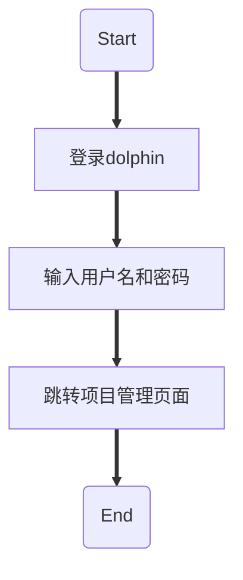
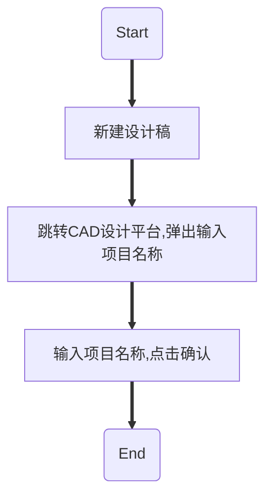
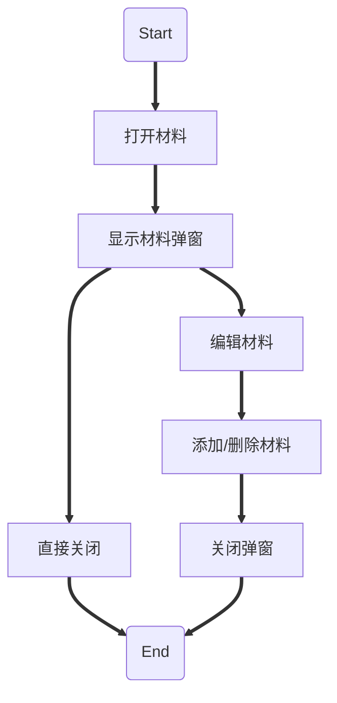
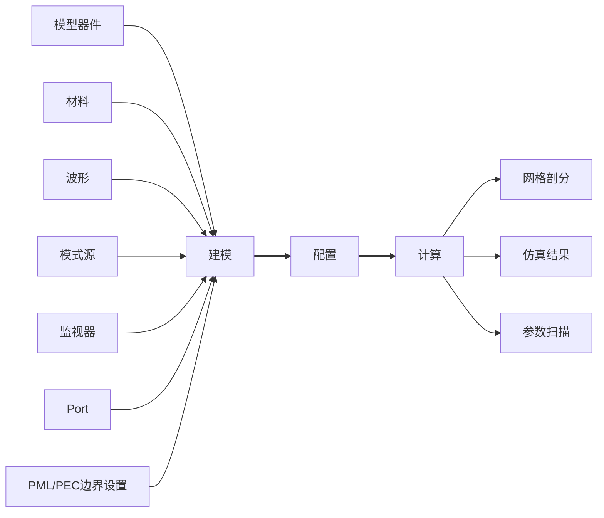
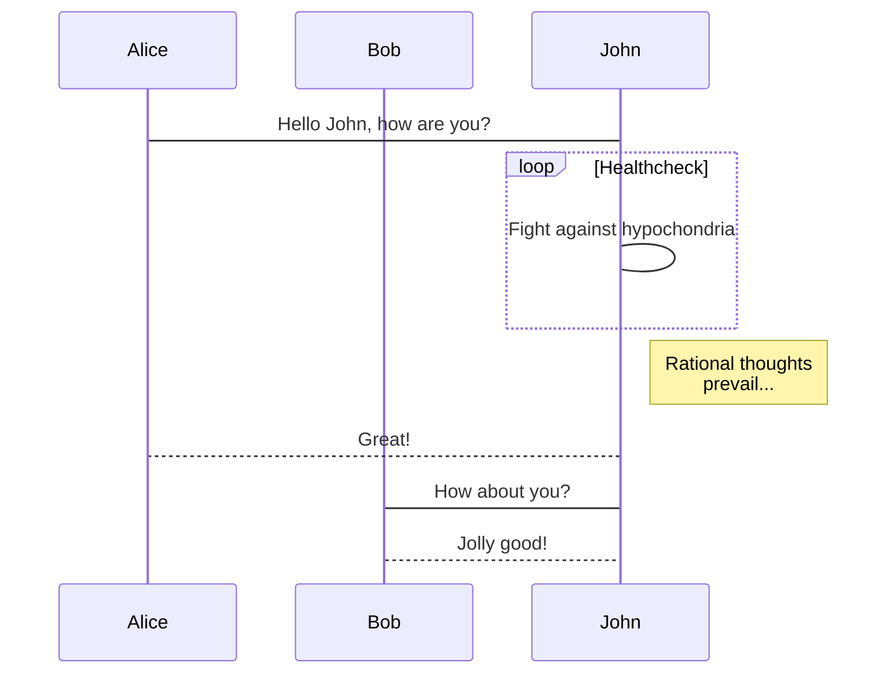

> Just keep doing.

##  20221025 

```ad-note
title: Chrome 内存分析

[使用 Chrome Devtools 分析内存问题 - OKKI前端团队](https://fe.okki.com/post/62cbfea7136f570343d89416/)
[Vue系列之常见内存泄漏定位与解决_51CTO博客_vue内存泄漏](https://blog.51cto.com/u_15127679/3763626)
[Chrome开发者工具之JavaScript内存分析 - 苍青浪 - 博客园](https://www.cnblogs.com/cangqinglang/p/10580297.html)
[CN-Chrome-DevTools/CN-Chrome-DevTools: Chrome开发者工具中文手册](https://github.com/CN-Chrome-DevTools/CN-Chrome-DevTools)
[Chrome开发工具 JavaScript 内存分析-腾讯课堂](https://ke.qq.com/itdoc/chromedevtools/8ko91oeg.html)
[【chrome devtools】前端性能分析之chrome devtools的使用 前端项目内存性能优化的建议 前端浏览器崩溃卡死 前端性能分析实战_ws_code_csdn的博客-CSDN博客_chrome devtools 内存](https://blog.csdn.net/jmszl1991/article/details/116016781)
```

##  20221024 

```ad-note
title: IOC & DI & 前端应用

Ref：

[The Implementation of Inversion of Control based on TypeScript - Jeff Tian](https://jeff-tian.jiwai.win/posts/inversion-of-control-implementation-based-on-typescript-3fl6/)
[theia中的inversifyJS(上)：inversifyJs详解 - 掘金](https://juejin.cn/post/7049717544109752350)
[一统江湖的大前端（10）——inversify.js控制反转 - 掘金](https://juejin.cn/post/6925977528397987847)
[应用前端的IoC框架——InversifyJS - 掘金](https://juejin.cn/post/6951269906629427236)
[前端也要懂的解耦思想：从面向对象到面向接口 - 掘金](https://juejin.cn/post/6938702674476941349)
[前端也要懂的解耦思想：从面向接口到IoC容器 - 掘金](https://juejin.cn/post/6940197570769600525)
[前端也要懂的解耦思想：从IoC容器到DI实现 - 掘金](https://juejin.cn/post/6940990486110797855)
[inversify/InversifyJS: A powerful and lightweight inversion of control container for JavaScript & Node.js apps powered by TypeScript.](https://github.com/inversify/InversifyJS)
[InversifyJS a powerful IoC container for JavaScript apps powered by TypeScript](https://inversify.io/)
[InversifyJS |](https://www.inversify.cn/index.html)
[Introduction · GitBook](https://doc.inversify.cloud/zh_cn/)
[Decorator & Reflect Metadata & InversifyJS | Chenng's Home](https://chenng.cn/posts/Decorator-&-Reflect-Metadata-&-InversifyJS/)
[JavaScript Reflect Metadata 详解 - 简书](https://www.jianshu.com/p/653bce04db0b)
[TypeScript中的装饰器&元数据反射：从新手到专家四 - 知乎](https://zhuanlan.zhihu.com/p/42220487)
[解读 IoC 框架 InversifyJS - 掘金](https://juejin.cn/post/6844903705871925255)
[vuejs/vue-class-component: ES / TypeScript decorator for class-style Vue components.](https://github.com/vuejs/vue-class-component)
[kaorun343/vue-property-decorator: Vue.js and Property Decorator](https://github.com/kaorun343/vue-property-decorator)
[Using InversifyJS in NuxtJS | Damir's Corner](https://www.damirscorner.com/blog/posts/20200724-UsingInversifyjsInNuxtjs.html)
[IoC 在 TypeScript 中的實作 | Goofy](https://blog.cptsai.com/2022/05/21/ioc-implementation/)
[使用IOC解耦React组件 - 简书](https://www.jianshu.com/p/3c9371e180e7)
[从 InversifyJS 学习 IoC 的概念、实现以及在 JS 中的应用 · Issue #86 · Pines-Cheng/blog](https://github.com/Pines-Cheng/blog/issues/86)
[IoC和DI的基本概念及InversifyJS入门 - 掘金](https://juejin.cn/post/6844904119392534535)
[使用 TypeScript 和依赖注入实现一个聊天机器人[每日前端夜话0x76] - 腾讯云开发者社区-腾讯云](https://cloud.tencent.com/developer/article/1440569?from=15425&cps_key=1d358d18a7a17b4a6df8d67a62fd3d3d)
[Better JavaScript? Use TypeScript and Dependency Injection | Toptal](https://www.toptal.com/typescript/dependency-injection-discord-bot-tutorial)
[Ramda Documentation](https://ramdajs.com/)
[Ramda Documentation 中文](https://ramda.cn/)
[2022年国内外前端发展态势 - 掘金](https://juejin.cn/post/7126869314572910600)
[Theia - Cloud and Desktop IDE Platform](https://theia-ide.org/)
```

##  20221021 

Orca 已知问题：

- 目录结构缺乏组织，代码零散，没有实现“低耦合高内聚”
- store 过于杂乱，耦合 API 和视图更新逻辑
- 没有统一规范组织的 API 层
- 业务逻辑、用户交互、计算算法耦合，难以复用和维护
- 环境变量没有统一维护和规范组织，随地引用难以维护
- Typescript 类型定义缺少约定和规范组织
- js 和 ts 共存，ESLint 没有发挥功能
- 整个工程，缺乏页面性能优化。比如预加载、PWA等

```ad-note
title: 每一步操作都需要同步后端服务，这个是否可以优化？

使用PouchDB在客户端存储操作数据，改善服务端压力。

Ref: [淘系前端架构 - 周刊 - 210719 期 - 知乎](https://zhuanlan.zhihu.com/p/390985804)

```

```ad-note
title: Vue & React & rx.js & hook

现代框架 & Hook 使用 rx.js 

Ref:
[useRxState | vuse-rx](https://vuse-rx.raiondesu.rocks/api/use-rx-state.html)
[Update of Vue Rx to Vue Next Rx - DEV Community 👩‍💻👨‍💻](https://dev.to/noprod/update-of-vue-rx-to-rx-vue-next-264g)
[mylabz-xyz/vue-next-rx: RxJS integration for Vue next](https://github.com/mylabz-xyz/vue-next-rx#readme)
[揭秘 Vue 3.0 最具潜力的 API_技术管理_古映杰_InfoQ精选文章](https://www.infoq.cn/article/k2a5yihgxodl3wdujheg)
[vuejs/vue-rx: 👁️ RxJS integration for Vue.js.](https://github.com/vuejs/vue-rx)
[前端框架 Rxjs 实践指北 - 腾讯云开发者社区-腾讯云](https://cloud.tencent.com/developer/article/1830311?cps_key=1d358d18a7a17b4a6df8d67a62fd3d3d)
[更好用的 RxJS+React hooks 集成方案 - 知乎](https://zhuanlan.zhihu.com/p/92248348)
[安装 | Observable Hooks](https://observable-hooks.js.org/zh-cn/guide/#%E4%BD%BF%E7%94%A8)
[frontend-record/与rxjs结合的常用hooks.md at master · yangfan-p/frontend-record](https://github.com/yangfan-p/frontend-record/blob/master/note/%E4%B8%8Erxjs%E7%BB%93%E5%90%88%E7%9A%84%E5%B8%B8%E7%94%A8hooks.md)
[LeetCode-OpenSource/rxjs-hooks: React hooks for RxJS](https://github.com/LeetCode-OpenSource/rxjs-hooks#apis)
[React 中使用 RxJS 优化数据流的处理 - 掘金](https://juejin.cn/post/7105034623431737357)
[你可能不知道的流式 React Hooks（关于组织代码的最佳实践） - 掘金](https://juejin.cn/post/6933018383961194509#heading-23)
[像呼吸一样自然：React hooks + RxJS - 掘金](https://juejin.cn/post/6844903726084259848)
```

```ad-note
title: axios & rx.js

Ref:

[vue axios Reflect Metadata 反射 - Google 搜索](https://www.google.com/search?q=vue+axios+Reflect+Metadata+%E5%8F%8D%E5%B0%84&newwindow=1&sxsrf=ALiCzsbXtPQpJaCC9YIEksrU8r3boeTAMg:1666348002931&ei=4nNSY7HGOLvekPIP9oyEmAs&start=20&sa=N&ved=2ahUKEwixv6WGjvH6AhU7L0QIHXYGAbM4ChDw0wN6BAgEEAk&biw=1920&bih=867&dpr=1)
[如何在React或Vue中使用Angular 的 Rxjs API服务 - 墨天轮](https://www.modb.pro/db/413319)
[抛弃Promise，Nestjs 使用 Rxjs 来处理异步请求 - 来去匆匆](https://blog.ezcomezgo.com/?p=301)
[使用 @ngify/http 响应式 HTTP 客户端处理常见的请求场景 - 掘金](https://juejin.cn/post/7121049508485529614#heading-16)
[这一次，放下 axios，使用基于 rxjs 的响应式 HTTP 客户端 - 掘金](https://juejin.cn/post/7079724273929027597)
[Nest - Rx.js在http请求中的应用 - 简书](https://www.jianshu.com/p/7b9651511a70)
[ReactiveX 学习笔记（25）使用 RxJS + Vue.js 调用 REST API - zwvista - 博客园](https://www.cnblogs.com/zwvista/p/9974653.html)
[JavaScript网络请求(一)：处理race condition竞态问题 | This Js](https://mrxf.github.io/2020/11/04/javascript-web-request-a-race-condition-problem/)
[聊聊RxJS中的错误重试 - Black-Hole's Blog](https://www.bugs.cc/p/rxjs-error-retry/)
[😈换一种方式对工程中的Api进行封装吧（fashion-axios） - 掘金](https://juejin.cn/post/7142653628904701988)
[theia中的inversifyJS(上)：inversifyJs詳解](https://qdmana.com/2022/01/202201061407334259.html)
[Typescript IOC控制反转 101 (2): 基於reflect-metadata的IOC容器 - 掘金](https://juejin.cn/post/7073361691609661453#heading-4)
[Nest - Rx.js在http请求中的应用 - 简书](https://www.jianshu.com/p/7b9651511a70)
[RxJS - Observable](https://rxjs.dev/guide/observable)
[fromPromise · 学习 RxJS 操作符](https://rxjs-cn.github.io/learn-rxjs-operators/operators/creation/frompromise.html)
[【前端】rxjs从入门到灵活使用 - 掘金](https://juejin.cn/post/6844904175231303693#heading-2)
[RxMarbles: Interactive diagrams of Rx Observables](https://rxmarbles.com/#every)
[SubscribableOrPromise | RxJS 中文文档](https://cn.rx.js.org/class/es6/MiscJSDoc.js~SubscribableOrPromiseDoc.html)
[30 天精通 RxJS :: 2017 iT 邦幫忙鐵人賽](https://ithelp.ithome.com.tw/users/20103367/ironman/1199)
[rxjs - RxJS: 简单入门_个人文章 - SegmentFault 思否](https://segmentfault.com/a/1190000012252368)
[RxJS之于异步，就像JQuery之于dom - 董川民](https://www.dongchuanmin.com/xhtml/1512.html)
[面向未来编程（Future-Oriented Programming），建设未来 Vue 生态 - V2EX](https://www.v2ex.com/t/575788)
[@ignorance/vuex-observable | Yarn - Package Manager](https://yarnpkg.com/package/@ignorance/vuex-observable)
[vuex-observable - CodeSandbox](https://codesandbox.io/embed/black-architecture-sb4g8?fontsize=14&hidenavigation=1&theme=dark)
[yesixuan/libs](https://github.com/yesixuan/libs)
[竞态问题与RxJs - WindrunnerMax - 博客园](https://www.cnblogs.com/WindrunnerMax/p/16340215.html)
[RxJS实践，Vue如何集成RxJS - CodeAntenna](https://codeantenna.com/a/sLYdLIuP92)
[认识认识RxJS - OKKI前端团队](https://fe.okki.com/post/622d8d4b4749766fa46f3fab/)
[vue-rxjs-starter，我完全放弃vuex了，用RxJS抽象出一个service，简直不要太爽 - CNode技术社区](https://cnodejs.org/topic/5924f2c0d371b6372a8afce9)
[JavaScript Theory: Promise vs Observable | by Wojciech Trawiński | JavaScript everyday | Medium](https://medium.com/javascript-everyday/javascript-theory-promise-vs-observable-d3087bc1239a)
[使用rxjs和webRTC和vue实现视频流在本地网络上的传输Demo_剑玄录的博客-CSDN博客_vue中使用rxjs](https://blog.csdn.net/yc454477405/article/details/120867889)
```
##  20221020 

创建 Vite + Vue 项目

- mock
- 使用Reflect Metadata & axios 反射接口数据

## 20221019

- [[RxJS]]
- [[Reflect Metadata]]

## 20221018

[[Max-Optics Api]]

- 接口文档不够详细：缺少业务场景和功能描述；
- 接口缺少域名、协议、路径，调用环境不完整；
- 接口字段缺少类型、描述，以及字段的长度限制；

如何使用 [[Javascrip 装饰器]]？

## 20221017

### 登录流程*



![[Pasted image 20221017150236.png]]

- [API Document - login](http://192.168.91.37/api/login/)
- [API Document - get_user](http://192.168.91.37/api/get_user/)
- [API Document - search_projects_for_dolphin](http://192.168.91.37/api/search_projects_for_dolphin/)
- [API Document - circle_summary](http://192.168.91.37/api/circle_summary/)
- [API Document - circle_groups](http://192.168.91.37/api/circle_groups/)
- [API Document - circle_groups](http://192.168.91.37/api/circle_groups/)

> NOTE：circle_groups 接口重复调用

### 建模配置



![[Pasted image 20221017151356.png]]

- [API Document - circle_summary](http://192.168.91.37/api/circle_summary/)

![[Pasted image 20221017151640.png]]

- [API Document - check_token](http://192.168.91.37/api/check_token/)
- [API Document - search_waveforms](http://192.168.91.37/api/search_waveforms/)
- [192.168.91.37/socket.io/?EIO=4&transport=polling&t=OFaoeWG](http://192.168.91.37/socket.io/?EIO=4&transport=polling&t=OFaoeWG)
- [API Document - get_view_configuration](http://192.168.91.37/api/get_view_configuration/)
- [API Document - get_user](http://192.168.91.37/api/get_user/)
- [192.168.91.37/socket.io/?EIO=4&transport=polling&t=OFaoeYO&sid=Y-GfNP269nzvOcaeALOp](http://192.168.91.37/socket.io/?EIO=4&transport=polling&t=OFaoeYO&sid=Y-GfNP269nzvOcaeALOp)
- [192.168.91.37/socket.io/?EIO=4&transport=polling&t=OFaoeYP&sid=Y-GfNP269nzvOcaeALOp](http://192.168.91.37/socket.io/?EIO=4&transport=polling&t=OFaoeYP&sid=Y-GfNP269nzvOcaeALOp)
- [API Document - set_view_configuration](http://192.168.91.37/api/set_view_configuration/)
- [192.168.91.37/socket.io/?EIO=4&transport=polling&t=OFaq5zx&sid=f9RrhFyxLm8UV3NpALPZ](http://192.168.91.37/socket.io/?EIO=4&transport=polling&t=OFaq5zx&sid=f9RrhFyxLm8UV3NpALPZ)
- [API Document - get_public_materials](http://192.168.91.37/api/get_public_materials/)
- [API Document - search_materials](http://192.168.91.37/api/search_materials/)
- [API Document - search_projects](http://192.168.91.37/api/search_projects/)
- [API Document - search_projects](http://192.168.91.37/api/search_projects/)

![[Pasted image 20221017152243.png]]

- [API Document - search_projects](http://192.168.91.37/api/search_projects/)
- [API Document - search_projects](http://192.168.91.37/api/search_projects/)
- [API Document - create_project](http://192.168.91.37/api/create_project/)
- [API Document - open_project](http://192.168.91.37/api/open_project/)
- [API Document - save_project](http://192.168.91.37/api/save_project/)
- [API Document - load_project](http://192.168.91.37/api/load_project/)
- [API Document - autoSave_project](http://192.168.91.37/api/autoSave_project/)
- [API Document - set_project_configuration](http://192.168.91.37/api/set_project_configuration/)
- [API Document - set_project_configuration](http://192.168.91.37/api/set_project_configuration/)
- [API Document - get_tasks](http://192.168.91.37/api/get_tasks/)

#### 材料编辑



![[Pasted image 20221017154026.png]]

- [API Document - get_public_materials](http://192.168.91.37/api/get_public_materials/)
- [API Document - search_materials](http://192.168.91.37/api/search_materials/)

![[Pasted image 20221017154110.png]]

- [API Document - change_materials](http://192.168.91.37/api/change_materials/)

![[Pasted image 20221017162600.png]]

- [API Document - create_material](http://192.168.91.37/api/create_material/)
- [API Document - delete_material](http://192.168.91.37/api/delete_material/)

#### 波形编辑


![[Pasted image 20221017165120.png]]

- [API Document - search_waveforms](http://192.168.91.37/api/search_waveforms/)
- [API Document - change_waveforms](http://192.168.91.37/api/change_waveforms/)
- [API Document - create_waveform](http://192.168.91.37/api/create_waveform/)
- [API Document - delete_many_waveforms](http://192.168.91.37/api/delete_many_waveforms/)

#### 模型器件编辑

![[Pasted image 20221017171707.png]]
#### 算法模拟

![[Pasted image 20221017165941.png]]

#### 模式源编辑

#### 监视器编辑

#### Port 编辑

### 运行计算

#### 仿真计算

#### 网格剖分

#### 参数扫描

### 快捷操作

#### Ctrl + s（保存）

#### Ctrl + z（撤回）

## 20221014

Orca 插件化思考？
- [大型 Web 应用插件化架构探索 - 掘金](https://juejin.cn/post/6916863150872592392)
- [前端进阶：跟着开源项目学习插件化架构 - 掘金](https://juejin.cn/post/6844904196689379335)
- [前端插件化架构的探索和实践（上篇） - 掘金](https://juejin.cn/post/6867718721348042765)
- [前端插件化架构的思考 - 掘金](https://juejin.cn/post/6844904090275676168)
- [实现前端插件化架构设计，将需求开发「交给别人」 - 掘金](https://juejin.cn/post/7118929960038842381)
- [插件化设计模式在前端领域的应用](https://webfe.kujiale.com/cha-jian-hua-she-ji-mo-shi-zai-qian-duan-ling-yu-de-ying-yong/)

![[Pasted image 20221016185201.png]]


```markdown
https://wangxiao.xisaiwang.com/tiku2/report505792958.html?isSubPaper=Y
https://wangxiao.xisaiwang.com/tiku2/ctjx505792958.html
```

## 20221013

功能流程：







## 20221012

10 月工作任务：
- Orca 业务功能流程图和依赖接口时序图
- visualizer 组件优化：VTable.vue、VController.vue
- Orca 功能检查和优化建议

Orca 功能模块：
- CAD 建模
	- 模型器件（Structures）
	- 模式源（Source）
	- 监视器（Monitor）
	- 解算器（Port）
	- 网格剖分（Remesh）
	- 材料管理（Material）
	- 波形（Waveforms）
- 算法模拟器（Simulation）
	- FDTD
	- EME
	- FDE
- 栏目/视窗
	- 菜单栏
	- 快捷栏
	- 工具栏
	- 状态栏
	- objects展示列表（Objects Tree）
	- 仿真结果（Results View）
	- 参数扫描（Optimizations and Sweeps）
	- 任务树（Task Tree）


## 20221011
整体优化方案

-   项目工程结构优化
-   visualizer 组件优化
-   Angelfish 组件迁移
-   计算公式封装
-   补充 Typescript 类型定义
-   补充代码注释

第一期改造点：

1.  visualizer 组件优化：VTable.vue、VController.vue
2. Angelfish 组件迁移：draw 和 modules 文件夹下的部分组件使用 Angelfish 重写

> 主要是2方面的优化：1) Typescript 改造和补充类型定义; 2) template 逻辑优化；

## 20221010

- 代码追溯大会
- 熟悉 orca 代码

## 20221009

- 电脑环境配置
- 获取代码，并启动项目
- 新人培训：光电芯片知识

## 20221008

- 公司入职
- 新人入职材料
- 门禁卡
- 开通 IT 权限：电脑密码，代码仓库访问权限
