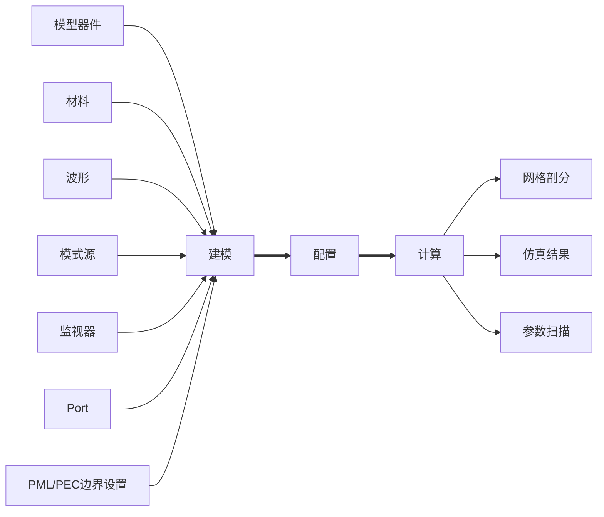
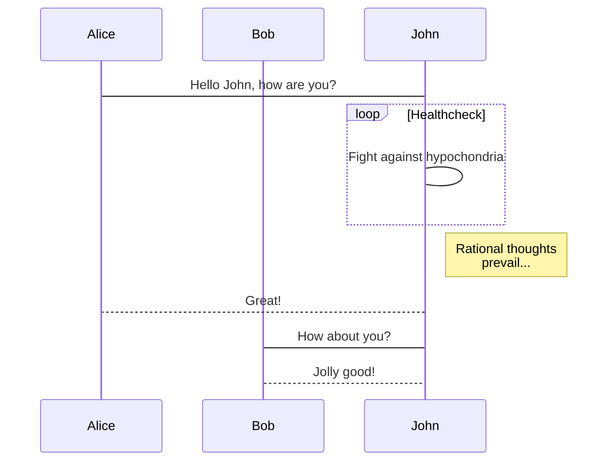

> Just keep doing.

##  20230317 

[vite build error: out of memory · Issue #2433 · vitejs/vite](https://github.com/vitejs/vite/issues/2433)
[julienXX/terminal-notifier: Send User Notifications on macOS from the command-line.](https://github.com/julienXX/terminal-notifier)
[构建选项 | Vite 官方中文文档](https://cn.vitejs.dev/config/build-options.html#build-sourcemap)
[vite copy files 文件 - Google 搜索](https://www.google.com/search?q=vite+copy+files+%E6%96%87%E4%BB%B6&newwindow=1&sxsrf=AJOqlzW8KIEgM8ttBFov40hMB8EPrlsF_g%3A1679032454033&ei=hgAUZJzTAab3kPIPpOqkyAg&ved=0ahUKEwicrvSno-L9AhWmO0QIHSQ1CYkQ4dUDCBA&uact=5&oq=vite+copy+files+%E6%96%87%E4%BB%B6&gs_lcp=Cgxnd3Mtd2l6LXNlcnAQAzIFCCEQoAEyBQghEKABMgUIIRCgATIFCCEQoAE6CggAEEcQ1gQQsAM6BAgjECc6CAgAEIAEEMsBOgUIABCABDoECAAQHjoGCAAQCBAeOgYIABAFEB5KBAhBGABQxwdYxBVgshdoAXABeACAAbMDiAHOEJIBBzItMS40LjGYAQCgAQHIAQfAAQE&sclient=gws-wiz-serp)
[vue.js - Vite - Static Files Are Not Copying - Stack Overflow](https://stackoverflow.com/questions/69540063/vite-static-files-are-not-copying)
[vite-plugin-files-copy/main.js at main · tcly861204/vite-plugin-files-copy](https://github.com/tcly861204/vite-plugin-files-copy/blob/main/main.js)
[Vite打包静态文件拷贝需求 - sanvae - 博客园](https://www.cnblogs.com/sanvae/p/14764716.html)
[sapphi-red/vite-plugin-static-copy: rollup-plugin-copy with dev server support.](https://github.com/sapphi-red/vite-plugin-static-copy#readme)
[Yarn Workspace使用指南 - 知乎](https://zhuanlan.zhihu.com/p/381794854)
[Vite+Electron快速构建一个VUE3桌面应用(二)——动态模块热重载 - 知乎](https://zhuanlan.zhihu.com/p/422648687)


##  20230316 

> Vite Build Error: FATAL ERROR: Reached heap limit Allocation failed - JavaScript heap out of memory


[vite build error: out of memory · Issue #2433 · vitejs/vite · GitHub](https://github.com/vitejs/vite/issues/2433)

[企业工作台 - 上海曼光信息科技有限公司](https://e.gitee.com/max-optics/dashboard)
[node 插件 rimraf 介绍 - 简书](https://www.jianshu.com/p/3c825f5d27b4)
[Vite Electron 热更新 - Google 搜索](https://www.google.com/search?q=Vite+Electron+%E7%83%AD%E6%9B%B4%E6%96%B0&newwindow=1&sxsrf=AJOqlzXyaldAx_XRA-rr71rJFckPNM4OSw%3A1678935113817&ei=SYQSZIS9MYnT-Qadl7r4AQ&ved=0ahUKEwjEhb3YuN_9AhWJad4KHZ2LDh8Q4dUDCA8&uact=5&oq=Vite+Electron+%E7%83%AD%E6%9B%B4%E6%96%B0&gs_lcp=Cgxnd3Mtd2l6LXNlcnAQAzIFCAAQogQyBQgAEKIEMgUIABCiBDIFCAAQogQyBQgAEKIEOggIABCiBBCwAzoFCAAQgAQ6BAgAEB46BggAEAcQHjoICAAQBxAeEAo6CAgAEIAEEMsBOgcIABANEIAEOgYIABAIEB46BQghEKABSgQIQRgBUI4LWLFPYI1RaAhwAHgBgAGvBIgB6yeSAQkyLTIuNi4zLjKYAQCgAQKgAQHIAQLAAQE&sclient=gws-wiz-serp)
[electron-vite：新一代 Electron 开发利器，带你轻松玩转 Electron - 掘金](https://juejin.cn/post/7137987061176336397)
[npm script工作流(六) 跨平台兼容 - 简书](https://www.jianshu.com/p/497867f631e2)
[npm script 跨端兼容的实现 - 掘金](https://juejin.cn/post/6844903860864188430)
[构建选项 | Vite 官方中文文档](https://cn.vitejs.dev/config/build-options.html#build-sourcemap)
[Playground - OpenAI API](https://platform.openai.com/playground/p/default-chat?mode=chat)
[Vite+Electron快速构建一个VUE3桌面应用(二)——动态模块热重载 - 知乎](https://zhuanlan.zhihu.com/p/422648687)
[Vite+Electron快速构建一个VUE3桌面应用(三)——打包 - 知乎](https://zhuanlan.zhihu.com/p/423211730)
[Issues · Kuari/Blog](https://github.com/Kuari/Blog/labels/Electron)
[console.group - 搜索](https://cn.bing.com/search?q=console.group&qs=CT&pq=console.gr&sc=10-10&cvid=F7ECD296DE9B4E259DD7CEA5F89C90BB&FORM=QBLH&sp=1&lq=0)
[你需要知道的 19 个 console 实用调试技巧 - 掘金](https://juejin.cn/post/7025399805878730788#heading-10)
[console.group - Web API 接口参考 | MDN](https://developer.mozilla.org/zh-CN/docs/Web/API/Console/group)
[lerna nohoist 管理 - Google 搜索](https://www.google.com/search?newwindow=1&sxsrf=AJOqlzXWg51AI7tFexjkOsqbBtWHRR6YRg:1678955145180&q=lerna+nohoist+%E7%AE%A1%E7%90%86&spell=1&sa=X&ved=2ahUKEwiEwpaog-D9AhVNPUQIHZNTCuQQBSgAegQICBAB&biw=1728&bih=767&dpr=1)
[Lerna 多包管理工具的萌新探索 // 圆方](https://www.lumin.tech/articles/what-is-lerna/)
[Lerna的依赖管理及hoisting浅析 | ￥ЯႭ1I0](https://yrq110.me/post/tool/how-lerna-manage-package-dependencies/)
[nohoist in Workspaces | Yarn Blog](https://classic.yarnpkg.com/blog/2018/02/15/nohoist/)
[深入理解 yarn 中的 nohoist 机制 · Issue #72 · chenxiaochun/blog](https://github.com/chenxiaochun/blog/issues/72)
[Yarn Workspaces - 用 nohoist 避免指定依賴被移到根目錄](https://blog.kvzl.net/posts/yarn-workspaces-nohoist)
[使用Yarn Workspace管理多project repo • OnionTalk](https://www.hateonion.me/posts/b2b0/)
[Monorepo最佳实践之Yarn Workspaces - 掘金](https://juejin.cn/post/7011024137707585544#heading-17)
[yarn workspace如何处理不同版本的外部依赖关系？ - 李小菜丶 - 博客园](https://www.cnblogs.com/bq-med/articles/16371359.html)
[多项目逻辑复用与monorepo_shymean](https://shymean.com/article/%E5%A4%9A%E9%A1%B9%E7%9B%AE%E9%80%BB%E8%BE%91%E5%A4%8D%E7%94%A8%E4%B8%8Emonorepo)
[lerna nohoist use - Google 搜索](https://www.google.com/search?q=lerna+nohoist+use&newwindow=1&sxsrf=AJOqlzV-4Ag3YAq_i7483UVN9xTgslot6g%3A1678958061985&ei=7d0SZKzkO4X8kPIP8aKO4A4&ved=0ahUKEwjsjoKXjuD9AhUFPkQIHXGRA-wQ4dUDCA8&uact=5&oq=lerna+nohoist+use&gs_lcp=Cgxnd3Mtd2l6LXNlcnAQAzIFCCEQoAEyBQghEKABMgUIIRCgAToKCAAQRxDWBBCwAzoICAAQgAQQywE6BAgAEB46BggAEAgQHkoECEEYAFCuBli2EWCJFmgBcAF4AIABkQOIAa4NkgEHMi0xLjMuMZgBAKABAcgBA8ABAQ&sclient=gws-wiz-serp)
[nohoist in Workspaces | Yarn Blog](https://classic.yarnpkg.com/blog/2018/02/15/nohoist/)
[yarn-nohoist-examples/package.json at master · connectdotz/yarn-nohoist-examples](https://github.com/connectdotz/yarn-nohoist-examples/blob/master/workspaces-examples/universal-cipher/package.json)
[Lerna 多包管理工具的萌新探索 - 知乎](https://zhuanlan.zhihu.com/p/409104356)
[脚手架开发：Lerna简介 | CHENHUOJUN BLOG](https://www.chenhuojun.com/2021/07/08/%E8%84%9A%E6%89%8B%E6%9E%B6%E5%BC%80%E5%8F%91%EF%BC%9Alerna%E7%AE%80%E4%BB%8B/#lerna-clean)
[Workspaces in Yarn | Yarn Blog](https://classic.yarnpkg.com/blog/2017/08/02/introducing-workspaces/)


##  20230314 

```ad-note
title: Git 原理

[Git实用技巧和原理解读](https://colstuwjx.github.io/2020/11/git%E5%AE%9E%E7%94%A8%E6%8A%80%E5%B7%A7%E5%92%8C%E5%8E%9F%E7%90%86%E8%A7%A3%E8%AF%BB/)
[图解git原理的几个关键概念 | Tony Bai](https://tonybai.com/2020/04/07/illustrated-tale-of-git-internal-key-concepts/)
[这才是真正的Git——Git原理及实用技巧](https://www.lzane.com/slide/git-under-the-hood/#/)

```

```ad-note
title: Git 常用技巧

[Advanced Git Log | Atlassian Git Tutorial](https://www.atlassian.com/git/tutorials/git-log)
[分享个人珍藏的 Git 使用技巧 | DevTools优质外文翻译 | 开发者工具论坛](https://learnku.com/devtools/t/37366)
[521xueweihan/git-tips: Git的奇技淫巧](https://github.com/521xueweihan/git-tips#git-%E9%85%8D%E7%BD%AE-http-%E5%92%8C-socks-%E4%BB%A3%E7%90%86)
[这才是真正的Git——分支合并 - LZANE | 李泽帆（靓仔）](https://www.lzane.com/tech/git-merge/)
[Git实用技巧35招 - CherishTheYouth - 博客园](https://www.cnblogs.com/CherishTheYouth/p/CherishTheYouth_20210426.html)
[批量删除git 本地分支、远程分支、tag - yo水平 - 博客园](https://www.cnblogs.com/yoable/p/8124343.html)
[Git-骚操作-批量删除分支 - 掘金](https://juejin.cn/post/6844903760381083662)

```

[What RegEx will match all loopback addresses?](https://stackoverflow.com/questions/8426171/what-regex-will-match-all-loopback-addresses)
> 匹配本地地址

```ad-note
title: Git Object

[这个 git 命令你每天都在用，但你却不知道 - 掘金](https://juejin.cn/post/7209852117296611384?)
[理解了这 3 个 object，你甚至能自己写个 git！ - 掘金](https://juejin.cn/post/7205517870976499770)
[Git's database internals I: packed object store | The GitHub Blog](https://github.blog/2022-08-29-gits-database-internals-i-packed-object-store/)
[Git Tutorial: Working with git objects using "git cat-file" - DevOpsSchool.com](https://www.devopsschool.com/blog/git-tutorial-working-with-git-objects-using-git-cat-file/)
[深入 Git：Git 物件儲存 - blob 物件 | Titangene Blog](https://titangene.github.io/article/git--blob-object.html)
[Git - Git Objects](https://git-scm.com/book/zh-tw/v2/Git-Internals-Git-Objects)
[Understanding the Fundamentals of Git](https://towardsdatascience.com/understanding-the-fundamentals-of-git-25b5b7ded3c4)

```

```ad-note
title: 每日一跃

[Typescript的interface自动化生成API文档 - 掘金](https://juejin.cn/post/7181271791468281913?)
[Vue3 如何实现一个带遮罩的 dialog 对话框 - 掘金](https://juejin.cn/post/7182585412508975165?)
[你还在用传统方法进行深浅拷贝？教你一种更现代的方法！ - 掘金](https://juejin.cn/post/7209226686372692029?)
[生产上的问题你不会用 sourcemap 定位吗？ - 掘金](https://juejin.cn/post/7209648356530962489?)

```

```ad-note
title: git flow & 问题排查

[git查看某次提交修改的文件 - Google 搜索](https://www.google.com/search?newwindow=1&sxsrf=AJOqlzU15Y942ZR0P-1V7-1cZjClqYkIJg%3A1678771387253&lei=uwQQZJSFD8HmkPIPmKWBwAI&q=git%E6%9F%A5%E7%9C%8B%E6%9F%90%E6%AC%A1%E6%8F%90%E4%BA%A4%E4%BF%AE%E6%94%B9%E7%9A%84%E6%96%87%E4%BB%B6&ved=2ahUKEwjUzsjh1tr9AhVBM0QIHZhSACgQsKwBKAN6BAhWEAQ&biw=1728&bih=768&dpr=1)
[git 查看最近或某一次提交修改的文件列表相关命令整理 - 习惯沉淀 - 博客园](https://www.cnblogs.com/yadongliang/p/14547608.html)
[git 看某次commit改了哪些文件 | emila](https://emila-github.github.io/2017/03/24/git%20-%20%E7%9C%8B%E6%9F%90%E6%AC%A1commit%E6%94%B9%E4%BA%86%E5%93%AA%E4%BA%9B%E6%96%87%E4%BB%B6/)
[Git查看某次提交所修改的文件](https://www.bitlogs.tech/2020/08/git%E6%9F%A5%E7%9C%8B%E6%9F%90%E6%AC%A1%E6%8F%90%E4%BA%A4%E6%89%80%E4%BF%AE%E6%94%B9%E7%9A%84%E6%96%87%E4%BB%B6/)
[Find what changed in a Git commit | Opensource.com](https://opensource.com/article/21/4/git-whatchanged)
[git - How do I list all the files in a commit? - Stack Overflow](https://stackoverflow.com/questions/424071/how-do-i-list-all-the-files-in-a-commit)
[Git - 维护项目](https://git-scm.com/book/zh/v2/%E5%88%86%E5%B8%83%E5%BC%8F-Git-%E7%BB%B4%E6%8A%A4%E9%A1%B9%E7%9B%AE#_the_shortlog)

```

##  20230313 

```ad-note
title: input file & showOpenFilePicker

[不使用file类型input也能触发文件上传 « 张鑫旭-鑫空间-鑫生活](https://www.zhangxinxu.com/wordpress/2021/08/file-system-access-api/)
[Web APIs - File.webkitRelativePath 非标准的。这个功能不是标准的轨道。](https://runebook.dev/zh/docs/dom/file/webkitrelativepath)
[File Upload, Mastering These 8 Scenarios Is Enough | by Bytefer | JavaScript in Plain English](https://javascript.plainenglish.io/file-upload-mastering-these-8-scenarios-is-enough-ef392eda7e68)
[读取文件/文件夹并回显 - 只有时间是永恒 - 博客园](https://www.cnblogs.com/bbdbolg/p/14691384.html)
[input| MDN](https://developer.mozilla.org/zh-CN/docs/Web/HTML/Element/input/file#%E9%9D%9E%E6%A0%87%E5%87%86%E5%B1%9E%E6%80%A7)
["webkitRelativePath" | Can I use... Support tables for HTML5, CSS3, etc](https://caniuse.com/?search=webkitRelativePath)
[(3条消息) 从 23.9K 的前端开源项目我学到了啥？_fe_lucifer的博客-CSDN博客](https://blog.csdn.net/azl397985856/article/details/121187008)
[js showOpenFilePicker showSaveFilePicker showDirectoryPicker API - Ajanuw - 博客园](https://www.cnblogs.com/ajanuw/p/13788051.html)
[FileSaver.js](https://github.com/eligrey/FileSaver.js)

```

##  20230310 

[vite使用nodeJS内置的模块 - 灯塔下的守望者 - 博客园](https://www.cnblogs.com/tangyouwei/p/vite-uses-nodejs-built-in-modules-z12udha.html)

```ad-note
title: Electron & 刷新 & 热键

[(3条消息) electron遇到的问题_electron 禁用ctrl+r_monikaH的博客-CSDN博客](https://blog.csdn.net/qq_40072782/article/details/106889053)
[Electron 项目搭建 - 掘金](https://juejin.cn/post/6844904053915254797#heading-0)

```

```md
https://github.com/mrdoob/three.js
https://github.com/Ovilia/ThreeExample.js
https://www.jianshu.com/p/a9960941ddf2
https://segmentfault.com/a/1190000041531427
https://juejin.cn/post/7108724284721201159
https://troisjs.github.io/guide/
https://zhuanlan.zhihu.com/p/560349448
http://www.webgl3d.cn/pages/2e5d69/
https://threejs.org/docs/index.html#manual/zh/introduction/Creating-a-scene
https://vuejsexamples.com/tag/three-js/
https://juejin.cn/post/7056241894451314725
https://typescript-eslint.io/linting/typed-linting/monorepos
https://typescript-eslint.io/rules/triple-slash-reference/
https://typescript-eslint.io/rules/ban-types/
https://main--typescript-eslint.netlify.app/architecture/parser
https://typescript-eslint.io/linting/troubleshooting/#i-get-errors-telling-me-eslint-was-configured-to-run--however-that-tsconfig-does-not--none-of-those-tsconfigs-include-this-file
https://typescript-eslint.io/linting/typed-linting/
https://juejin.cn/post/7207417288705458231?

```

##  20230309 

com.docker.backend cannot start Exit code 101

```sh
pkill -9 -fl "com.docker.backend"
```

> [Fatal Error com.docker.backend cannot start Exit code 101 · Issue #6565 · docker/for-mac · GitHub](https://github.com/docker/for-mac/issues/6565)

```ad-note
title: 每日一跃

[可以在浏览器页面运行 node 代码了！webContainer 发布 1.0 - 掘金](https://juejin.cn/post/7201464975722332216?)
[为什么越来越多的项目选择 Monorepo？ - 掘金](https://juejin.cn/post/7207743145999368229?)
[TS泛型进阶 - 掘金](https://juejin.cn/post/7170662948656906253?#heading-20)
[模拟实现 PNPM Monorepo 的依赖项管理功能 - 掘金](https://juejin.cn/post/7207787191622942776?)
[aspect-ratio很爽，却是低版本浏览器的噩梦 - 掘金](https://juejin.cn/post/7206239061585526841?)
[Electron开发： 踩坑windows与macOS平台开发差异 - 掘金](https://juejin.cn/post/7208050893055934519?)
[开发弹窗，你使用状态驱动还是命令式？ - 掘金](https://juejin.cn/post/7182393187917365305?)
[xijs, 一款开箱即用的开源工具库 - 掘金](https://juejin.cn/post/7208111879150911544?)
[仿贝壳app全景看房（React+Mobx+Egg+Three.js入门级全栈实战项目） - 掘金](https://juejin.cn/post/7189993796749721637?#heading-12)
[5W1H 带你入门 Monorepo - 掘金](https://juejin.cn/post/7207689082184974394?)

```

```ad-note
title: Obsidian & Word

[pandoc插件导出word格式 正确识别本地图片 - 经验分享 - Obsidian 中文论坛](https://forum-zh.obsidian.md/t/topic/1930/14)
[obsidian导出带图片的word - 知乎](https://zhuanlan.zhihu.com/p/570748937)
[Obsidian 导出 Word 方法](https://www.uncoverman.com/the-way-markdown-to-word-in-obsidian.html)

```

##  20230308 

[[单机版启动缓慢调查]]

[Mac下配置Aria2](https://gist.github.com/maboloshi/a4b1f27567319d4a42352aadd036a578)

[GitHub - binux/ThunderLixianExporter: export thunder lixian url to aria2/wget](https://github.com/binux/ThunderLixianExporter)

[Aria2 GUI最佳实践](https://jacobchang.cn/best-practices-of-aria2.html)

```ad-note
title: mac & docker & windows

[如何使用 Wine 在 Mac 上运行 Windows 程序|windows|mac|应用程序|虚拟机|exe_网易订阅](https://www.163.com/dy/article/HG1HH5V60552E671.html)
[Mac使用技巧：mac wine打开exe文件方法，让Mac运行Windows软件](https://pc.poppur.com/Mac/7923.html)
[第一杯红酒：Wine让Windows程序运行在Linux上 - 啦哆咪](https://lado.me/2017/04/27/wine-run-windows-program-on-linux/)
[迁移到 MacBook Pro M1 Max - 张志敏的技术专栏](https://beginor.github.io/2022/03/14/move-to-macbook-pro-m1-max.html)
[macbook air m1安装win10虚拟机 - 知乎](https://zhuanlan.zhihu.com/p/363732520)
[Download Windows Insider Preview ARM64](https://www.microsoft.com/en-us/software-download/windowsinsiderpreviewARM64)
[给 mac 虚拟机装个 windows · 雪之梦](https://snowdreams1006.github.io/tools/mac-vmware-install-windows.html)
[Docker：在 Docker 安装部署 Windows 镜像容器 - 简书](https://www.jianshu.com/p/4d02f7f84cf2)
[获取镜像 - Docker — 从入门到实践](https://yeasy.gitbook.io/docker_practice/image/pull)
[Windows 容器基础映像 | Microsoft Learn](https://learn.microsoft.com/zh-cn/virtualization/windowscontainers/manage-containers/container-base-images)
[Windows Server Core by Microsoft | Docker Hub](https://hub.docker.com/_/microsoft-windows-servercore)

```

![[Pasted image 20230308111926.png]]

```sh
git checkout wyffix2
git log --since="2023-02-14" --until="2023-02-21" --pretty=format:"%h, %cd, %an : %s"
```

![[Pasted image 20230308093654.png]]

![[Pasted image 20230308140834.png]]

![[Pasted image 20230308140839.png]]

##  20230307 

```ad-note
title: webGL

https://blog.csdn.net/qq_39009348/article/details/118157654
https://www.jianshu.com/p/b56694de7c44
http://psy-data.github.io/2015/charts_page5.html
https://blog.csdn.net/qq_45797116/article/details/111665440
https://zhuanlan.zhihu.com/p/470120132
https://echarts.apache.org/examples/zh/index.html#chart-type-heatmap
https://echarts.apache.org/examples/zh/editor.html?c=heatmap-cartesian
https://echarts.apache.org/examples/zh/editor.html?c=heatmap-large
https://echarts.apache.org/examples/zh/editor.html?c=map-bin
https://juejin.cn/post/6982193464104468488#heading-1
https://juejin.cn/post/7167731031473291301
https://juejin.cn/post/6855916221465362446
https://github.com/GrayMind/WebGL-Programming-Guide
https://juejin.cn/post/6992023855384494116#heading-4
https://juejin.cn/post/6966027504943366151#heading-5
https://juejin.cn/post/6950819358645944351

```

```ad-note
title: 单机版启动缓慢调查

1. 构建包检查

- MOPassive-2.1.0.0+build.02211700-setup 正常；
- MOPassive-2.1.0.0+build.02231658-setup 打不开；

0221之前的构建包启动正常，0223之后的版本均启动缓慢。

2. 代码检查

- 代码分支：testDev
- 找出0221-0223之间提交的代码
- [feat(orca): add select color](http://gitlab.max.com/mo/aquaman/-/merge_requests/52/commits?commit_id=0c6147f04766c1c42b5b3763f68587becd5cd7a4)该次合并后，单机版开始出现启动缓慢；

```

```sh
git checkout testDev
git log --since="2023-02-21" --until="2023-02-23" --pretty=format:"%h, %cd, %an : %s"
```

```
b06e1adf0 n
54ca68681 
759a5e09f n
abcf18cc9 n
abb52cc46 y
3c46f8c22 y
```

![[Pasted image 20230307145017.png]]

```sh
30f2916aab883003d11078a7a6bdb86ad0d5a5ab n
ece28a44a9cc4a97051a6849e3bfe0e1cedf7045 y
```

![[Pasted image 20230308094730.png]]

[Git - Viewing the Commit History](https://git-scm.com/book/en/v2/Git-Basics-Viewing-the-Commit-History)

[git命令对某段时间内项目提交记录进行查询](https://blog.csdn.net/BlessLj/article/details/95365621)


##  20230306 

```ad-note
title: Vue & defineAsyncComponent

[🧩 Vue 深入组件开发☞#异步组件# - 掘金](https://juejin.cn/post/7109083455601770533)
[Dynamic component imports doesn't work · Issue #15448 · nuxt/nuxt](https://github.com/nuxt/nuxt/issues/15448)

```

##  20230303 

如果修改了 `node_modules` 文件，使用 pnpm 安装的项目依赖包会被全部影响。

例如，项目 A 使用了依赖包 foo，如果无意间修改了依赖包 foo 中的内容，那么其他项目中的引用的 foo 也会被修改。

解决办法：

```sh
# 进入项目中，删除 foo
pnpm remove foo
# 从 store 中删除 foo 
pnpm prune foo
# 再次安装 foo
pnpm add foo
```

[pnpm prune](https://pnpm.io/zh/cli/prune)

```ad-note
title: npm workspaces

[前端 - workspaces - monorepo实战 - 岁月是把杀猪刀 - SegmentFault 思否](https://segmentfault.com/a/1190000041264204)
[npm的workspace原理和使用，yyds - 掘金](https://juejin.cn/post/7056644043098456071)
[热乎乎的 workspaces 替代 npm link 调试的新方式 - 简书](https://www.jianshu.com/p/b76d06b3eb58)
[Ruan Martinelli - Getting Started with npm Workspaces](https://ruanmartinelli.com/posts/npm-7-workspaces-1)

```

##  20230301 

[The best Vue.js Frameworks 2023](https://madewithvuejs.com/blog/the-best-vue-js-frameworks)

[Vue3.2 + Element-Plus 二次封装 el-table（Pro版🚀🚀） - 掘金](https://juejin.cn/post/7166068828202336263)

##  20230228 

```ad-note
title: bind

[手写bind - 知乎](https://zhuanlan.zhihu.com/p/54285383)
[解析 bind 原理，并手写 bind 实现 · Issue #81 · sisterAn/JavaScript-Algorithms](https://github.com/sisterAn/JavaScript-Algorithms/issues/81)

```

```ad-note
title: axios & electron & node

[Complete Guide to Axios HTTP Client](https://reflectoring.io/tutorial-guide-axios/)
[react native - How to get a local file using axios? - Stack Overflow](https://stackoverflow.com/questions/49235628/how-to-get-a-local-file-using-axios)
[Getting local files (file://) fail after upgrading from 0.18.0 to 0.19.0 · Issue #2416 · axios/axios](https://github.com/axios/axios/issues/2416)
[(3条消息) NodeJS获取当前目录和运行文件所在目录_彭世瑜的博客-CSDN博客_nodejs 当前目录](https://blog.csdn.net/mouday/article/details/105325635)
[05_Node js 文件管理模块 fs - 掘金](https://juejin.cn/post/6844903778177515534)
[electron如何获取当前主程序的路径，如何获取主程序名称](https://newsn.net/say/electron-getpath.html)
[得物商家客服桌面端Electron技术实践 - 掘金](https://juejin.cn/post/7195447709904404536)

```

##  20230227 

```ad-note
title: weChat & chatGPT

[我的个人微信也迅速接入了 ChatGPT - 掘金](https://juejin.cn/post/7176813187705077816)
[openAi | Zzh's note](https://1270001.xyz/ChatGPT.html)
[重磅：使用UOS微信桌面版协议登录，wechaty免费版web协议重放荣光 | Wechaty](https://wechaty.js.org/2021/04/13/wechaty-uos-web/)
[5分钟把ChatGPT装进微信里 | Wechaty](https://wechaty.js.org/2022/12/07/play-chatgpt-with-wechaty/)
[wechaty-chatgpt/index.js at main · sunshanpeng/wechaty-chatgpt](https://github.com/sunshanpeng/wechaty-chatgpt/blob/main/index.js)
[eatmoreapple/openwechat: golang微信SDK](https://github.com/eatmoreapple/openwechat)
[wux-weapp/wxbot: 微信机器人，个人微信号小助手平台， nodejs + nuxt + wechaty 技术栈](https://github.com/wux-weapp/wxbot)
[快速开始 - Wechaty](https://wechaty.gitbook.io/wechaty/v/zh/quick-start)
[账号管理 | 微信开放文档](https://developers.weixin.qq.com/doc/aispeech/platform/account/accounts.html)

```

```ad-note
title: chatGPT

[Javascript 原生实现](https://chat.openai.com/chat)
[chatgpt 注册 - 搜索 - 掘金](https://juejin.cn/search?query=chatgpt%20%E6%B3%A8%E5%86%8C&utm_source=gold_browser_extension&utm_medium=search)
[我的个人微信也迅速接入了 ChatGPT - 掘金](https://juejin.cn/post/7176813187705077816)
[超详细的ChatGPT注册教程来了 - 掘金](https://juejin.cn/post/7175917144025071673#heading-5)
[OpenAI 推出超神 ChatGPT 注册攻略来了 - 掘金](https://juejin.cn/post/7173447848292253704#heading-1)
[获取虚拟手机号码。短期手机号码。手机短信激活服务](https://sms-activate.org/getNumber)
[10分钟教你搭建属于自己的ChatGPT微信机器人_哔哩哔哩_bilibili](https://www.bilibili.com/video/BV11D4y1h7iC/?vd_source=428347ad0cd2408b9ee76fe8f1afb202)
[ChatGPT能接入微信了！ - 知乎](https://zhuanlan.zhihu.com/p/590505058)
[我把chatGpt接入了微信群聊 - 掘金](https://juejin.cn/post/7184626139645050935)
[wechaty/wechaty: Conversational RPA SDK for Chatbot Makers](https://github.com/wechaty/wechaty)
[5分钟把ChatGPT装进微信里 | Wechaty](https://wechaty.js.org/2022/12/07/play-chatgpt-with-wechaty/)
[sunshanpeng/wechaty-chatgpt: 基于wechaty创建一个自己的ChatGPT微信机器人](https://github.com/sunshanpeng/wechaty-chatgpt)
[eatmoreapple/openwechat: golang微信SDK](https://github.com/eatmoreapple/openwechat)

```

```ad-note
title: 每日一跃

[使用Echarts绘制街道、镇级地图（bigmap) - 掘金](https://juejin.cn/post/7186944817639718973?)
[如何封装一个高质量的表单通用组件？ - 掘金](https://juejin.cn/post/7202952940197380154?)
[如何优雅地校验后端接口数据，不做前端背锅侠 - 掘金](https://juejin.cn/post/7166061734803963917?)
[我开源了一个好玩且好用的前端脚手架😏 - 掘金](https://juejin.cn/post/7202891949380173880?)
[分享7 个VUE项目用得上的JavaScript库 - 掘金](https://juejin.cn/post/7175905647018377277?)
[为iframe正名，你可能并不需要微前端 - 掘金](https://juejin.cn/post/7185070739064619068?#heading-20)
[leegedan/Scent](https://github.com/leegedan/Scent)
[注册了 ChatGPT 后，我迫不及待的问了它这 30 个问题 - 掘金](https://juejin.cn/post/7174725650991808572?)
[我用 ChatGPT 读 Vue3 源码 - 掘金](https://juejin.cn/post/7203325974120169527?)
[盘点那些玩出花的ChatGPT开源项目 - 掘金](https://juejin.cn/post/7200947950708916283?)
[JavaScript | 1000个判断条件难道要写了1000个 if ? 一文教你如何实现分支优化 - 掘金](https://juejin.cn/post/7172147708914827300?)
[JS: function前面加!，引发思考🤔 - 掘金](https://juejin.cn/post/7203734711780081722?)
[你可能忽略的10种JavaScript快乐写法 - 掘金](https://juejin.cn/post/7203243879255277623?)
[前端常用设计模式（一） - 掘金](https://juejin.cn/post/7182750482438291512)
[维护8年的前端开源项目长啥样？ - 掘金](https://juejin.cn/post/7179953478813351992?)
[太香了！用tauri做了个效率小工具 - 掘金](https://juejin.cn/post/7194780452106797117?)
[Signal：更多前端框架的选择 - 掘金](https://juejin.cn/post/7203266679602151482?)
[2023前端二面手写面试题总结 - 掘金](https://juejin.cn/post/7203277707755896869?)
[🎉 dumi 2，它来了它来了它来了 - 掘金](https://juejin.cn/post/7167325806778122270?)
[用零碎时间个人建站 - 掘金](https://juejin.cn/post/7201730884373168185?)

#chatgpt #echarts #map #components #mock #typescript #iframe #tauri
```

##  20230223 

[2023年你应该关注的JavaScript趋势](https://juejin.cn/post/7202914988012142629)

[7种Height的比较](https://blog.csdn.net/Sarahapy/article/details/107037243)

```ad-note
title: nginx

[Vue项目部署--nginx配置-吴惟刚](http://www.wuweigang.com/?id=329)
[vue3+ts+vite+nginx部署探索 - 掘金](https://juejin.cn/post/6992855441512333349)
[使用 include 指令简化 Nginx 配置 · Coding Life](https://akuma.github.io/2013/11/02/%E4%BD%BF%E7%94%A8-include-%E6%8C%87%E4%BB%A4%E7%AE%80%E5%8C%96-Nginx-%E9%85%8D%E7%BD%AE/)

```

##  20230222 

```ad-note
title: 锚点

[(3条消息) Vue 路由哈希模式下的锚点定位支持_凝弧的博客-CSDN博客_hash模式使用query传参 不能使用页面锚点](https://blog.csdn.net/wildye/article/details/106074290)
[Vue路由hash模式下锚点滚动实现 - 简书](https://www.jianshu.com/p/455fd587658d)
[React SPA 应用 hash 路由如何使用锚点 - 掘金](https://juejin.cn/post/6844903911732543495)
[Element.scrollIntoView() - Web API 接口参考 | MDN](https://developer.mozilla.org/zh-CN/docs/Web/API/Element/scrollIntoView)

```

##  20230221 

```ad-note
title: Support for Import Assertions

默认情况下，ES Module 只能导入 JS 代码，无法导入 JSON。tc39 新提案 `Import Assertions` 可以解决这个问题。

在 vite + Vue3.0 的项目中，有 2 种思路可以获取该提案的支持。

- 使用 rollup 插件
- 使用 babel 插件

另外，Vite 也支持使用特殊的 `import.meta.glob` 函数从文件系统动态导入.

参考：

[vite-plugin-babel - npm](https://www.npmjs.com/package/vite-plugin-babel)
[import.meta.glob/globEager批量引入文件 | 遇见前端](https://www.soulferry.xyz/?p=768)
[功能 | Vite 官方中文文档](https://cn.vitejs.dev/guide/features.html#glob-import)
[Support Import Assertions · Issue #4934 · vitejs/vite](https://github.com/vitejs/vite/issues/4934)
[[v3.0] Basic support for import assertions by lukastaegert · Pull Request #4646 · rollup/rollup](https://github.com/rollup/rollup/pull/4646)
[javascript - vite 里怎么 import json文件呢？ - SegmentFault 思否](https://segmentfault.com/q/1010000042773717)
[功能 | Vite 官方中文文档](https://cn.vitejs.dev/guide/features.html#glob-import)
[fast-glob | 仰望星空](http://www.xinmi.life/blogs/%E5%89%8D%E7%AB%AF/%E5%B7%A5%E5%85%B7%E9%93%BE/fast-glob.html#%E5%9F%BA%E7%A1%80%E7%94%A8%E6%B3%95)
[Reading files with Node.js](https://nodejs.dev/en/learn/reading-files-with-nodejs/)
[calebdwilliams/rollup-plugin-import-assert: Rollup plugin for working with ES module import assertions](https://github.com/calebdwilliams/rollup-plugin-import-assert)
[tc39/proposal-import-assertions: Proposal for syntax to import ES modules with assertions](https://github.com/tc39/proposal-import-assertions)
[import assertions | 数字生活 DigitalLife](https://wiki.404lab.top/javascript/import%20assertions/)
[Import assertions · V8](https://v8.dev/features/import-assertions)

```

[GitHub - zhaoxuhui1122/vue-markdown](https://github.com/zhaoxuhui1122/vue-markdown)
> 一款使用marked和highlight.js开发的一款markdown编辑器

```ad-note
title: Dynamic import & JSON

[Dynamic import() · V8](https://v8.dev/features/dynamic-import#dynamic)
[How to Import JSON file as a Module | Bits and Pieces](https://blog.bitsrc.io/how-to-import-json-file-as-a-module-e4965295a7b3)
[如何在 JavaScript 中读取 JSON 文件](https://www.freecodecamp.org/chinese/news/how-to-read-json-file-in-javascript/)
[Dynamic import with json file doesn't work typescript - Stack Overflow](https://stackoverflow.com/questions/70601733/dynamic-import-with-json-file-doesnt-work-typescript)
[动态导入](https://zh.javascript.info/modules-dynamic-imports)
[JavaScript 中的 JSON Modules - 掘金](https://juejin.cn/post/7037764312756125732)
[(3条消息) 在 ES 模块（Node.js）中导入 JSON 文件_lio_zero的博客-CSDN博客](https://blog.csdn.net/weixin_46267040/article/details/125369651)
[Summary of import assertions and JSON modules | miyauci.me](https://miyauchi.dev/posts/import-assertions-json-modules/)

```

```ad-note
title: macOS Ventura 定时开关机

[macOS Ventura 把定时开关机改到了终端？？,系统与软件-MacX.NET -](https://www.macx.net/th-2240340-1-1.html)
[(3条消息) macOs Ventura 13自动开机关机设置教程(命令行)_macos13 定时关机_小手琴师的博客-CSDN博客](https://blog.csdn.net/boildoctor/article/details/127684538)
[如何在 macOS Ventura 中安排 Mac 关机和睡眠 - 0x资讯](https://0xzx.com/2022121011042950273.html)

```

##  20230220 

```ad-note
title: 每日一跃

[Vue3.2: 仿飞书App组织架构选人组件封装 - 掘金](https://juejin.cn/post/7199609052124545084?)
[在Vue3这样子写页面更快更高效 - 掘金](https://juejin.cn/post/7172889961446768670?)
[如何开发一个人人爱的组件？ - 掘金](https://juejin.cn/post/7189158794838933565?)
[终极compose函数封装方案！ - 掘金](https://juejin.cn/post/6989815456416661534)
[vue阻止重复请求 - 掘金](https://juejin.cn/post/7189231050806001719?#heading-10)

#components #compose #fp

[当面试官问我前端可以做的性能优化有哪些 - 掘金](https://juejin.cn/post/7194400984490049573?)
[年后被吊打的第一面 - 掘金](https://juejin.cn/post/7193979904458195005?)
[前端性能优化——首页资源压缩63%、白屏时间缩短86% - 掘金](https://juejin.cn/post/7188894691356573754?)
[如何突破技术瓶颈（适合P6以下） - 掘金](https://juejin.cn/post/7168671474234949662?)
[两行CSS让页面提升了近7倍渲染性能！ - 掘金](https://juejin.cn/post/7168629736838463525?)
[从0到1搭建前端监控平台，面试必备的亮点项目 - 掘金](https://juejin.cn/post/7172072612430872584)

#性能 #面试

[真的有必要用微前端框架么？ - 掘金](https://juejin.cn/post/7201282972967944250?)
[为什么我能坚持？因为写技术文章给我的太多了呀！ - 掘金](https://juejin.cn/post/7185891954083758136?)
[我的 React 最佳实践 - 掘金](https://juejin.cn/post/7161244682008133639?)
[出于好奇，我get了一个新的CSS知识🍾 - 掘金](https://juejin.cn/post/7176059912043102268?)
[放弃 console.log 吧！用 Debugger 你能读懂各种源码 - 掘金](https://juejin.cn/post/7175468840476737592?)
[10个yyds的Vue、React源码解析开源项目 - 掘金](https://juejin.cn/post/7199828364953321532?)
[二十张图片彻底讲明白Webpack设计理念，以看懂为目的 - 掘金](https://juejin.cn/post/7170852747749621791?)
[新时代的 SSR 框架破局者：qwik - 掘金](https://juejin.cn/post/7186161640121827387?)
[Vite 配置篇：日常开发掌握这些配置就够了！ - 掘金](https://juejin.cn/post/7170843707217412126?)
[🌄 JavaScript 的三座大山 - 掘金](https://juejin.cn/post/7182571660003213370?)
[vue配套生态已经全面使用pnpm了,你再不学就说不过去了!🤣🤣🤣 - 掘金](https://juejin.cn/post/7200679596122538045?)

#debuuger #源码 #webpack #qwik
```

##  20230217 

[2023 年 8 大 Web 开发趋势预测 - 掘金](https://juejin.cn/post/7193542003408732218)

```ad-note
title: markdown

[Markdown文件居然也可以直接作为Vue路由组件？ - 掘金](https://juejin.cn/post/7155089099399888910)
[How to Convert HTML to Markdown in JavaScript - Coding Beauty](https://codingbeautydev.com/blog/javascript-convert-html-to-markdown/)
[记一次 Vue 3 动态展示 markdown 文件](https://desnlee.com/post/vue3-markdown/)
[Public dir warning about import a json from public directory · Issue #7853 · vitejs/vite](https://github.com/vitejs/vite/issues/7853)
[(3条消息) 在Vite2+Vue3渲染Markdown文档(亲测有效）_vite-plugin-markdown_雄霸是也的博客-CSDN博客](https://blog.csdn.net/shortlived/article/details/126064438)
[Issues · antfu/vite-plugin-md](https://github.com/antfu/vite-plugin-md/issues?q=dynamic)
[(3条消息) 【vite+vue3.0】基于vite写一个将md文件渲染为js文件的插件_程序不了猿的博客-CSDN博客](https://blog.csdn.net/qq_37730829/article/details/112766357)
[Vue3项目如何通过自定义的Vite Plugin实现路由加载md文件 - 掘金](https://juejin.cn/post/7196915437808074809)

```

##  20230216 

[丹顶鹤](https://dongniao.net/nd/1419/%E4%B8%B9%E9%A1%B6%E9%B9%A4/Red-crowned+Crane/Red-crowned+Crane)

```ad-note
title: Monorepo & ESLint

[基于 monorepo 的 vscode 插件及其相关 packages 开发的架构实践总结 · Issue #99 · Nealyang/PersonalBlog](https://github.com/Nealyang/PersonalBlog/issues/99)
[(3条消息) 多项目版本管理：monorepo 策略_薛定谔的猫96的博客-CSDN博客_monorepo](https://blog.csdn.net/qq_42415326/article/details/125148474)
[(oﾟvﾟ)ノ Hi - emo——给项目配置prettier，eslint，husky加强协作规范](https://www.cnblogs.com/wangyang0210/p/16658361.html)
[javascript - Error while loading rule '@typescript-eslint/dot-notation' - Stack Overflow](https://stackoverflow.com/questions/64116378/error-while-loading-rule-typescript-eslint-dot-notation)
[eslint: @typescript-eslint error when add some rules · Issue #123 · vuejs/create-vue](https://github.com/vuejs/create-vue/issues/123)
[Troubleshooting & FAQs | typescript-eslint](https://typescript-eslint.io/linting/troubleshooting/#i-get-errors-telling-me-eslint-was-configured-to-run--however-that-tsconfig-does-not--none-of-those-tsconfigs-include-this-file)
[Monorepo Configuration | typescript-eslint](https://typescript-eslint.io/linting/typed-linting/monorepos#one-tsconfigjson-per-package-and-an-optional-one-in-the-root)
[Configurations | typescript-eslint](https://typescript-eslint.io/linting/configs/#recommended-requiring-type-checking)
[typescript-eslint/tsconfig.eslint.json at main · typescript-eslint/typescript-eslint](https://github.com/typescript-eslint/typescript-eslint/blob/main/tsconfig.eslint.json)
[为什麽前端工程越来越爱使用 Monorepo 架构？ - 腾讯云开发者社区-腾讯云](https://cloud.tencent.com/developer/article/2023736?cps_key=1d358d18a7a17b4a6df8d67a62fd3d3d)
[qq449245884/xiaozhi](https://github.com/qq449245884/xiaozhi)

#monorepo #eslint
```

##  20230215 

```ad-note
title: ECharts & Y轴小数

[echarts折线图两组数据使用两个y轴代码 - 掘金](https://juejin.cn/post/7064032799031820319)
[echarts中y轴数值出现小数的解决办法 - 简书](https://www.jianshu.com/p/c8801aec0e8f)
[Documentation - Apache ECharts](https://echarts.apache.org/zh/option.html#yAxis.silent)
[(3条消息) echarts 对于数据差值较大，导致显示图形差异很大（甚至无法显示）echarts堆叠图数据差异大-崽崽的谷雨的博客-CSDN博客](https://blog.csdn.net/weixin_44058725/article/details/124469701)

#echarts 
```

```ad-note
title: 每日一跃

[zlib searcher](https://zlibsearch.1kbtool.com/)

#zLib-Searcher #book

[SwitchHosts - 快速一键切换修改 hosts 的免费开源工具 (跨平台支持 Win/Mac/Linux) - 异次元软件下载](https://www.iplaysoft.com/switchhosts.html)
[谷歌翻译中国版停服！教你解决修复 Chrome 浏览器无法翻译网页的问题方法教程 - 异次元软件下载](https://www.iplaysoft.com/fix-chrome-translate.html)

#google #translate

[React Context 实现原理：它在 antd 源码里简直用的太多了 - 掘金](https://juejin.cn/post/7200002468460806205)

#react
```

##  20230214 

```ad-note
title: Reflow & Repaint & getBoundingClientRect

[浏览器的回流与重绘 (Reflow & Repaint)-阿里云开发者社区](https://developer.aliyun.com/article/790627?userCode=okjhlpr5)
[前端面试查漏补缺–(五) 渲染机制及重绘和回流 - 射手猫的个人博客](https://www.shotcat.com/%E5%89%8D%E7%AB%AF%E9%9D%A2%E8%AF%95%E6%9F%A5%E6%BC%8F%E8%A1%A5%E7%BC%BA-%E4%BA%94-%E6%B8%B2%E6%9F%93%E6%9C%BA%E5%88%B6%E5%8F%8A%E9%87%8D%E7%BB%98%E5%92%8C%E5%9B%9E%E6%B5%81/)
[- 射手猫的个人博客](https://www.shotcat.com/)
[javascript - 浏览器的回流和重绘 - 个人文章 - SegmentFault 思否](https://segmentfault.com/a/1190000017506726)
[你真的会用getBoundingClientRect吗 - 掘金](https://juejin.cn/post/6844903496639053831)
[浏览器的回流与重绘 (Reflow & Repaint) - 掘金](https://juejin.cn/post/6844903569087266823)

```

##  20230213 

```ad-note
title: 每日一跃

[linux - 利用命令行工具pdfimages来提取PDF中的图片 - Solomon's 技术专栏 - SegmentFault 思否](https://segmentfault.com/a/1190000018032027)
[Poppler是PDF的出色命令行工具| Linux成瘾者](https://www.linuxadictos.com/zh-CN/poppler%E6%98%AFpdf%E7%9A%84%E5%87%BA%E8%89%B2%E5%91%BD%E4%BB%A4%E8%A1%8C%E5%B7%A5%E5%85%B7.html)
[(3条消息) python MAC pdf2image 的安装 以及遇到的一些坑_qq_1096260969的博客-CSDN博客_pdf2image.exceptions.pdfinfonotinstallederror: una](https://blog.csdn.net/qq_36489878/article/details/103880834)
[Belval/pdf2image: A python module that wraps the pdftoppm utility to convert PDF to PIL Image object](https://github.com/Belval/pdf2image)
[Mac環境でPDFから画像を書き出す最も簡単な方法 - ゲームエンジニアの雑記ブログ](https://eng.shibuya24.info/entry/pdf2jpg)
[poppler](https://freedesktop.org/wiki/Software/poppler/)
[ImageMagick/ImageMagick: 🧙‍♂️ ImageMagick 7](https://github.com/ImageMagick/ImageMagick)

关键词： #mac #pdf


[OpenAI 推出超神 ChatGPT 注册攻略来了 - 掘金](https://juejin.cn/post/7173447848292253704)
[不吹牛，完爆ant design的定位组件！floating-ui来也 - 掘金](https://juejin.cn/post/7171054283591254029)
[ant-design-mobile/package.json at master · ant-design/ant-design-mobile](https://github.com/ant-design/ant-design-mobile/blob/master/package.json)
[MSEdgeExplainers/explainer.md at main · MicrosoftEdge/MSEdgeExplainers](https://github.com/MicrosoftEdge/MSEdgeExplainers/blob/main/CSSAnchoredPositioning/explainer.md)
[2023开年第一面：滴滴 - 掘金](https://juejin.cn/post/7199065225759686712)
[Node.js 高级编程之 Stream（我是跟 ChatGPT 学会的） - 掘金](https://juejin.cn/post/7198439108140744765)
[从 微信 JS-SDK 认识 JSBridge - 掘金](https://juejin.cn/post/7199297355748458551)
[2022年JavaScript明星项目公布，最受欢迎的竟是它？ - 掘金](https://juejin.cn/post/7185760633369919549)
[The best of JavaScript, HTML and CSS | Best of JS](https://bestofjs.org/)

关键词： #floating-ui #stream #JSBridge #Best-of-js

```

##  20230210 

[2023 年了！ pnpm monorepo用起来！ - 掘金](https://juejin.cn/post/7184392660939964474)

```ad-note
title: pnpm & typescript

[[Feature request] 支持指定忽略 sourceDir 下的文件或文件夹 · Issue #938 · vuepress/vuepress-next](https://github.com/vuepress/vuepress-next/issues/938)
[实践 Vue3 组件库-介绍一下这个系列 - 掘金](https://juejin.cn/post/7136467262826872868)
[实践 Vue3 组件库-基于 VuePress 开发组件文档 - 掘金](https://juejin.cn/post/7136825713411227679#heading-6)
[vlib-starter/package.json at 2-docs · bfehub/vlib-starter](https://github.com/bfehub/vlib-starter/blob/2-docs/docs/package.json)
[使用Vite和TypeScript带你从零打造一个属于自己的Vue3组件库 - 掘金](https://juejin.cn/post/7117886038126624805#heading-19)
[开发插件 | VuePress](https://v2.vuepress.vuejs.org/zh/advanced/plugin.html)
[vuepress升级成vitepress - 掘金](https://juejin.cn/post/7021062842790969381)
[一个超方便将现有博客生成vuepress2文档站的插件 - 掘金](https://juejin.cn/post/7175542250674815033)
[配置 | VuePress](https://v2.vuepress.vuejs.org/zh/reference/default-theme/config.html#sidebar)
[构建结构化站点的核心配置和约定 | Chingod ASP.NET Core快速开发平台](https://chingod.com/pages/33d574/)
[TypeScript 编译性能优化：Project Reference-51CTO.COM](https://www.51cto.com/article/715780.html)
[探究 tsconfig.node.json 文件和 references 字段的作用 - 掘金](https://juejin.cn/post/7126043888573218823)
[聊一聊 TypeScript 的工程引用 - 掘金](https://juejin.cn/post/6844904004615421966)
[TypeScript/tsconfig.json at main · microsoft/TypeScript](https://github.com/microsoft/TypeScript/blob/main/src/tsconfig.json)
[Boost your productivity with TypeScript project references - LogRocket Blog](https://blog.logrocket.com/boost-your-productivity-with-typescript-project-references/)
[TypeScript: Documentation - Project References](https://www.typescriptlang.org/docs/handbook/project-references.html)
[Managing a full-stack, multipackage monorepo using pnpm - LogRocket Blog](https://blog.logrocket.com/managing-full-stack-monorepo-pnpm/)
[cryogenicplanet.tech](https://cryogenicplanet.tech/posts/)
[Setting up a monorepo with pnpm and TypeScript](https://www.brockherion.dev/blog/posts/setting-up-a-monorepo-with-pnpm-and-typescript/)

关键词： #references #typescript #pnpm
```

```js
export function getAlWaveformsOptions() {
  const createPublicOption = () => ({
    label: 'User',
    options: getWaveforms().map((m) => {
      debugger;
      return {
        label: `${m.name} `, value: m.id
      };
    })
  });
  const createPrivateOption = () => ({
    label: 'Project',
    options: getProjectWaveforms().map((m) => {
      debugger;
      return {
        label: `${m.name} `, value: m.id
      };
    })
  });
  return [createPrivateOption(), createPublicOption()];
}
```

```js
{
  key: 'waveform_id',
  _label: 'waveform Name',
  _type: 'search-select-group',
  choices: getAlWaveformsOptions()
}
```

![[Pasted image 20230210092354.png]]

![[Pasted image 20230210092436.png]]

##  20230209 

```md
handelclick -> loadProjectResult -> Result View

initTaskList -> getHistoricalTaskList -> historicalTaskList -> historyTaskTree -> HTML
```

```ad-note
title: Obsidian & 博客

[SivanLaai/blog: Obsidian写hugo博客，快捷键Crtl + U快速发布并自动部署，专注文字本身。](https://github.com/SivanLaai/blog)
[使用Obsidian配合Hexo写博客 | 杂烩饭](https://zahui.fan/posts/ldle4xfe/)
[Hexo + Obsidian + Git 完美的博客部署与编辑方案 - 掘金](https://juejin.cn/post/7120189614660255781)
[晴耕雨讀 - 用 Obsidian 写博客的方法](https://0x3f.org/posts/how-to-write-blog-with-obsidian/)
[请问是否有办法能够将 obsidian 的笔记生成一个博客展示？ - 疑问解答 - Obsidian 中文论坛](https://forum-zh.obsidian.md/t/topic/13458)
[用Obsidian digital garden插件发布笔记 - 经验分享 - Obsidian 中文论坛](https://forum-zh.obsidian.md/t/topic/10331/4)

```

##  20230208 
[\<input\> | MDN](https://developer.mozilla.org/zh-CN/docs/Web/HTML/Element/input)
[How, to, add, title, property, to, el-input, component?](https://github.com/ElemeFE/element/issues/6609)
> Element UI 默认支持 `title` 属性透传。`title` 属性是全局属性，所有HTML标签都支持。

[一种通用单手键盘](https://patents.google.com/patent/CN101526859A/zh)

```ad-note
title: 每日一跃

[怎样使用 Thefuck 应用程序更正您之前的 Linux/Unix 命令 | 月灯依旧](https://bynss.com/linux/631499.html)
[TheFuck—Python写的超实用命令纠正工具 - 知乎](https://zhuanlan.zhihu.com/p/340716333)
[nvbn/thefuck: Magnificent app which corrects your previous console command.](https://github.com/nvbn/thefuck)

关键词： #thefuck #zsh 

[asciinema —— 一款对开发者很方便的命令行录制工具 | Laravel China 社区](https://learnku.com/articles/28920)
[Configuration file - asciinema](https://asciinema.org/docs/config)
[教你使用 asciinema 录制命令行操作 - 知乎](https://zhuanlan.zhihu.com/p/28423868)

关键词： #gif #asciinema 

[denisidoro/navi: An interactive cheatsheet tool for the command-line](https://github.com/denisidoro/navi#usage)
[命令提示工具navi | 细数星辰](https://fandro-blog.vercel.app/2020/05/26/%E5%91%BD%E4%BB%A4%E6%8F%90%E7%A4%BA%E5%B7%A5%E5%85%B7navi/)
[打造一个花里胡哨(功能强大)的shell - Oh My Zsh](https://itfinn.com/2019/10/27/install-oh-my-zsh/)
[完美的Linux之【navi】使用笔记 - 知乎](https://zhuanlan.zhihu.com/p/89923195)
[denisidoro/navi: An interactive cheatsheet tool for the command-line](https://github.com/denisidoro/navi#installation)
[navi/installation.md at master · denisidoro/navi](https://github.com/denisidoro/navi/blob/master/docs/installation.md#installing-the-shell-widget)
[navi/installation.md at master · denisidoro/navi](https://github.com/denisidoro/navi/blob/master/docs/installation.md#installing-the-shell-widget)
[navi/shell_scripting.md at master · denisidoro/navi](https://github.com/denisidoro/navi/blob/master/docs/shell_scripting.md)
[命令行提示工具 navi - 简书](https://www.jianshu.com/p/dce764d2835e)
[完美的Linux之【navi】使用笔记 - 我们都很努力着 - 博客园](https://www.cnblogs.com/godfeer/p/11694095.html)
[icatalina/zsh-navi-plugin: Navi plugin for ZSH](https://github.com/icatalina/zsh-navi-plugin/)

关键词： #zsh #navi

[20个非标准命令行工具 | Infvie Envoy](https://www.infvie.com/ops-notes/non-standard-command.html)
[Darren Burns - Blog](https://darrenburns.net/)
[打造一个高效的开发终端【Mac 篇】 - 掘金](https://juejin.cn/post/7105369971470893087)
[给你的终端加点料 —— 7 个让终端更好用的小工具 - 少数派](https://sspai.com/post/59666)
[oh my zsh and powerlevel10k: A Match Made in Heaven](https://www.debugpoint.com/oh-my-zsh-powerlevel10k/)
[Top popular Zsh plugins on GitHub (2021)](https://safjan.com/top-popular-zsh-plugins-on-github-2021/)

关键词： #zsh #plugins

[ranger/ranger: A VIM-inspired filemanager for the console](https://github.com/ranger/ranger)
[Usage · jarun/nnn Wiki](https://github.com/jarun/nnn/wiki/Usage#installation)
[如何使用 shell（3/3）—— 配置 zsh | Hi! 上天不?](https://a-wing.top/shell/2021/05/10/zsh-config)
[如何使用 shell（1/3）—— shell 兼容和历史 | Hi! 上天不?](https://a-wing.top/shell/2021/05/01/sh-compatibles-history)
[如何使用 shell（2/3）—— 新时代的 shell | Hi! 上天不?](https://a-wing.top/shell/2021/05/05/new-shell)
[4 款超级好用的终端文件管理器，提高你的使用效率！ - 掘金](https://juejin.cn/post/6963493333347860511)
[几款超牛逼的终端命令行工具！好用到爆-51CTO.COM](https://www.51cto.com/article/672610.html)
[nnn：为 Linux 高级用户提供的强大的基于终端的文件管理器 - Linux迷](https://www.linuxmi.com/nnn-linux-terminal-file-manager.html)
[Homebrew/homebrew-autoupdate: An easy, convenient way to automatically update Homebrew.](https://github.com/Homebrew/homebrew-autoupdate)

关键词： #nnn #shell #zsh #file-manager
```


```ad-note
title: iTerm2 配置

[Mac 上的终端神器 iTerm2 - 贝尔塔猫 - 博客园](https://www.cnblogs.com/cylee/p/8443059.html)
[(3条消息) iterm2全屏状态呼出到当前窗口_黄金时代的架构之路的博客-CSDN博客_item2 在当前桌面显示](https://blog.csdn.net/fvdfsdafdsafs/article/details/88820452)
[iTerm2 会话窗口的恢复](https://wayou.github.io/2020/05/09/iTerm2-%E4%BC%9A%E8%AF%9D%E7%AA%97%E5%8F%A3%E7%9A%84%E6%81%A2%E5%A4%8D/)
[iTerm2 整合 Tmux 利器 - 开发者头条](https://toutiao.io/posts/q86tnu/preview)
[iTerm2 与 tmux -CC 集成 | trzsz.github.io](https://trzsz.github.io/cn/tmuxcc)
[终端复用神器 tmux 简介配置及高频操作 | 个人服务器运维指南 | 山月行](https://shanyue.tech/op/tmux-setting.html#last-but-not-least)
[iterm2 + oh my zash + tmux配置及使用_每天都必须加油鸭的博客-CSDN博客](https://blog.csdn.net/buzhidao2333shuosha/article/details/121066685)
[还在为 iTerm 多窗口操作烦恼？tmux 这款神器轻松帮你解决_51CTO博客_iterm怎么打开](https://blog.51cto.com/u_9411970/5010835)
[优雅地使用命令行：Tmux 终端复用 | Harttle Land](https://harttle.land/2015/11/06/tmux-startup.html)
[如何用Vim搭建IDE？ | Harttle Land](https://harttle.land/2015/11/04/vim-ide.html)
[Tmux 使用教程 - 阮一峰的网络日志](https://www.ruanyifeng.com/blog/2019/10/tmux.html)
[Using iTerm2’s built-in integration with tmux | by Dave Smith | Medium](https://medium.com/@gveloper/using-iterm2s-built-in-integration-with-tmux-d5d0ef55ec30)
[My tmux workflow](https://carlosbecker.com/posts/tmux-sessionizer/)
[Faster command-line workflow with tmux | by Lam Bui | Medium](https://medium.com/@lamdbui/faster-command-line-workflow-with-tmux-a6539c8eae2c)
[Tmux Workflow | rockyourcode](https://www.rockyourcode.com/tmux-workflow/)
[Home · aroary/lorem_ipsum Wiki](https://github.com/aroary/lorem_ipsum/wiki)
[Hotkey](https://manual.raycast.com/hotkey)

```

##  20230206 

[如何 Git Clone 指定分支](https://www.freecodecamp.org/chinese/news/git-clone-branch-how-to-clone-a-specific-branch/)

[Any recommendations for a Mac Mastodon client?](https://www.reddit.com/r/Mastodon/comments/10qja86/mac_client/)

```ad-note
title: brew & pyenv

[请问 homebrew 依赖关系中能使用 pyenv 安装的 Python 么？ - V2EX](https://www.v2ex.com/t/881400)
[How can I make homebrew's python and pyenv live together? - Stack Overflow](https://stackoverflow.com/questions/30499795/how-can-i-make-homebrews-python-and-pyenv-live-together)
[(10 封私信 / 81 条消息) 如何让macOS自带的python和brew下载的python不冲突？ - 知乎](https://www.zhihu.com/question/433535940)
[Mac OS X 下 Python 多版本管理器 pyenv 的安装及使用 | Python 技术论坛](https://learnku.com/articles/32921)
[(3条消息) mac:brew管理 python 多版本共存_github_37320188的博客-CSDN博客](https://blog.csdn.net/github_37320188/article/details/95051527)
[How To Install and Use Homebrew on Linux_视频编解码_weixin_0010034-DevPress官方社区](https://devpress.csdn.net/linux/62e79704a254c06d462e2b79.html)
[定期更新 Homebrew - 简书](https://www.jianshu.com/p/6f650badc462)
[macOS Mojave 被 homebrew 嫌弃了！ - V2EX](https://www.v2ex.com/t/815746)
[(3条消息) 搞懂macOS上基于homebrew的Python多版本管理_micromicrofat的博客-CSDN博客_mac brew python](https://blog.csdn.net/MacwinWin/article/details/112384643)
[Mac 安装和管理多个 Python 版本 - 掘金](https://juejin.cn/post/6844903861979709453)
[MacOS HomeBrew 更新遇到的问题解决 - JoyLau's Blog | JoyLau](http://blog.joylau.cn/2020/03/18/MacOS-Homebrew-Question/)
[pyenv 离线安装python - 简书](https://www.jianshu.com/p/87a8c3e9ef5e)
[Python setup on macOS. Tools Used: Homebrew, Pyenv and Pipenv | by Upendar Gareri | Medium](https://medium.com/@ThisIsUpen/python-setup-on-macos-59b2329bd920)
[Homebrew and Pyenv Python Playing Pleasantly in Partnership | by Andy Reagan | Towards Data Science](https://towardsdatascience.com/homebrew-and-pyenv-python-playing-pleasantly-in-partnership-3a342d86319b)
[执行应用程序出现： No such file or directory_qwaszx523的博客-CSDN博客](https://blog.csdn.net/qwaszx523/article/details/56488718)

```

##  20230203 

```ad-note
title: jest

[带你入门前端工程（四）：测试](https://www.freecodecamp.org/chinese/news/front-end-engineering-test/)
[javascript - Jest 单元测试疑难点入门 - 原创小文章 - SegmentFault 思否](https://segmentfault.com/a/1190000041386455)
[单元测试 - Jest 入门知识全覆盖 ! - 掘金](https://juejin.cn/post/7080342960390275086#heading-26)
[Jest单元测试中的常用方法和技巧 - 掘金](https://juejin.cn/post/6997581158670630948#heading-2)
[ES6 类模拟 · Jest](https://jestjs.io/zh-Hans/docs/es6-class-mocks)

```

```ad-note
title: github 自定义首页

[Awesome Github Profile](https://zzetao.github.io/awesome-github-profile/)
[halfrost (halfrost)](https://github.com/halfrost)
[rahul-jha98/github-stats-transparent: Automatically generate summary GitHub statistics images for your profile using Actions, no server required](https://github.com/rahul-jha98/github-stats-transparent)
[jstrieb/github-stats: Better GitHub statistics images for your profile, with stats from private repos too](https://github.com/jstrieb/github-stats)
[Introduction | CodersRank Documentation](https://docs.codersrank.io/)
[gautamkrishnar/README.md at master · gautamkrishnar/gautamkrishnar](https://github.com/gautamkrishnar/gautamkrishnar)
[Github 个人首页的 README，这样玩儿~ - Ficow Shen's Blog](https://blog.ficowshen.com/page/post/19)
[github-readme-stats/readme_cn.md at master · anuraghazra/github-readme-stats](https://github.com/anuraghazra/github-readme-stats/blob/master/docs/readme_cn.md#%E8%87%AA%E5%AE%9A%E4%B9%89)
[花式自定义Github首页：作为程序员最棒的自我介绍 - 杜赛的博客](https://www.dusaiphoto.com/article/166/)
[DenverCoder1/github-readme-streak-stats: 🔥 Stay motivated and show off your contribution streak! 🌟 Display your total contributions, current streak, and longest streak on your GitHub profile README](https://github.com/DenverCoder1/github-readme-streak-stats)
[Github 首页美化教程（一）：打造个性化的GitHub首页 - 知乎](https://zhuanlan.zhihu.com/p/454597068)
[Ashutosh00710/github-readme-activity-graph: A dynamically generated activity graph to show your GitHub activities of last 31 days.](https://github.com/Ashutosh00710/github-readme-activity-graph)
[Shields.io: Quality metadata badges for open source projects](https://shields.io/)
[ryo-ma/github-profile-trophy: 🏆 Add dynamically generated GitHub Stat Trophies on your readme](https://github.com/ryo-ma/github-profile-trophy/)
[lowlighter/metrics: 📊 An infographics generator with 30+ plugins and 300+ options to display stats about your GitHub account and render them as SVG, Markdown, PDF or JSON!](https://github.com/lowlighter/metrics)

```

##  20230202 

[mini-vue](https://github.com/cuixiaorui/mini-vue)
> 实现最简 vue3 模型，用于深入学习 vue3， 让你更轻松的理解 vue3 的核心逻辑

[front-end-interview-skills](https://github.com/cuixueshe/front-end-interview-skills)
> 前端技巧

```ad-note
title: 每日一跃

[代码生成-从 module css 生成 dts - rxliuli blog](https://blog.rxliuli.com/p/b8e8ce8bccff49d191480a40a18a7fc8/)

关键词： #vscode-dts #typescript

[vuepress-plugin/plugins/vuepress-plugin-auto-sidebar-navbar/lib at 44a2ea8daa6a03edff83dbe7637cf9398eacdf86 · iamouyangdan/vuepress-plugin](https://github.com/iamouyangdan/vuepress-plugin/tree/44a2ea8daa6a03edff83dbe7637cf9398eacdf86/plugins/vuepress-plugin-auto-sidebar-navbar/lib)
[一鱼两吃——VuePress 2 搭建独立博客和知识管理库 - 掘金](https://juejin.cn/post/6980134339434512421#heading-3)
[从零开始写一个vuepress插件 | 远方的灯塔 - 专注于服务端技术分享](https://terwergreen.com/post/write-a-vuepress-plugin-from-scratch.html#%E5%88%9D%E5%A7%8B%E5%8C%96%E6%8F%92%E4%BB%B6%E9%A1%B9%E7%9B%AE)
[Vuepress2插件 — 代码剪贴板 | Qbenben](https://blog.qbb.sh/docs/play/vuepress-plugin-clipboard.html#install)
[从零实现一个 VuePress 插件 - 冴羽的JavaScript博客 - SegmentFault 思否](https://segmentfault.com/a/1190000041285750)
[插件 API | VuePress](https://v2.vuepress.vuejs.org/zh/reference/plugin-api.html)
[(3条消息) VuePress插件分享_九城风雪的博客-CSDN博客](https://blog.csdn.net/weixin_42029738/article/details/125833297)
[插件 | VuePress](https://vuepress.github.io/zh/guide/plugin.html#%E7%A4%BE%E5%8C%BA%E6%8F%92%E4%BB%B6)
[vuepress-plugin-permalink-pinyin/index.js at master · viko16/vuepress-plugin-permalink-pinyin](https://github.com/viko16/vuepress-plugin-permalink-pinyin/blob/master/index.js)
[dzcpy/transliteration: UTF-8 to ASCII transliteration / slugify module for node.js, browser, Web Worker, React Native, Electron and CLI.](https://github.com/dzcpy/transliteration)
[vuepress-reco/vuepress-theme-reco: 🔥 The 2.x of vuepress-theme-reco.](https://github.com/vuepress-reco/vuepress-theme-reco)
[使用ts开发vuepress自动生成侧边栏插件 - 掘金](https://juejin.cn/post/7093920481899708447)
[插件 API | VuePress](https://v2.vuepress.vuejs.org/zh/reference/plugin-api.html)

关键词： #vuepress
```

[使用ts开发vuepress自动生成侧边栏插件 - 掘金](https://juejin.cn/post/7093920481899708447)

##  20230201 

![[Pasted image 20230201111152.png]]

![[Pasted image 20230201143312.png]]

```ad-note
title: 每日一跃

[dendronhq/dendron: The personal knowledge management (PKM) tool that grows as you do!](https://github.com/dendronhq/dendron)
[Dendron 笔记 Kevin: 该如何索引 10,000 条笔记｜从零道一 S3E10 | 从零道一 0011.one](https://podcast0011.zhubai.love/posts/2111471257954000896)
[The Top One Reason That I Use Obsidian for PKM — Unlocking the Power of Vim | by Amy Li | Level Up Coding](https://levelup.gitconnected.com/the-top-one-reason-that-i-use-obsidian-for-pkm-unlocking-the-power-of-vim-bb314f20818e)
[esm7/obsidian-vimrc-support: A plugin for the Obsidian.md note-taking software](https://github.com/esm7/obsidian-vimrc-support)
[Obsidian-01-开启 vim 模式 | Henry](https://tszv.vercel.app/pages/a9b133/#%E9%80%9A%E8%BF%87-vim-%E6%89%A7%E8%A1%8C-obsidian-%E7%9A%84%E5%91%BD%E4%BB%A4)
[Obsidian 中使用 Vim 模式并配置 Vimrc | Verne in GitHub](https://einverne.github.io/post/2022/07/obsidian-vim-and-vimrc.html)
[improved-vimcursor - Obsidian Hub - Obsidian Publish](https://publish.obsidian.md/hub/02+-+Community+Expansions/02.05+All+Community+Expansions/Plugins/improved-vimcursor)
[Obsidian 搭配 Vim Mode，提升笔记体验 - V2EX](https://v2ex.com/t/911769#reply14)
[Dendron](https://www.dendron.so/)

关键词： #vim #Obsidian #Dendron #markdown

[GitHub - jesseduffield/lazygit: simple terminal UI for git commands](https://github.com/jesseduffield/lazygit)
[lazygit/Keybindings\_zh.md at master · jesseduffield/lazygit · GitHub](https://github.com/jesseduffield/lazygit/blob/master/docs/keybindings/Keybindings_zh.md)

关键词： #lazygit

[一个软件，满足你所有的截图需求：ShareX - 少数派](https://sspai.com/post/43937)
[ShareX - The best free and open source screenshot tool for Windows](https://getsharex.com/)
[(10 封私信 / 81 条消息) mac下有没有一款软件能够实时显示键盘按键？ - 知乎](https://www.zhihu.com/question/48377338)
[keycastr/keycastr: KeyCastr, an open-source keystroke visualizer](https://github.com/keycastr/keycastr)
[实时显示键盘按键的工具，录屏或教学使用 - 行走的思想 - 博客园](https://www.cnblogs.com/onelikeone/p/16173265.html)
[alyssaxuu/screenity: The most powerful screen recorder & annotation tool for Chrome 🎥](https://github.com/alyssaxuu/screenity)
[LICEcap：一款简单小巧，能够录制屏幕并生成 GIF 的软件 - 呼呼小笼包的博客 bun.plus](https://bun.plus/posts/software-recommendation-LICEcap)
[Cockos Incorporated | LICEcap](https://www.cockos.com/licecap/)
[GIPHY CAPTURE – 录屏并输出为 GIF 动画图片[OS X] – 反斗软件](https://www.apprcn.com/giphy-capture.html)
[GIPHY Capture. The GIF Maker](https://apps.apple.com/cn/app/giphy-capture-the-gif-maker/id668208984?mt=12)

关键词： #ShareX #LICEcap #Keycastr #GIPHY
```

##  20230131 

```ad-note
title: 每日一跃

[What Is the SSH known_hosts File and How to Temporarily Ignore It | Baeldung on Linux](https://www.baeldung.com/linux/ssh-known_hosts-ignore-emporarily)
[How to Add Public Key to known_hosts File | Baeldung on Linux](https://www.baeldung.com/linux/public-key-known_hosts)
[openssh - Generate hashed name for SSH known_hosts - Unix & Linux Stack Exchange](https://unix.stackexchange.com/questions/416586/generate-hashed-name-for-ssh-known-hosts)
[How to Use Autojump Advanced Navigation in Linux - ByteXD](https://bytexd.com/how-to-use-autojump-advanced-navigation-in-linux/)


关键词： #ssh #known_hosts #autojump

[(3条消息) 推荐一款 macOS 终端下自动配置系统代理的神器 ZSH-OSX-AutoProxy_运维之美的博客-CSDN博客](https://blog.csdn.net/easylife206/article/details/113903855)
[用Starship来管理iTerm主题](https://pepcn.com/macos/yong-starshiplai-guan-li-itermzhu-ti)
[ZSH 自动读取 macOS 系统代理配置并设置环境变量 | Sukka's Blog](https://blog.skk.moe/post/macos-auto-read-proxy-settings-zsh/)

关键词： #zsh #proxy #starship

[How to Change the Cursor Color in CSS | SamanthaMing.com](https://www.samanthaming.com/tidbits/31-css-caret-color/)
[css3怎样设置鼠标禁止样式-css教程-PHP中文网](https://www.php.cn/css-tutorial-485965.html)
[caret-color - CSS: Cascading Style Sheets | MDN](https://developer.mozilla.org/en-US/docs/Web/CSS/caret-color)

关键词： #cursor #css #caret-color
```
##  20230130 

[[git-remote-host-identification-has-changed]]

```ad-note
title: 每日一跃

[actions/checkout: Action for checking out a repo](https://github.com/actions/checkout)
[changesets/action](https://github.com/changesets/action)
[Why and how to adopt actions/checkout@v3 in your GitHub Action workflow](https://blog.eidinger.info/why-and-how-to-adopt-actionscheckoutv3-in-your-github-action-workflow)

关键词： #github #action

[字节前端架构组工程化代码片段 - 掘金](https://juejin.cn/post/7176935575302668346#heading-1)
[JS 原生的深拷贝来啦——structuredClone - 掘金](https://juejin.cn/post/7193997944171790396)
[相学长的2022年度总结 - 掘金](https://juejin.cn/post/7184382077477847095)
[我对不同阶段前端工程师的额外要求 - 掘金](https://juejin.cn/post/7188025237747793980)
[JavaScript 函数式编程到底是个啥 - 掘金](https://juejin.cn/post/6844903482265190413)
[structuredClone() - Web 开发技术 | MDN](https://developer.mozilla.org/zh-CN/docs/web/api/structuredClone)
[年轻人的第一款单元测试框架———vitest - 掘金](https://juejin.cn/post/7190159077908381756)
[从这两套题，重新认识JS的this、作用域、闭包、对象 - 掘金](https://juejin.cn/post/6844903493845647367)

关键词： #utils #vitest #this #FP #structuredClone

[2022，38岁，裸辞，自由职业一年实况分享 - 掘金](https://juejin.cn/post/7177321772134924325)
[去年裸辞全职做开源后，趁快过年说说这一年的经历 - 掘金](https://juejin.cn/post/7189522702300872760)

关键词： #hertzbeat #opensource #monitor
```

##  20230129 

```ad-note
title: Shadowrocket

[Johnshall/Shadowrocket-ADBlock-Rules-Forever: 提供多款 Shadowrocket 规则，拥有强劲的广告过滤功能。每日8时重新构建规则。](https://github.com/Johnshall/Shadowrocket-ADBlock-Rules-Forever)
[Shadowrocket 规则自动更新](https://www.icloud.com/shortcuts/20bd590bc99e4ef0a157d2fe6e8c273d)

```

```ad-note
title: fcrackzip

[【Mac 教程系列第 10 篇】如何在 Mac 上破解带有密码的 ZIP 压缩文件[通俗易懂] - 腾讯云开发者社区-腾讯云](https://cloud.tencent.com/developer/article/2092291?cps_key=1d358d18a7a17b4a6df8d67a62fd3d3d)
[Marc Lehmann's "FCrackZip"](http://oldhome.schmorp.de/marc/fcrackzip.html)
[Mac 解密 zip 解压 | 计算机科学论坛](https://learnku.com/articles/42921)

```

```ad-note
title: forms

[Formily](https://v2.formilyjs.org/)
[Submit | Element-plus](https://element-plus.formilyjs.org/guide/submit.html)
[Vue.js Form Library | Getting Started Guide](https://surveyjs.io/form-library/documentation/get-started-vue)
[Checkbox and Radio Inputs](https://vee-validate.logaretm.com/v4/examples/checkboxes-and-radio/)

```

```ad-note
title: Bats

[BATS 使用方式 & 心得 — xnum's blog](https://xnum.github.io/2017/10/bats/)
[Tutorial — bats-core 1 documentation](https://bats-core.readthedocs.io/en/stable/tutorial.html#quick-installation)
[bats-Bash自动化测试工具 - 掘金](https://juejin.cn/post/6844903779452764167)

```

##  20230128 

```ad-note
title: 每日一跃

[2022 我用 MacBook Pro 整一年 【感想 与 踩坑指南】 - 掘金](https://juejin.cn/post/7181274704659873850)
[🛬🛬🛬前端仔电脑里的秘密 - 掘金](https://juejin.cn/post/7187272143657730108)
[尤雨溪：回顾2022，展望2023 - 掘金](https://juejin.cn/post/7183705937180524601)
[React和Vue谁会淘汰谁？ - 掘金](https://juejin.cn/post/7190550643386351653)
[不要再用js设置rem了，现代css自适应方案来了 - 掘金](https://juejin.cn/post/7189222771140853797)

关键词： #Vapor-Mode

[比 JSON.stringify 快两倍的fast-json-stringify - 掘金](https://juejin.cn/post/7173482852695146510)
[JSON.stringify() 的 5 使用场景 - 掘金](https://juejin.cn/post/7191712569394987065#heading-0)

关键词： #JSON

[加3行代码减少80%构建时间 - 掘金](https://juejin.cn/post/7135756687134162980)

关键词： #Docker

[使用Vue3.2新指令v-memo提升性能(含源码浅析) - 掘金](https://juejin.cn/post/7157229673301147656)

关键词： #v-memo

[2023年如何成为Web3开发者？详细聊聊Web3开发者的那些事 - 掘金](https://juejin.cn/post/7181761563336900669#heading-5)
[Web3远程开发的年终总结 - 掘金](https://juejin.cn/post/7187272999546912828)
[一个Web3开发的入门历程 - 掘金](https://juejin.cn/post/7138072108516507661)
[Web3免费领比特币的“水龙头”到底是什么？教你开发多个版本的水龙头DApp（涵盖前端、后端、智能合约） - 掘金](https://juejin.cn/post/7187270524098543672)
[还在考虑要不要加入Web3？Web3求职全攻略 - 掘金](https://juejin.cn/post/7189499500925288504)
[揭秘web3元宇宙千万级项目的财富密码：凭什么一个div卖一千块？ - 掘金](https://juejin.cn/post/7184249126669221946)
[使用 React+ethers.js 开发简单加密钱包 - 掘金](https://juejin.cn/post/7177284349040017469)
[Web3年入百万的“空投”到底是什么？教你开发批量转账的空投DApp（涵盖前端、智能合约） - 掘金](https://juejin.cn/post/7192098867868303417)

关键词： #Web3 #DApp #solidity #区块链

[(3条消息) Vue3 工具函数 shared_前端小溪的博客-CSDN博客_@vue/shared](https://blog.csdn.net/weixin_44952258/article/details/120249828)
[idux/Button.tsx at caf4dbf1c9a8de635899b2ac2cca6cf1e73a12ce · IDuxFE/idux](https://github.com/IDuxFE/idux/blob/caf4dbf1c9a8de635899b2ac2cca6cf1e73a12ce/packages/components/button/src/Button.tsx)
[（二）vue3-shared（vue3工具函数） - 掘金](https://juejin.cn/post/6999174590551293959#heading-6)
[vue.js - vue3 中隐藏的实用API - 个人文章 - SegmentFault 思否](https://segmentfault.com/a/1190000041616822)

关键词： #normalizeClass #vue-shared #idux

[monorepo在jest、eslint配置共享中的应用 - 掘金](https://juejin.cn/post/7140929996125634568)
[前端工程化 - 随笔分类 - 下一个十年 - 博客园](https://www.cnblogs.com/mate-ui/category/2084923.html)
[转发：TypeScript Monorepo 最佳实践 - 下一个十年 - 博客园](https://www.cnblogs.com/mate-ui/p/16969107.html)
[pnpm+changesets来管理monorepos项目 - 掘金](https://juejin.cn/post/7157634070615162893)
[pnpm + workspace + changesets 构建你的 monorepo 工程 - 掘金](https://juejin.cn/post/7098609682519949325#heading-8)
[现代 Monorepo 工程技术选型，聊聊我的思考 - 知乎](https://zhuanlan.zhihu.com/p/521060986)
[前端工程化：如何使用monorepo进行多项目的高效管理 - 掘金](https://juejin.cn/post/7043990636751503390)
[Monorepo 的这些坑，我们帮你踩过了！ - 掘金](https://juejin.cn/post/6972139870231724045#heading-12)

关键词： #monorepo #pnpm

[(3条消息) monorepo工作流基础之changesets打开与进阶（Speeches）_咲奈的博客-CSDN博客_changesets](https://blog.csdn.net/qq_21567385/article/details/122361591)
[实践 Vue3 组件库-基于 changesets 的版本管理及自动化发布 - 掘金](https://juejin.cn/post/7140639347937640479#heading-4)
[使用 Changesets 管理类库版本及更新日志 - 掘金](https://juejin.cn/post/7054144427622826020)
[Changesets: 流行的 monorepo 场景发包工具 - 掘金](https://juejin.cn/post/7024827345059971080#heading-7)

关键词： #Changesets #monorepo #pnpm

[antfu/eslint-config: Anthony's ESLint config presets](https://github.com/antfu/eslint-config)
[实践 Vue3 组件库-基于 VuePress 开发组件文档 - 掘金](https://juejin.cn/post/7136825713411227679)
[lint/packages/eslint-config-vue at main · bfehub/lint](https://github.com/bfehub/lint/tree/main/packages/eslint-config-vue)
[万字长文手摸手带你从0到1搭建一个monorepo前端组件化项目 - 掘金](https://juejin.cn/post/7166625561769410591)
[【前端组件化】系列文章第一篇——方案探究 - 掘金](https://juejin.cn/post/7139513166613970958)
[关于前端大管家 package.json，你知道多少？ - 掘金](https://juejin.cn/post/7023539063424548872)

关键词： #monorepo #Vue3 #组件库
```

[浅谈软件研发管理体系建设](https://www.cnblogs.com/westwind1/p/15675389.html)

```sh
Last login: Sat Jan 28 09:16:43 on console
objc[3297]: Class AMSupportURLConnectionDelegate is implemented in both /usr/lib/libauthinstall.dylib (0x1f26eb480) and /System/Library/PrivateFrameworks/MobileDevice.framework/Versions/A/MobileDevice (0x1217ec2b8). One of the two will be used. Which one is undefined.
objc[3297]: Class AMSupportURLSession is implemented in both /usr/lib/libauthinstall.dylib (0x1f26eb4d0) and /System/Library/PrivateFrameworks/MobileDevice.framework/Versions/A/MobileDevice (0x1217ec308). One of the two will be used. Which one is undefined.
```

![[Pasted image 20230128184312.png]]

[MacBook Pro M1 通过 Rosetta 2 安装 Homebrew 教程_米开朗基杨的博客-CSDN博客](https://blog.csdn.net/alex_yangchuansheng/article/details/111570190)
[苹果 Rosetta 2 技术原理：这个 “翻译”有点本事 - 知乎](https://zhuanlan.zhihu.com/p/340146304)
[如果您需要在 Mac 上安装 Rosetta - 官方 Apple 支持 (中国)](https://support.apple.com/zh-cn/HT211861)
[【解决】Class AMSupportURLConnectionDelegate is implemented in both /usr/lib/libauth - 掘金](https://juejin.cn/post/7072203613191274532)


##  20230114 

[长毛象（Mastodon）搭建 - 掘金](https://juejin.cn/post/7167963283176521741)
[什么是Fediverse，它能使网络去中心化吗？ - 掘金](https://juejin.cn/post/7086744064342622245)
[JavaScript 正则之零宽断言详解｜8月更文挑战 - 掘金](https://juejin.cn/post/6991423346294390792)
[pnpm + workspace + changesets 构建你的 monorepo 工程 - 掘金](https://juejin.cn/post/7098609682519949325#heading-3)
[在字节用 Monorepo，我们帮你踩了这些坑](https://mp.weixin.qq.com/s/KExxFGJASD-DczC5BCGNMQ)
[现代 Monorepo 工程技术选型，聊聊我的思考 - 知乎](https://zhuanlan.zhihu.com/p/521060986)
[Monorepo 的这些坑，我们帮你踩过了！ - 掘金](https://juejin.cn/post/6972139870231724045#heading-20)
[前端工程化：如何使用monorepo进行多项目的高效管理 - 掘金](https://juejin.cn/post/7043990636751503390)
[使用 Git | pnpm](https://pnpm.io/zh/git)


##  20230113 

[JavaScript 正则之零宽断言详解](https://juejin.cn/post/6991423346294390792)

```ad-note
title: Vue 组件封装

[一篇关于Vue业务组件的封装踩坑思考 - 掘金](https://juejin.cn/post/7178916232975319077)
[vue如何二次封装一个高频可复用的组件 - 掘金](https://juejin.cn/post/7154656509715021837#heading-2)
[封装组件的技巧和坑 - 掘金](https://juejin.cn/post/6986921261297303565)
[vue3中vue.extend的替代方案 - 简书](https://www.jianshu.com/p/6fb680c387be)
[Vue3+Vite+TypeScript基于Element plus 二次封装【表单】组件(含Vue3知识点) - 掘金](https://juejin.cn/post/7096347542090153997#heading-9)

```

```ad-note
title: el-dialog 封装

[Vue+Element实现服务调用el-dialog弹窗-梅竹生辉](https://www.dingsky.com/article/25.html)
[el-dialog 关闭再打开后窗口内容不刷新问题 - 知乎](https://zhuanlan.zhihu.com/p/562462448)
[更优雅的方式使用element的el-dialog - 掘金](https://juejin.cn/post/6980916501314289678#heading-7)
[🚀vue3封装一个符合思维，简单实用的弹出层 - 知乎](https://zhuanlan.zhihu.com/p/520637115)
[vue-element-dialog/index.js at main · edwdz/vue-element-dialog](https://github.com/edwdz/vue-element-dialog/blob/main/src/index.js)
[基于vue3.0弹窗组件的封装 - 掘金](https://juejin.cn/post/7120889815662673957)
[Vue3 项目中封装dialogManager，优雅的使用el-dialog - 掘金](https://juejin.cn/post/7186111161429917751)

```

##  20230112 

```sh
tr -d '\n' < ~/.ssh/id_ed25519.pub | pbcopy
```

[万字长文-落地微前端 qiankun 理论与实践指北 - 掘金](https://juejin.cn/post/7069566144750813197)

[vue3.x+element-plus [Vue warn]信息 - 晚风轻踩云朵 - 博客园](https://www.cnblogs.com/99aying/p/14850351.html)

##  20230111 

```ad-note
title: CSS 打字机 & JS 打字机 & HTML中\n换行

[实现【打字机动画】的两种办法 - Wise.Wrong - 博客园](https://www.cnblogs.com/wisewrong/p/7858092.html)
[纯css实现：文字可换行的下划线、波浪线等效果 - 掘金](https://juejin.cn/post/6977381057439989796)
[CSS排版为何强？瞧瞧多牛这换行 « 张鑫旭-鑫空间-鑫生活](https://www.zhangxinxu.com/wordpress/2022/06/css-line-break-word-wrap-all/)
[打字机效果 | 使用type.js模拟打字输入回退效果 - 腾讯云开发者社区-腾讯云](https://cloud.tencent.com/developer/article/1918526?cps_key=1d358d18a7a17b4a6df8d67a62fd3d3d)
[mattboldt/typed.js: A JavaScript Typing Animation Library](https://github.com/mattboldt/typed.js/)
[Hamsterism | 可換行的打字動畫效果](https://hamsterism.com/articles/wrapable-typing-animation/)
[12 Creative CSS and JavaScript Text Typing Animations](https://www.codesdope.com/blog/article/12-creative-css-and-javascript-text-typing-animati/)
[如何实现「文字输入高亮」的效果 - 知乎](https://zhuanlan.zhihu.com/p/31817172)
[小tips: 纯CSS实现打字动画效果 « 张鑫旭-鑫空间-鑫生活](https://www.zhangxinxu.com/wordpress/2019/01/css-typewriter-effect/)
[纯css实现：单行文本的打字机动画效果 - 掘金](https://juejin.cn/post/6975531630836318222)
[【实战】用CSS实现文本打字机效果-云社区-华为云](https://bbs.huaweicloud.com/blogs/351145)
[CSS 揭秘笔记 - 文字效果 - 掘金](https://juejin.cn/post/6844903481011077127)
[Vite + Vue + TS](http://127.0.0.1:5173/typewriter)
[如何让 HTML 识别 string 里的 '\n' 并成功换行？ - 简书](https://www.jianshu.com/p/a580568e0055)
[(3条消息) 一行代码简单解决HTML中\n换行_胖胖a的博客-CSDN博客_html \n](https://blog.csdn.net/qq_44812132/article/details/105008067)

```

##  20230110 

```ad-note
title: vue 组件封装

https://juejin.cn/post/6991423346294390792
https://juejin.cn/post/7154656509715021837#heading-2
https://blog.csdn.net/yy_1028/article/details/125093324
https://juejin.cn/post/7103435854446034975#heading-2
https://juejin.cn/post/7046282409767092237
https://github.com/maicFir/lessonNote/blob/master/vue/05-keep-alive/src/components/form-modal/view/index.vue
https://cn.vuejs.org/guide/essentials/template-syntax.html#using-javascript-expressions

```

##  20230109 

```ad-note
title: javascript math expression evaluator

[Building an Expression Evaluator](https://chidiwilliams.com/post/evaluator/)
[在JavaScript中将字符串作为数学表达式求值 - 问答 - 腾讯云开发者社区-腾讯云](https://cloud.tencent.com/developer/ask/sof/45284?cps_key=1d358d18a7a17b4a6df8d67a62fd3d3d)
[JavaScript Expression Evaluator](https://silentmatt.com/javascript-expression-evaluator/)
[sharkdp/insect: High precision scientific calculator with support for physical units](https://github.com/sharkdp/insect)
[josdejong/mathjs: An extensive math library for JavaScript and Node.js](https://github.com/josdejong/mathjs)

```

##  20230107 

```ad-note
title: 提升正则可读性

[乔姆斯基范式 - 维基百科，自由的百科全书](https://zh.wikipedia.org/wiki/%E4%B9%94%E5%A7%86%E6%96%AF%E5%9F%BA%E8%8C%83%E5%BC%8F)
[厉害！这篇正则表达式竟写的如此详尽 - 掘金](https://juejin.cn/post/7132628898453880840)
[javascript - 请问正则如何匹配多层成对的括号？ - SegmentFault 思否](https://segmentfault.com/q/1010000004277905)
[提升正则可读性的六种方法](https://taoshu.in/regex-readability.html)
[正则表达式不要背 - 掘金](https://juejin.cn/post/6844903845227659271)
[正则表达式来获得Javascript中的括号之间的字符串 - 问答 - 腾讯云开发者社区-腾讯云](https://cloud.tencent.com/developer/ask/sof/41237?cps_key=1d358d18a7a17b4a6df8d67a62fd3d3d)
[js正则表达式，匹配括号中的内容（不包含括号）_kaiking_g的博客-CSDN博客_js 正则 匹配括号内的内容](https://blog.csdn.net/u013299635/article/details/125717591)
[js结合正则验证数学公式_初生的太阳丶的博客-CSDN博客_js使用正则表达式验证数学公式表达式](https://blog.csdn.net/Strive279/article/details/121768068)

```

```ad-note
title: 调度场算法

[调度场算法 - Panda Home](https://old-panda.com/2020/11/29/shunting-yard-algorithm/)
[eval的实现—— 调度场算法（shunting yarn algorithm） - 掘金](https://juejin.cn/post/7024013331815989279)
[算法学习笔记(39): 调度场算法 - 知乎](https://zhuanlan.zhihu.com/p/147623236)
[调度场算法 - 维基百科，自由的百科全书](https://zh.m.wikipedia.org/zh-hans/%E8%B0%83%E5%BA%A6%E5%9C%BA%E7%AE%97%E6%B3%95)
[phoenixor/rpn.js - 码云 - 开源中国](https://gitee.com/phoenixor/rpn.js)

```

```ad-note
title: 逆波兰表达式 & 前缀、中缀以及后缀表达式

[javascript中解析四则运算表达式的算法和示例 - phpStudy](https://m.xp.cn/b.php/107696.html)
[【详细笔记】前缀、中缀以及后缀表达式 (JS Version) - 知乎](https://zhuanlan.zhihu.com/p/100057848)
[alan-x/rpn-calculate: 使用逆波兰表达式实现的四则运算解析库、计算器](https://github.com/alan-x/rpn-calculate)
[js-rpn/utils.js at master · zubinzhang/js-rpn](https://github.com/zubinzhang/js-rpn/blob/master/src/utils.js)
[JavaScript实现四则混合运算 - Zubin](https://www.zubin.site/blog/42728bd.html)
[JavaScript逆波兰表达式求值 - 掘金](https://juejin.cn/post/7058073192929165320)
[力扣第150题-逆波兰表达式求值 - 掘金](https://juejin.cn/post/7087469539096526862)
[js实现 - 逆波兰式 - Wenksti - 博客园](https://www.cnblogs.com/wen-k-s/p/10925987.html)
[leetcode-js/evalPN.js at master · LazyDuke/leetcode-js](https://github.com/LazyDuke/leetcode-js/blob/master/%E9%80%82%E4%B8%AD/%5B150%5D%E9%80%86%E6%B3%A2%E5%85%B0%E8%A1%A8%E8%BE%BE%E5%BC%8F%E6%B1%82%E5%80%BC/evalPN.js)
[JavaScript实现逆波兰式_嫑哭嘦笑的博客-CSDN博客](https://blog.csdn.net/weixin_44439874/article/details/125484158)

```

##  20230106 

[一文看懂递归 - 掘金](https://juejin.cn/post/6844904008595816462)
[介绍禁止输入三种不让input输入中文的方法](https://www.cnblogs.com/webSnow/p/15710920.html)
[js文本框input 禁止输入特殊字符（正则）](https://blog.csdn.net/wpf_China/article/details/121272438)

```ad-note
title: 四则运算

https://segmentfault.com/q/1010000004277905
https://zh.wikipedia.org/wiki/%E4%B9%94%E5%A7%86%E6%96%AF%E5%9F%BA%E8%8C%83%E5%BC%8F
https://taoshu.in/regex-readability.html
https://juejin.cn/post/7058073192929165320
https://juejin.cn/post/6844903845227659271
https://www.zubin.site/blog/42728bd.html
https://github.com/zubinzhang/js-rpn/blob/master/src/utils.js
https://m.xp.cn/b.php/107696.html
https://juejin.cn/s/js%20%E6%AD%A3%E5%88%99%E5%8C%B9%E9%85%8D%E4%B8%AD%E6%8B%AC%E5%8F%B7
https://cloud.tencent.com/developer/ask/sof/41237?cps_key=1d358d18a7a17b4a6df8d67a62fd3d3d
https://blog.csdn.net/u013299635/article/details/125717591
https://zhidao.baidu.com/question/390927694476683085.html
https://blog.csdn.net/Strive279/article/details/121768068
https://c.runoob.com/front-end/854/
https://developer.mozilla.org/zh-CN/docs/Web/JavaScript/Reference/Global_Objects/RegExp/@@match
https://github.com/alan-x/rpn-calculate

```

##  20230104 

```ad-note
title: 时间追踪

[顶级免费开源时间管理软件 开源地理空间基金会中文分会 开放地理空间实验室](https://www.osgeo.cn/post/16d18)
[四款主流时间追踪工具及它们的隐私特性 - 少数派](https://sspai.com/post/61451)
[obsidina选择待办事项并自动记录时间(QuickAdd 和 Toggl插件介绍) by 风尘噗噗啊 - Obsidian中文教程 - Obsidian Publish](https://publish.obsidian.md/chinesehelp/01+2021%E6%96%B0%E6%95%99%E7%A8%8B/obsidina%E9%80%89%E6%8B%A9%E5%BE%85%E5%8A%9E%E4%BA%8B%E9%A1%B9%E5%B9%B6%E8%87%AA%E5%8A%A8%E8%AE%B0%E5%BD%95%E6%97%B6%E9%97%B4(QuickAdd+%E5%92%8C+Toggl%E6%8F%92%E4%BB%B6%E4%BB%8B%E7%BB%8D)+by+%E9%A3%8E%E5%B0%98%E5%99%97%E5%99%97%E5%95%8A)
[obsidian选择待办事项并自动记录时间(QuickAdd + Toggl插件介绍)_哔哩哔哩_bilibili](https://www.bilibili.com/video/BV1yq4y1P7x5/)
[用 Tasker 实现时间记录自动化 - 少数派](http://silenceallat.top/save_html/%E5%B0%91%E6%95%B0%E6%B4%BE/file/%E7%94%A8%20Tasker%20%E5%AE%9E%E7%8E%B0%E6%97%B6%E9%97%B4%E8%AE%B0%E5%BD%95%E8%87%AA%E5%8A%A8%E5%8C%96%20-%20%E5%B0%91%E6%95%B0%E6%B4%BE.html)
[25-3 将 Toggl 捷径打造得更完整和灵活 - InfoCG](https://www.infocg.cn/jishufenxiang/155023.html)
[Toggl 插件，时间分配在线记录工具-文章|扩展迷](https://www.extfans.com/articles/2115/)
[时间量化管理：Toggl的使用 - 少数派](https://sspai.com/post/44349)

```

##  20221231 

```ad-note
title: RegExp

https://medium.com/starbugs/the-correct-way-to-import-lodash-libraries-bdf613235927
https://xie.infoq.cn/article/3aba9bbb701cd74afa5b66fcb
https://blog.csdn.net/m0_46672781/article/details/126858956
https://developer.mozilla.org/zh-CN/docs/Web/JavaScript/Guide/Regular_Expressions
https://developer.mozilla.org/zh-CN/docs/Web/JavaScript/Reference/Global_Objects/RegExp/test
https://blog.csdn.net/lm1022/article/details/79050083
https://juejin.cn/post/7062000859378352164#heading-10
https://juejin.cn/post/6844903750994231303#heading-3
https://juejin.cn/post/7136044541651451917#heading-3
https://blog.csdn.net/tj_ygy/article/details/115003168
https://juejin.cn/post/6844904014824505352
https://segmentfault.com/a/1190000009599204
https://segmentfault.com/a/1190000038322642?utm_source=sf-backlinks
https://github.com/MikeMcl/big.js/
https://github.com/royNiladri/js-big-decimal#usage
https://github.com/zubinzhang/js-rpn/blob/master/src/count.js
https://segmentfault.com/q/1010000021801232
https://www.cnblogs.com/xiaohuochai/p/5612230.html
http://javascript.ruanyifeng.com/stdlib/regexp.html

```

##  20221230 

[lodash | 如何正確的 import lodash. feat. babel-import-plugin, lodash-es | Starbugs Weekly 星巴哥技術專欄](https://medium.com/starbugs/the-correct-way-to-import-lodash-libraries-bdf613235927)
[lodash 在vue3+vite中按需加载_vite_木叶🐱_InfoQ写作社区](https://xie.infoq.cn/article/3aba9bbb701cd74afa5b66fcb)
[(3条消息) vue中element中的input框和laod中防抖和节流结合使用（性能优化）使用lodash相关方法_勇敢*牛牛的博客-CSDN博客_element input 防抖](https://blog.csdn.net/m0_46672781/article/details/126858956)
[正则表达式 - JavaScript | MDN](https://developer.mozilla.org/zh-CN/docs/Web/JavaScript/Guide/Regular_Expressions)
[(3条消息) js正则 匹配 汉字、数字、英文字母、下划线 的 正则表达式_Lucy-的博客-CSDN博客_js正则匹配字母](https://blog.csdn.net/lm1022/article/details/79050083)
[JS 实现计算器的四则运算功能（附实现步骤 + 教程） - 掘金](https://juejin.cn/post/7062000859378352164#heading-9)
[[前端漫谈] 做一个四则计算器 - 掘金](https://juejin.cn/post/6844903750994231303)
[JS如何处理四则运算表达式，并按照正确的运算优先级输出结果 - 掘金](https://juejin.cn/post/7136044541651451917#heading-0)
[js 检验四则运算字符串是否合法](https://www.fly63.com/article/detial/8999)

##  20221228 

[Table 表格 | Element Plus](https://element-plus.org/zh-CN/component/table.html#table-column-%E5%B1%9E%E6%80%A7)
[A Pen by whimsy](https://codepen.io/whimsy/pen/LYRXoXo)
[JavaScript DOM查询，原生js实现元素子节点的获取 - iszhangk - 博客园](https://www.cnblogs.com/iszhangk/p/10869009.html)
[js 设置焦点到input-掘金](https://juejin.cn/s/js%20%E8%AE%BE%E7%BD%AE%E7%84%A6%E7%82%B9%E5%88%B0input)
[JS获取子节点、父节点和兄弟节点的方法实例总结 - 掘金](https://juejin.cn/post/7025433995873615903)
[(3条消息) JS获取子节点、父节点和兄弟节点的若干种方式_-老K-的博客-CSDN博客_js获取子元素](https://blog.csdn.net/laok_/article/details/75760572)
[封装element Dialog实现全屏、最小、双击回复原状和拖拽功能 - 简书](https://www.jianshu.com/p/fa36f0ed9222)
[基于vue3 ts element plus table表格二次封装详细步骤-码云笔记](https://www.mybj123.com/17272.html)
[在 Vue3 + Element Plus 中生成动态表格，动态修改表格，多级表头，合并单元格 - 知乎](https://zhuanlan.zhihu.com/p/526129960)
[vue3 + Element Plus动态生成表格，并实现内容可编辑_ymzhaoUSTB的博客-CSDN博客_vue3表格](https://blog.csdn.net/ymzhaobth/article/details/104716431)
[Vite + Vue + TS](http://127.0.0.1:5173/table)
[TypeScript 与组合式 API | Vue.js](https://cn.vuejs.org/guide/typescript/composition-api.html#typing-ref)
[(3条消息) el-table 使用sort-method 自定义排序详解_无情无疫的博客-CSDN博客_sort-method](https://blog.csdn.net/su_zhen_hua/article/details/114692420)
[(3条消息) element-ui table排序sortable三种状态，怎么去掉默认状态_qq_36437172的博客-CSDN博客_sort-orders](https://blog.csdn.net/qq_36437172/article/details/86166481)
[(3条消息) 表格排序问题，element表格排序问题，element-plus表格排序问题_imkaifan的博客-CSDN博客](https://blog.csdn.net/weixin_43131046/article/details/122473037)
[element ui中表格排序sortable请求后台接口 - 掘金](https://juejin.cn/post/6905990569500246030)
[ElementPlus里的类型别名声明及使用 - 简书](https://www.jianshu.com/p/a9b72a44c92d)
[[Enhancement] [table] el-table获取当前滚动条所在的位置 · Discussion #9679 · element-plus/element-plus](https://github.com/element-plus/element-plus/discussions/9679)


##  20221226 

[下载EasyConnect](https://mirrors.sdwu.edu.cn/easyconnect/)

```ad-note
title: chromedriver

[chromedriver - npm](https://www.npmjs.com/package/chromedriver)
[ChromeDriver - WebDriver for Chrome - Downloads](https://sites.google.com/chromium.org/driver/downloads?authuser=0)

```

```ad-note
title: home

[Windows 错误 0x80070570 - 咕咚! - 博客园](https://www.cnblogs.com/linga/p/10215082.html)
[win10删除文件提示错误0x80070570 - Microsoft Community](https://answers.microsoft.com/zh-hans/windows/forum/all/win10%E5%88%A0%E9%99%A4%E6%96%87%E4%BB%B6%E6%8F%90/14d06ccb-ba23-444d-b7e6-a49dc2708bb0)
[8 有保证的方法来修复硬盘上的 Windows 错误代码 0x80070570。](https://www.remosoftware.com/info/cn/fix-error-0x80070570-the-file-or-directory-is-corrupted-and-unreadable/)
[错误 0x80070570： 文件或目录损坏且无法读取。_Mr_Fish_LEE的博客-CSDN博客_0x80070570](https://blog.csdn.net/weixin_44271578/article/details/107235263)
[windows terminal 的自动代理怎么不见了？ - V2EX](https://www.v2ex.com/t/766084)
[my-powershell-utils](https://gist.github.com/marcong95/3125920c58c06a099dc964057369dd81)
[Set proxy through windows command line including login parameters - Stack Overflow](https://stackoverflow.com/questions/26992886/set-proxy-through-windows-command-line-including-login-parameters)
[pnpm cannot process "https-proxy" and "proxy"-flags · Issue #3274 · pnpm/pnpm](https://github.com/pnpm/pnpm/issues/3274)
[关于 Aliases - PowerShell | Microsoft Learn](https://learn.microsoft.com/zh-cn/powershell/module/microsoft.powershell.core/about/about_aliases?view=powershell-7.3)
[Remove-Item (Microsoft.PowerShell.Management) - PowerShell | Microsoft Learn](https://learn.microsoft.com/zh-cn/powershell/module/microsoft.powershell.management/remove-item?view=powershell-7.3)
[How to overwrite or remove PowerShell alias?](https://www.tutorialspoint.com/how-to-overwrite-or-remove-powershell-alias)
[PowerShell for `rm -rf` – Jessitron](https://jessitron.com/2020/03/12/powershell-for-rm-rf/)
[coreybutler/nvm-windows: A node.js version management utility for Windows. Ironically written in Go.](https://github.com/coreybutler/nvm-windows)

```

##  20221221 

```ad-note
title: mac install electron error & RequestError: connect ETIMEDOUT

![[Pasted image 20221221155359.png]]

![[Pasted image 20221221144235.png]]

[(2条消息) 在存在局域网代理服务器时使用npm install electron 解决报错RequestError: connect ETIMEDOUT的问题_Jeady5的博客-CSDN博客_request signininitiate failed with message: connec](https://blog.csdn.net/downanddusk/article/details/123752215)
[Error: connect ETIMEDOUT 13.250.177.223:443 · Issue #497 · agalwood/Motrix](https://github.com/agalwood/Motrix/issues/497)
[Error: Electron failed to install correctly, please delete node_modules/electron and try installing again · Issue #8466 · electron/electron](https://github.com/electron/electron/issues/8466)
[electron 7.0.0安装失败 - 个人文章 - SegmentFault 思否](https://segmentfault.com/a/1190000020890483)

```


[MOL-P-079 变量列表和消息窗口分成两个窗口](https://e.gitee.com/max-optics/issues/kanban/members?issue=I66SHY)

**20221220**

![[Pasted image 20221221110226.png]]

-   `GlobalParameters`与`Message`并排排列, 初始宽度比例为`6:4`, 两个窗口的父容器可进行高度调整, 两个并排窗口之间增加橡皮筋, 用户可自由拖动设置窗口宽度比例
-   `GlobalParameters`中可对全局参数进行新增/修改/删除, 列宽根据内容自适应, 也点击表头进行排序
-   `Message`中修改为仅显示最终一条信息

**20221221**

![[Pasted image 20221221110253.png]]

-   “两个窗口的父容器可进行高度调整”：会导致 CAD 重新绘制，不做。
-   “全局参数进行新增/修改/删除”：新增：见上条评论中的 New 按钮；修改：在单元格双击可直接编辑；删除：上条评论中的图片，最后一列放置删除的图标。
-   “Message中修改为仅显示最终一条信息”：根据信息流中的换行符，在仿真运行过程中，只展示信息流的最后一行。当仿真进行完毕后，会有对话框弹出，至此之后显示 Success!

```ad-note
title: iOS16 关闭允许粘贴

[ios16允许粘贴怎么关闭？ios16允许粘贴怎么设置？哪里设置？ - 知乎](https://zhuanlan.zhihu.com/p/565011242)
[清除剪贴板中的所有内容](https://www.icloud.com/shortcuts/d104d60a63a141019d26054f40d0fea4)
[iOS16粘贴弹窗终于可以关闭了，新增剪贴版弹窗开关-资讯-芝麻科技讯](https://www.zmtc.com/apple/3812.html)
```

```ad-note
title: three.js 闪烁

[three中模型材质闪烁问题 - web与webGL - 博客园](https://www.cnblogs.com/yaosusu/p/16597753.html)
[(2条消息) three.js 模型重合相交部分闪烁 Z-Fighting_Felicia_1001101的博客-CSDN博客](https://blog.csdn.net/sinat_35823840/article/details/112800900)
[Three.js锯齿闪烁重影模型的解决方案方法-WEBGL学习网](https://www.webglstudy.com/article/1002889.html)


```

##  20221220 

[使用JS方法slice()分割数组并达到打印分页效果](https://blog.csdn.net/LUxxxX/article/details/84975143)

[利用chrome保存和查看网络请求 - 简书](https://www.jianshu.com/p/4bbafc24696e)

```ad-note
title: ssh: connect to host github.com port 22: Operation timed out

[[解决]git-ssh: connect to host github.com port 22: Connection timed out - 简书](https://www.jianshu.com/p/c3aac5024877)
[Using SSH over the HTTPS port - GitHub Docs](https://docs.github.com/en/authentication/troubleshooting-ssh/using-ssh-over-the-https-port#enabling-ssh-connections-over-https)

```

```ad-note
title: JS 整型判断 & TypeScript 内置工具

[在JavaScript中判断整型的N种方法 | OurJS](http://ourjs.com/detail/538a72e34929582e62000008)
[TS 练习题-如何快速定义整数类型？ - 掘金](https://juejin.cn/post/7112820549117542408)
[TypeScript 内置工具详谈 - 掘金](https://juejin.cn/post/6988364988427534349)

```


[Use git over socks5 proxy](https://gist.github.com/bynil/2126e374db8495fe33de2cbc543149ae)
[设置git使用socks5代理](https://gist.github.com/bluethon/45766d0a4541ab633e32a49b6c4e4bdd)


##  20221219 

```ad-note
title: three.js 性能优化

[(2条消息) Three 之 three.js （webgl）性能优化、提高帧率的思路/方向整理_仙魁XAN的博客-CSDN博客_threejs加载速度优化](https://blog.csdn.net/u014361280/article/details/124285654)
[ThreeJS 性能优化 - 渲染帧率优化 - 知乎](https://zhuanlan.zhihu.com/p/352890957)
[ThreeJS 性能优化 - 减面 - 知乎](https://zhuanlan.zhihu.com/p/360260878)
[(2条消息) Three.js 内存释放问题_jiaweimin123的博客-CSDN博客_threejs 释放内存](https://blog.csdn.net/jiaweimin123/article/details/115325191)
[three.js内存释放问题 - 简书](https://www.jianshu.com/p/c8734f65181f)
[如何废置对象 – three.js docs](https://threejs.org/docs/#manual/zh/introduction/How-to-dispose-of-objects)

```

```ad-note
title: ts 小技巧

[(5 封私信 / 81 条消息) 夜尽天明 - 知乎](https://www.zhihu.com/people/ye-jin-si-tian-ming-zhu/posts)
[TypeScript进阶, 如何避免 any - 知乎](https://zhuanlan.zhihu.com/p/485364423)
[TypeScript-Lodash](https://kawayilinlin.github.io/typescript-lodash/)
[几个提高开发效率的 TS 小技巧 - 知乎](https://zhuanlan.zhihu.com/p/473961256)

```

```ad-note
title: 理解TypeScript中的infer关键字

[从0开始的TypeScriptの十三：infer、extends、keyof、typeof、in_typescript_空城机_InfoQ写作社区](https://xie.infoq.cn/article/ba59a793ab23d2db1f0e75a92)
[TypeScript 的 Infer 关键词 - 知乎](https://zhuanlan.zhihu.com/p/133249506)
[TS进阶之infer - 简书](https://www.jianshu.com/p/707a304d7752)
[理解TypeScript中的infer关键字 - 掘金](https://juejin.cn/post/6844904170353328135)
[LeetCode-OpenSource/hire: Join LeetCode](https://github.com/LeetCode-OpenSource/hire)
[infer | 深入理解 TypeScript](https://jkchao.github.io/typescript-book-chinese/tips/infer.html#%E4%BB%8B%E7%BB%8D)
[TypeScript: Documentation - TypeScript 2.8](https://www.typescriptlang.org/docs/handbook/release-notes/typescript-2-8.html#type-inference-in-conditional-types)

```

[TS关键字extends用法总结 - 掘金](https://juejin.cn/post/6998736350841143326)

```ad-note
title: Vue3 & TS/TSX 最佳实践

[Vue3 + TSX 最佳实践？不存在的 - 掘金](https://juejin.cn/post/7007731144418394149)
[Vue3 + TS 最佳实践 - 掘金](https://juejin.cn/post/7001897686567747598)

```

```ad-note
title: windows Error: spawn esbuild.exe ENOENT

[vite：npm run dev报错：spawn esbuild.exe ENOENT_吹口琴的喵的博客-CSDN博客_esbuild.exe enoent](https://blog.csdn.net/qq_36404808/article/details/118672341)
[Error: spawn C:\..\node_modules\esbuild\esbuild.exe ENOENT · Issue #1361 · vitejs/vite](https://github.com/vitejs/vite/issues/1361)

![[Pasted image 20221219223048.png]]
```


##  20221217 

- Structures
- Simulation
- Mode Source
- Monitor
- Port

##  20221216 

- addModeExpansion.vue(Attr)
- modals.ts(ModeExpansion)
- 支持全局变量

![[Pasted image 20221216180139.png]]

##  20221215 

```ad-note
title: 每日一读 20221215

[盘点阿里巴巴 15 个顶级前端开源项目 - 掘金](https://juejin.cn/post/7135382523672002590)
[案例+图解带你一文读懂Canvas🔥🔥（2W+字） - 掘金](https://juejin.cn/post/7119495608938790942)
[老板让你做性能优化，第一步你应该做什么？🔥🔥 - 掘金](https://juejin.cn/post/7121323745980973070)
[这样封装列表 hooks,一天可以开发 20 个页面 - 掘金](https://juejin.cn/post/7165467345648320520)
[Hooks时代，如何写出高质量的react和vue组件？ - 掘金](https://juejin.cn/post/7123961170188304391)
[花1块钱让你的网站支持 ChatGPT - 掘金](https://juejin.cn/post/7176539666210881592)
[Using server-sent events - Web APIs | MDN](https://developer.mozilla.org/en-US/docs/Web/API/Server-sent_events/Using_server-sent_events#event_stream_format)

```

```ad-note
title: WebGL & WebGPU & Shaders

[淘系前端团队](https://fed.taobao.org/blog/taofed/do71ct/optimizing-page-performance-with-shader/)
[【译】WebGL With Three.js: Shaders - 掘金](https://juejin.cn/post/7141402665669378062)
[Diana Smith | UI Engineer / Web Developer / Frontend Specialist | cyanharlow @ GitHub](https://diana-adrianne.com/)
[HTML5 Canvas,WebGL,CSS Shaders,GLSL的暧昧关系 « 张鑫旭-鑫空间-鑫生活](https://www.zhangxinxu.com/wordpress/2011/10/html5-canvas-webgl-css-shaders-glsl%E7%9A%84%E6%9A%A7%E6%98%A7%E5%85%B3%E7%B3%BB/)
[高冷的 WebGL - 掘金](https://juejin.cn/post/6844903478456745997)
[用Three.js打造酷炫3D个人网站（含源码） - 掘金](https://juejin.cn/post/6985033373857579045)
[0xFloyd/Portfolio_2020: 3D Interactive World, built using Three.js and Ammo.js](https://github.com/0xFloyd/Portfolio_2020)
[不懂就问系列-Canvas和WebGL是啥关系？ · Cooper's Blog](https://cooperhu.com/2019/10/15/canvas/)
[huguobo/One-Take: 一镜到底demo](https://github.com/huguobo/One-Take)
[html5 - 从零到一：实现通用一镜到底H5 - 从零到一 - SegmentFault 思否](https://segmentfault.com/a/1190000017848401?utm_source=tag-newest)
[一镜到底H5大合集：一口气看尽一个H5的套路 - 数英](https://www.digitaling.com/articles/40228.html)

```

##  20221214 

table 分页

```html
<an-table
  size="mini"
  :data="viewTableData.slice((page.currentPage - 1) * page.pageSize, page.currentPage * page.pageSize)"
  border
  highlight-current-row
  height="30vh"
  :deep-ref="
  (ref) => {
    editTable = ref;
  }
  "
  @selection-change="handleSelectionChange"
  @row-click="handleCurrentChange"
/>  

<!-- 分页1 -->

<div class="pagination">
  <el-pagination
    v-model:currentPage="page.currentPage"
    v-model:page-size="page.pageSize"
    background
    layout="total, sizes, prev,pager, next"
    :total="viewTableData.length"
    class="mt-4"
    :page-sizes="[100]"
    @current-change="handlePageCurrentChange"
    @page-size="handlePageSize"
  />
</div>

```

##  20221213 

- object Tree 样式修改
- project中的参数设定, 现有界面保持不变, 另在Message中加一个Tab页, 可进行参数的查看和操作
- objectTree与Sweep做成两个Tab, 打开默认显示ObjectTree

[分享7 个VUE项目用得上的JavaScript库 - 掘金](https://juejin.cn/post/7175905647018377277)
[等级用户专属活动上线啦丨写好文，瓜分6万元现金大奖 - 掘金](https://juejin.cn/post/7162096952883019783)
[naver/egjs-infinitegrid: A module used to arrange card elements including content infinitely on a grid layout.](https://github.com/naver/egjs-infinitegrid)
[x-extends/vxe-table: vxe-table vue 表格解决方案](https://github.com/x-extends/vxe-table)
[xuliangzhan/vxe-table-demo: 💧 vxe-table 使用示例](https://github.com/xuliangzhan/vxe-table-demo)
[TanStack/table: 🤖 Headless UI for building powerful tables & datagrids for TS/JS - React-Table, Vue-Table, Solid-Table, Svelte-Table](https://github.com/TanStack/table)


##  20221212 

单机版修改：
1. Message未填充满
2. ObjectTree与Sweep做成两个Tab, 打开默认显示ObjectTree
3. Project中的参数设定, 现有界面保持不变, 另在Message中加一个Tab页, 可进行参数的查看和操作
4. 按钮填充色为底色, 不要白色, 鼠标悬停时高亮显示


![[Pasted image 20221212105241.png]]

![[Pasted image 20221212105404.png]]

![[Pasted image 20221212105511.png]]

![[Pasted image 20221212105601.png]]

[Remove all stylings (border, glow) from textarea](https://stackoverflow.com/questions/17109702/remove-all-stylings-border-glow-from-textarea)

```
project.document.attrs.configGlobleParam
src/engine/types/index.ts
```

##  20221209 

```ad-note
title: pnpm

https://pnpm.io/zh/using-changesets
https://juejin.cn/post/7053340250210795557#heading-21
https://zhuanlan.zhihu.com/p/419399115
https://juejin.cn/post/7055281852789047304
https://juejin.cn/post/6950082433647640612#heading-7
https://kuizuo.cn/pnpm-monorepo-practice/#%E5%90%AF%E5%8A%A8%E9%A1%B9%E7%9B%AE
https://juejin.cn/post/7143848867438526501
https://github.com/qmhc/vite-plugin-dts/issues/155
https://www.npmjs.com/settings/rich1e/packages
https://www.51cto.com/article/715946.html
https://juejin.cn/post/7091956084092436494
https://developer.aliyun.com/article/998772?userCode=okjhlpr5#slide-3
https://juejin.cn/search?query=pnpm%20changesets&type=0
https://juejin.cn/post/7098609682519949325
https://blog.csdn.net/it_xcr/article/details/114655778
https://www.linsizao.site/%E5%B0%81%E8%A3%85vue3%E6%8F%92%E4%BB%B6install%E6%96%B9%E6%B3%95/
https://juejin.cn/post/7021430391957372942
https://gitee.com/WangQingGiteeA/w-plus/blob/master/packages/components/button/src/button.ts
https://juejin.cn/post/7021430391957372942
https://juejin.cn/post/7101117617233985566
https://juejin.cn/post/7070379360162676749
https://juejin.cn/post/7117886038126624805#heading-28
https://juejin.cn/post/7121381989864701982#heading-5
https://juejin.cn/post/7157634070615162893#heading-0
https://donaldxdonald.xyz/blog/monorepopart2
https://github.com/rich1e
https://zhuanlan.zhihu.com/p/423860019

```

[npm script 命令补全的实现 - 掘金](https://juejin.cn/post/6844903858695569415)

##  20221208 

11月考核
- slots 设计

##  20221207

`.d.ts` 类型文件调试
- vite-plug-dts
- ts-morph
- vue-tsc
- rollup-plugin-typescript / rollup-plugin-typescript2

```ad-note
title: dts

https://juejin.cn/column/7118932817119019015
https://juejin.cn/post/7158043921895915557
https://juejin.cn/post/7156904103438712846
https://juejin.cn/post/7117886038126624805#heading-21
https://github.com/qmhc/vite-plugin-dts/issues/42
https://github.com/JobinJia/ant-design-vue-components/blob/main/scripts/build.js
https://gitee.com/naturefw-code/nf-rollup-ui-element-plus/blob/master/vite.config.ts
https://juejin.cn/post/7124967210749001765#heading-6
https://github.com/flingyp/vue-admire-plus
https://juejin.cn/post/7159903067339489310#heading-3
https://juejin.cn/post/6844903918414102535#heading-2
https://github.com/HeroCloudy/vue3-component-library-archetype/blob/main/package.json
https://github.com/Swatinem/rollup-plugin-dts
https://github.com/qmhc/vite-plugin-dts
https://segmentfault.com/a/1190000040127796
https://juejin.cn/post/7098258164138639368
https://juejin.cn/post/7094137506152595492
https://juejin.cn/post/7075988604224274446
https://juejin.cn/post/7040655239849967652
https://www.jianshu.com/p/dcdd48b81529
https://cn.vuejs.org/guide/scaling-up/tooling.html#typescript
https://github.com/johnsoncodehk/volar/tree/master/vue-language-tools/vue-tsc
https://github.com/johnsoncodehk/volar/discussions/640#discussioncomment-1555479
https://github.com/johnsoncodehk/volar/blob/master/packages/vue-tsc/README.md?plain=1#L24
https://github.com/sethidden/vue-tsc-component-library-example
https://segmentfault.com/q/1010000040358767
https://blog.sxzz.moe/element-plus/#src-type-safe-json
https://github.com/egoist/vue-dts-gen
https://juejin.cn/post/6970511566525448199
https://juejin.cn/post/7013003475608928286
https://www.jianshu.com/p/3fff3be52395
https://github.com/chenjing0823/xbb-plus/blob/master/build/gen-types.ts
https://cnodejs.org/topic/6130bb67fe0c511308ae86de
https://www.cnblogs.com/sexintercourse/p/16786524.html
https://www.banyudu.com/posts/frontend-ast-parse-practice.cf5a6c
https://ts-morph.com/setup/adding-source-files
https://dev.to/imomaliev/til-fix-ts2307-cannot-find-module-src-or-its-corresponding-type-declarations-40n9
http://127.0.0.1:5173/
https://github.com/ezolenko/rollup-plugin-typescript2
https://www.npmjs.com/package/ts-node#command-line

```

##  20221206 

npm 打包调试

```sh
pnpm pack
pnpm add ./mg-dynamic-form-1.0.3.tgz
pnpm remove @mg/dynamic-form
```

[npm 命令高级指南 | wangzengdi's Blog](https://adispring.github.io/2021/04/30/npm-cli-advance-guide/)

- **vite-plugin-libcss**

##  20221205 

动态表单 Demo
- npm 发布
- 打包调试

![[Pasted image 20221205162327.png]]

```shell
# uname/pwd yuqigong/qwer 
# email gongyuqi@max-optics.com
# 注册
npm adduser --registry http://192.168.91.62/
# 登录
npm login
# 发布
npm publish --registry http://192.168.91.62/

# nrm ls
# nrm add mg http://192.168.91.62/
# nrm use mg
```

[verdaccio发布私有库 - 简书](https://www.jianshu.com/p/92f9c90d2d10)
[【RN】verdaccio+ngrok发布npm私有仓库 - 简书](https://www.jianshu.com/p/9b5837800eee)


##  20221202 

动态表单 Demo
- tab 支持多个自定义组件
- 性能提升（wasm）

##  20221201 

动态表单 Demo
- `Provide / Inject`  优化 dynamicModel，减少参数层层传递

##  20221130 

动态表单 Demo
-   `slots` 支持多个自定义组件

##  20221129 

动态表单Demo
- `slots` 嵌套自定义组件

##  20221128 

动态表单Demo
- 使用 JSX 封装 slots
- node package 打包构建

##  20221125 

动态表单Demo
- 使用JSX封装基础输入框 - jsxForm

##  20221124 

动态表单Demo
- Slots & JSX

##  20221123

动态表单Demo
- Slots & h() & components

##  20221122 

研读cachalot项目源码

动态表单Demo
- Input
- Select
- Radio
- Checkbox
- Switch

##  20221121 

动态表单Demo
- Typescript 完善（AttrDialog.vue）

##  20221118

动态表单Demo
- getCurrentInstance 调研

##  20221117 

![[Pasted image 20221117111311.png]]

```md
M3PW-TFPC-HNVD-QWFC-2MJ8-57JQ
```

动态表单Demo
- 动态表单代码分析
- AttrDialog.vue 代码优化
- slot 功能设计

##  20221116

动态表单Demo
- tab 功能完善
- bind 数据回显功能设计
- 动态表单需求沟通

需求沟通（小吴）：
- 带单位的输入框
- 分组带标题
- 组件数据联动 - 波长&频率
- 重置时，显示默认值或者上一次内容

##  20221115

动态表单Demo
- 演示Demo
- 演示文档
- 功能参数优化
- 模板逻辑封装

需求沟通（李老师）：
- AttrDialog.vue -> updateContent 逻辑梳理

##  20221114

居家办公 - 动态表单Demo
- Group 模板功能优化
- Biserial 模板功能优化

##  20221111 

动态表单Demo
- template 模板数据
- template 业务逻辑
- template 事件绑定

[javascript - 一个基于Vue3+element-plus 的 可编程动态表单_个人文章 - SegmentFault 思否](https://segmentfault.com/a/1190000042081228)

[git导出代码的方法~archive - 简书](https://www.jianshu.com/p/98fa58073554)

```ad-note
title: 动态表单资料

[jjxliu306/ng-form-elementplus: 动态表单，VUE动态表单。基于vue+element-plus实现动态表单组件，通过拖拽组件到面板即可实现一个表单。支持各个组件的动态隐藏显示，动态表格弹窗式维护。致力打造开源最强vue动态表单组件，持续维护](https://github.com/jjxliu306/ng-form-elementplus)
[xForm/util.ts at master · dongls/xForm](https://github.com/dongls/xForm/blob/master/packages/common/util.ts)
[el-form-model/ElFormModel.vue at master · wd3322/el-form-model](https://github.com/wd3322/el-form-model/blob/master/src/ElFormModel.vue)
[vform666/variant-form: A powerful form designer for Vue.](https://github.com/vform666/variant-form)
[(1条消息) element-plus表单验证使用 个人总结_ymzhaoUSTB的博客-CSDN博客_element plus 表单验证](https://blog.csdn.net/ymzhaobth/article/details/120820053)
[Element Form to Json，快速构建表单应用，支持表单分组 - 掘金](https://juejin.cn/post/6993907898371801118)
[Vue3组件（九）Vue + element-Plus + json = 动态渲染的表单控件 单列多列 - 腾讯云开发者社区-腾讯云](https://cloud.tencent.com/developer/article/1795996?cps_key=1d358d18a7a17b4a6df8d67a62fd3d3d)
[Vue3+Vite+TypeScript基于Element plus 二次封装【表单】组件(含Vue3知识点) - 首席CTO笔记](https://www.shouxicto.com/article/3992.html)
[Form 表单 | Element Plus](https://element-plus.org/zh-CN/component/form.html#%E8%A1%A8%E5%8D%95%E6%A0%A1%E9%AA%8C)
[(2条消息) Vue3.0 — element-plus 表单嵌套表格实现动态表单验证【实战】_Z.Dragon的博客-CSDN博客](https://blog.csdn.net/weixin_45295253/article/details/115582504)
[Vue3+Vite+TypeScript基于Element plus 二次封装【表单】组件(含Vue3知识点) - 首席CTO笔记](https://www.shouxicto.com/article/3992.html)
```

##  202211110

动态表单Demo
- modelValue
- update:modelValue

##  20221109 

动态表单Demo
- JXS 调研
- withModifiers 事件处理修饰符

```ad-note
title: 构建组件库

[vue3 jsx接收组件事件绑定 - 简书](https://www.jianshu.com/p/0464d573fc84)
[从零搭建基于 Vue 3.x + ElementPlus 的组件库 - c-137Summer - 博客园](https://www.cnblogs.com/leiting/p/15213831.html)
[Vue3核心Typescript类解析 - 掘金](https://juejin.cn/post/7005802610997329933)
[使用Vite和TypeScript带你从零打造一个属于自己的Vue3组件库 - 掘金](https://juejin.cn/post/7117886038126624805)
[完整的Axios封装-单独API管理层、参数序列化、取消重复请求、Loading、状态码... - 掘金](https://juejin.cn/post/6968630178163458084)
```

```ad-note
title: Vue & JSX 组件封装

[[ElementPlus]组件封装与设定默认值 - 掘金](https://juejin.cn/post/7152554100884766734)
[Vue3 封装 Element Plus Menu 无限级菜单组件 - 程序员优雅哥（\/同） - 博客园](https://www.cnblogs.com/youyacoder/p/16701222.html)
[渲染函数 & JSX — Vue.js](https://v2.cn.vuejs.org/v2/guide/render-function.html)
[element-ui 通用表单封装及VUE JSX应用 - 掘金](https://juejin.cn/post/6844903815884308493)
[advanced-vue-component-design 之受控组件 | Jack 的博客](https://jackchoumine.github.io/vue3/%E7%BB%84%E4%BB%B6%E8%AE%BE%E8%AE%A1%E4%B9%8B%E5%8F%97%E6%8E%A7%E7%BB%84%E4%BB%B6.html#%E5%8F%97%E6%8E%A7%E7%BB%84%E4%BB%B6-controlled-component)
[Element-plus组件二次封装项目实现过程 - 简书](https://www.jianshu.com/p/2ad8835b2e8b)
[当我们对组件二次封装时我们在封装什么 - 掘金](https://juejin.cn/post/7127925414885851144)
[vue.js 组件事件 - 掘金](https://juejin.cn/post/7120480077791363085)
[[译] Vue 3: Data 江河日下，Events 拔犀擢象 | Vue.js 技术论坛](https://learnku.com/articles/45571)
[Vue 3: Data down, Events up | Vue Mastery](https://www.vuemastery.com/blog/vue-3-data-down-events-up/)
```

##  20221108 

动态表单Demo
- 表单字段绑定逻辑与关系
- 动态导入表单字段组件

##  20221107 

10月考核：
- Orca 业务功能流程梳理；
- Orca 功能检查和优化建议

[[Orca - 功能流程图和时序图]]

##  20221104

动态表单Demo
- 创建项目
- 评估时间

##  20221103 

动态表单Demo
- 功能设计
- 技术调研

## 20221102

- Attr.vue 代码分析
- Orca 全链路代码分析
  1. registerModule
  2. runCommandAsync

##  20221101 

- 工作任务调整
- 动态表单优化

[Learning JavaScript Design Patterns](https://www.patterns.dev/posts/classic-design-patterns/)
[JavaScript Design Patterns – Explained with Examples](https://www.freecodecamp.org/news/javascript-design-patterns-explained/)

-   Nicholas Zakas ([Human Who Codes - The official website of Nicholas C. Zakas](http://nczonline.net/), [@slicknet](http://twitter.com/slicknet))
-   Andrée Hansson ([http://andreehansson.se](http://andreehansson.se/), [@peolanha](http://twitter.com/peolanha))
-   Luke Smith ([http://lucassmith.name](http://lucassmith.name/), [@ls_n](http://twitter.com/ls_n))
-   Eric Ferraiuolo ([http://ericf.me/](http://ericf.me/), [@ericf](https://twitter.com/ericf))
-   Peter Michaux ([http://michaux.ca](http://michaux.ca/), [@petermichaux](http://twitter.com/petermichaux))
-   Alex Sexton ([http://alexsexton.com](http://alexsexton.com/), [@slexaxton](http://twitter.com/slexaxton))
- Stoyan Stefanov ([Stoyan's web dev blog: phpied.com](http://www.phpied.com/)

##  20221031 

[[Orca - 功能流程图和时序图]]

> 更新

![[Pasted image 20221031144114.png]]

监视器的全局设置建议移出来

```ad-note
title: Markdown 符号 & 表情包 & 颜色 & 字体


- &#9744; x &cross; 
- &#9745; &#10004; &check; 

| Unchecked | Unchecked | Checked | Checked |    
| --------- | :-------: | ---------- | :------: |    
| `&#9744;` | &#9744; | `&#9745;` | &#9745; |   
| `x` | x   | `&#10004;` | &#10004; |  
| `&cross;` | &cross; | `&check;` | &check; |

Ref:

[Markdown中输出对勾符号和表情包](http://wfeii.com/2021/10/14/markdown-code.html)

[markdown编辑器语法——字体、字号与颜色](https://mbzx.github.io/2015/09/21/md-light/)
```

##  20221028 

[[Attr - 动态表单优化]]
[[mind - Attr 动态表单组件关系图]]
##  20221027

```ad-note
title: axios 使用 IoC 方式重构

1. 封装基础配置（baseURL，headers，withCredentials，timeout等）
2. 重写拦截器（request，response）
3. 重写错误处理逻辑（规范错误code，统一响应数据格式）
4. 通过适配器扩展功能（cache，请求token，超时重试等）

> 尽量保持 axios 原有的使用方式，即传参和返回格式保持一致，不会阉割原有功能。

[真没必要再对 axios 进行过度的封装 - 掘金](https://juejin.cn/post/7103743662315536392)
[vue3 axios全局配置封装 - 掘金](https://juejin.cn/post/7119334793854058532)

[Site Unreachable](https://github.com/axios/axios/issues/164#issuecomment-327837467)

```

```ad-info
title: axios 实现超时重试

[77.9K Star 的 Axios 项目如何优雅实现请求重试 - 腾讯云开发者社区-腾讯云](https://cloud.tencent.com/developer/article/1751882?cps_key=1d358d18a7a17b4a6df8d67a62fd3d3d)
[axios完美解决自动重试 | Node.js | 张文兵博客](https://www.zhangwenbing.com/blog/nodejs/rka_kpVlX)
```

```ad-info
title: axios & IoC 参考资料

[Dependency injection: setting up InversifyJS IoC for Typescript Apps | by @tkssharma | @tkssharma | Medium](https://medium.com/tkssharma/dependency-injection-setting-up-inversifyjs-ioc-for-typescript-apps-da65edfb1ea8)
[A simple introduction to IOC in Typescript with InversifyJS - Tech Imperialist](https://techimperialist.com/nodejs/a-simple-introduction-to-ioc-in-typescript-with-inversifyjs/)
[theia中的inversifyJS(上)：inversifyJs详解 - 掘金](https://juejin.cn/post/7049717544109752350)
[inversify/InversifyJS: A powerful and lightweight inversion of control container for JavaScript & Node.js apps powered by TypeScript.](https://github.com/inversify/InversifyJS)
[InversifyJS a powerful IoC container for JavaScript apps powered by TypeScript](https://inversify.io/)
[Theia - Cloud and Desktop IDE Platform](https://theia-ide.org/)
[theia/packages/core at master · eclipse-theia/theia](https://github.com/eclipse-theia/theia/tree/master/packages/core)
[应用前端的IoC框架——InversifyJS - 掘金](https://juejin.cn/post/6951269906629427236)
[Introduction · GitBook](https://doc.inversify.cloud/zh_cn/)
[真没必要再对 axios 进行过度的封装 - 掘金](https://juejin.cn/post/7103743662315536392#heading-4)
[vue3 axios全局配置封装 - 掘金](https://juejin.cn/post/7119334793854058532#heading-7)
[前端 - 使用 TypeScript 和依赖注入实现一个聊天机器人_个人文章 - SegmentFault 思否](https://segmentfault.com/a/1190000019315544)
[Daruk](https://darukjs.com/)
[daruk/inversify.config.ts at 977a6082966d92ef66048bca90ddcfd68f2e1d44 · darukjs/daruk](https://github.com/darukjs/daruk/blob/977a6082966d92ef66048bca90ddcfd68f2e1d44/src/core/inversify.config.ts)
[带你学习inversify.js系列 - inversify基础知识学习 - 知乎](https://zhuanlan.zhihu.com/p/137542149)
[了不起的 IoC 与 DI-51CTO.COM](https://www.51cto.com/article/623960.html)
[DI 、 IOC 和 DIP 的理解 - 掘金](https://juejin.cn/post/7074050629072584741)
[从前端角度彻底搞懂 DIP、IoC、DI、JS - 知乎](https://zhuanlan.zhihu.com/p/61018434)
[如何利用AOP+IOC思想解构前端项目开发 - 知乎](https://zhuanlan.zhihu.com/p/269624976)
[浅析前端开发中的 MVC/MVP/MVVM 模式 - 知乎](https://zhuanlan.zhihu.com/p/27302766)
```

##  20221026 

```ad-note
title: Vue & inversifyJS & Decorator

Ref:

[VanRoey/vue-inversify-plugin: A plugin for using inversify-js along with Vue.js](https://github.com/VanRoey/vue-inversify-plugin#readme)
[yogurt1/vue3-inversify: Vue3 + Class-style components + Inversify.JS for DI/IoC](https://github.com/yogurt1/vue3-inversify)
[Overview | Vue Class Component](https://class-component.vuejs.org/)
[kaorun343/vue-property-decorator: Vue.js and Property Decorator](https://github.com/kaorun343/vue-property-decorator)

```

##  20221025 

```ad-note
title: Chrome 内存分析

[使用 Chrome Devtools 分析内存问题 - OKKI前端团队](https://fe.okki.com/post/62cbfea7136f570343d89416/)
[Vue系列之常见内存泄漏定位与解决_51CTO博客_vue内存泄漏](https://blog.51cto.com/u_15127679/3763626)
[Chrome开发者工具之JavaScript内存分析 - 苍青浪 - 博客园](https://www.cnblogs.com/cangqinglang/p/10580297.html)
[CN-Chrome-DevTools/CN-Chrome-DevTools: Chrome开发者工具中文手册](https://github.com/CN-Chrome-DevTools/CN-Chrome-DevTools)
[Chrome开发工具 JavaScript 内存分析-腾讯课堂](https://ke.qq.com/itdoc/chromedevtools/8ko91oeg.html)
[【chrome devtools】前端性能分析之chrome devtools的使用 前端项目内存性能优化的建议 前端浏览器崩溃卡死 前端性能分析实战_ws_code_csdn的博客-CSDN博客_chrome devtools 内存](https://blog.csdn.net/jmszl1991/article/details/116016781)
```

##  20221024 

```ad-note
title: IOC & DI & 前端应用

Ref：

[The Implementation of Inversion of Control based on TypeScript - Jeff Tian](https://jeff-tian.jiwai.win/posts/inversion-of-control-implementation-based-on-typescript-3fl6/)
[theia中的inversifyJS(上)：inversifyJs详解 - 掘金](https://juejin.cn/post/7049717544109752350)
[一统江湖的大前端（10）——inversify.js控制反转 - 掘金](https://juejin.cn/post/6925977528397987847)
[应用前端的IoC框架——InversifyJS - 掘金](https://juejin.cn/post/6951269906629427236)
[前端也要懂的解耦思想：从面向对象到面向接口 - 掘金](https://juejin.cn/post/6938702674476941349)
[前端也要懂的解耦思想：从面向接口到IoC容器 - 掘金](https://juejin.cn/post/6940197570769600525)
[前端也要懂的解耦思想：从IoC容器到DI实现 - 掘金](https://juejin.cn/post/6940990486110797855)
[inversify/InversifyJS: A powerful and lightweight inversion of control container for JavaScript & Node.js apps powered by TypeScript.](https://github.com/inversify/InversifyJS)
[InversifyJS a powerful IoC container for JavaScript apps powered by TypeScript](https://inversify.io/)
[InversifyJS |](https://www.inversify.cn/index.html)
[Introduction · GitBook](https://doc.inversify.cloud/zh_cn/)
[Decorator & Reflect Metadata & InversifyJS | Chenng's Home](https://chenng.cn/posts/Decorator-&-Reflect-Metadata-&-InversifyJS/)
[JavaScript Reflect Metadata 详解 - 简书](https://www.jianshu.com/p/653bce04db0b)
[TypeScript中的装饰器&元数据反射：从新手到专家四 - 知乎](https://zhuanlan.zhihu.com/p/42220487)
[解读 IoC 框架 InversifyJS - 掘金](https://juejin.cn/post/6844903705871925255)
[vuejs/vue-class-component: ES / TypeScript decorator for class-style Vue components.](https://github.com/vuejs/vue-class-component)
[kaorun343/vue-property-decorator: Vue.js and Property Decorator](https://github.com/kaorun343/vue-property-decorator)
[Using InversifyJS in NuxtJS | Damir's Corner](https://www.damirscorner.com/blog/posts/20200724-UsingInversifyjsInNuxtjs.html)
[IoC 在 TypeScript 中的實作 | Goofy](https://blog.cptsai.com/2022/05/21/ioc-implementation/)
[使用IOC解耦React组件 - 简书](https://www.jianshu.com/p/3c9371e180e7)
[从 InversifyJS 学习 IoC 的概念、实现以及在 JS 中的应用 · Issue #86 · Pines-Cheng/blog](https://github.com/Pines-Cheng/blog/issues/86)
[IoC和DI的基本概念及InversifyJS入门 - 掘金](https://juejin.cn/post/6844904119392534535)
[使用 TypeScript 和依赖注入实现一个聊天机器人[每日前端夜话0x76] - 腾讯云开发者社区-腾讯云](https://cloud.tencent.com/developer/article/1440569?from=15425&cps_key=1d358d18a7a17b4a6df8d67a62fd3d3d)
[Better JavaScript? Use TypeScript and Dependency Injection | Toptal](https://www.toptal.com/typescript/dependency-injection-discord-bot-tutorial)
[Ramda Documentation](https://ramdajs.com/)
[Ramda Documentation 中文](https://ramda.cn/)
[2022年国内外前端发展态势 - 掘金](https://juejin.cn/post/7126869314572910600)
[Theia - Cloud and Desktop IDE Platform](https://theia-ide.org/)
```

##  20221021 

Orca 已知问题：

- 目录结构缺乏组织，代码零散，没有实现“低耦合高内聚”
- store 过于杂乱，耦合 API 和视图更新逻辑
- 没有统一规范组织的 API 层
- 业务逻辑、用户交互、计算算法耦合，难以复用和维护
- 环境变量没有统一维护和规范组织，随地引用难以维护
- Typescript 类型定义缺少约定和规范组织
- js 和 ts 共存，ESLint 没有发挥功能
- 整个工程，缺乏页面性能优化。比如预加载、PWA等

```ad-note
title: 每一步操作都需要同步后端服务，这个是否可以优化？

使用PouchDB在客户端存储操作数据，改善服务端压力。

Ref: [淘系前端架构 - 周刊 - 210719 期 - 知乎](https://zhuanlan.zhihu.com/p/390985804)

```

```ad-note
title: Vue & React & rx.js & hook

现代框架 & Hook 使用 rx.js 

Ref:
[useRxState | vuse-rx](https://vuse-rx.raiondesu.rocks/api/use-rx-state.html)
[Update of Vue Rx to Vue Next Rx - DEV Community 👩‍💻👨‍💻](https://dev.to/noprod/update-of-vue-rx-to-rx-vue-next-264g)
[mylabz-xyz/vue-next-rx: RxJS integration for Vue next](https://github.com/mylabz-xyz/vue-next-rx#readme)
[揭秘 Vue 3.0 最具潜力的 API_技术管理_古映杰_InfoQ精选文章](https://www.infoq.cn/article/k2a5yihgxodl3wdujheg)
[vuejs/vue-rx: 👁️ RxJS integration for Vue.js.](https://github.com/vuejs/vue-rx)
[前端框架 Rxjs 实践指北 - 腾讯云开发者社区-腾讯云](https://cloud.tencent.com/developer/article/1830311?cps_key=1d358d18a7a17b4a6df8d67a62fd3d3d)
[更好用的 RxJS+React hooks 集成方案 - 知乎](https://zhuanlan.zhihu.com/p/92248348)
[安装 | Observable Hooks](https://observable-hooks.js.org/zh-cn/guide/#%E4%BD%BF%E7%94%A8)
[frontend-record/与rxjs结合的常用hooks.md at master · yangfan-p/frontend-record](https://github.com/yangfan-p/frontend-record/blob/master/note/%E4%B8%8Erxjs%E7%BB%93%E5%90%88%E7%9A%84%E5%B8%B8%E7%94%A8hooks.md)
[LeetCode-OpenSource/rxjs-hooks: React hooks for RxJS](https://github.com/LeetCode-OpenSource/rxjs-hooks#apis)
[React 中使用 RxJS 优化数据流的处理 - 掘金](https://juejin.cn/post/7105034623431737357)
[你可能不知道的流式 React Hooks（关于组织代码的最佳实践） - 掘金](https://juejin.cn/post/6933018383961194509#heading-23)
[像呼吸一样自然：React hooks + RxJS - 掘金](https://juejin.cn/post/6844903726084259848)
```

```ad-note
title: axios & rx.js

Ref:

[vue axios Reflect Metadata 反射 - Google 搜索](https://www.google.com/search?q=vue+axios+Reflect+Metadata+%E5%8F%8D%E5%B0%84&newwindow=1&sxsrf=ALiCzsbXtPQpJaCC9YIEksrU8r3boeTAMg:1666348002931&ei=4nNSY7HGOLvekPIP9oyEmAs&start=20&sa=N&ved=2ahUKEwixv6WGjvH6AhU7L0QIHXYGAbM4ChDw0wN6BAgEEAk&biw=1920&bih=867&dpr=1)
[如何在React或Vue中使用Angular 的 Rxjs API服务 - 墨天轮](https://www.modb.pro/db/413319)
[抛弃Promise，Nestjs 使用 Rxjs 来处理异步请求 - 来去匆匆](https://blog.ezcomezgo.com/?p=301)
[使用 @ngify/http 响应式 HTTP 客户端处理常见的请求场景 - 掘金](https://juejin.cn/post/7121049508485529614#heading-16)
[这一次，放下 axios，使用基于 rxjs 的响应式 HTTP 客户端 - 掘金](https://juejin.cn/post/7079724273929027597)
[Nest - Rx.js在http请求中的应用 - 简书](https://www.jianshu.com/p/7b9651511a70)
[ReactiveX 学习笔记（25）使用 RxJS + Vue.js 调用 REST API - zwvista - 博客园](https://www.cnblogs.com/zwvista/p/9974653.html)
[JavaScript网络请求(一)：处理race condition竞态问题 | This Js](https://mrxf.github.io/2020/11/04/javascript-web-request-a-race-condition-problem/)
[聊聊RxJS中的错误重试 - Black-Hole's Blog](https://www.bugs.cc/p/rxjs-error-retry/)
[😈换一种方式对工程中的Api进行封装吧（fashion-axios） - 掘金](https://juejin.cn/post/7142653628904701988)
[theia中的inversifyJS(上)：inversifyJs詳解](https://qdmana.com/2022/01/202201061407334259.html)
[Typescript IOC控制反转 101 (2): 基於reflect-metadata的IOC容器 - 掘金](https://juejin.cn/post/7073361691609661453#heading-4)
[Nest - Rx.js在http请求中的应用 - 简书](https://www.jianshu.com/p/7b9651511a70)
[RxJS - Observable](https://rxjs.dev/guide/observable)
[fromPromise · 学习 RxJS 操作符](https://rxjs-cn.github.io/learn-rxjs-operators/operators/creation/frompromise.html)
[【前端】rxjs从入门到灵活使用 - 掘金](https://juejin.cn/post/6844904175231303693#heading-2)
[RxMarbles: Interactive diagrams of Rx Observables](https://rxmarbles.com/#every)
[SubscribableOrPromise | RxJS 中文文档](https://cn.rx.js.org/class/es6/MiscJSDoc.js~SubscribableOrPromiseDoc.html)
[30 天精通 RxJS :: 2017 iT 邦幫忙鐵人賽](https://ithelp.ithome.com.tw/users/20103367/ironman/1199)
[rxjs - RxJS: 简单入门_个人文章 - SegmentFault 思否](https://segmentfault.com/a/1190000012252368)
[RxJS之于异步，就像JQuery之于dom - 董川民](https://www.dongchuanmin.com/xhtml/1512.html)
[面向未来编程（Future-Oriented Programming），建设未来 Vue 生态 - V2EX](https://www.v2ex.com/t/575788)
[@ignorance/vuex-observable | Yarn - Package Manager](https://yarnpkg.com/package/@ignorance/vuex-observable)
[vuex-observable - CodeSandbox](https://codesandbox.io/embed/black-architecture-sb4g8?fontsize=14&hidenavigation=1&theme=dark)
[yesixuan/libs](https://github.com/yesixuan/libs)
[竞态问题与RxJs - WindrunnerMax - 博客园](https://www.cnblogs.com/WindrunnerMax/p/16340215.html)
[RxJS实践，Vue如何集成RxJS - CodeAntenna](https://codeantenna.com/a/sLYdLIuP92)
[认识认识RxJS - OKKI前端团队](https://fe.okki.com/post/622d8d4b4749766fa46f3fab/)
[vue-rxjs-starter，我完全放弃vuex了，用RxJS抽象出一个service，简直不要太爽 - CNode技术社区](https://cnodejs.org/topic/5924f2c0d371b6372a8afce9)
[JavaScript Theory: Promise vs Observable | by Wojciech Trawiński | JavaScript everyday | Medium](https://medium.com/javascript-everyday/javascript-theory-promise-vs-observable-d3087bc1239a)
[使用rxjs和webRTC和vue实现视频流在本地网络上的传输Demo_剑玄录的博客-CSDN博客_vue中使用rxjs](https://blog.csdn.net/yc454477405/article/details/120867889)
```
##  20221020 

创建 Vite + Vue 项目

- mock
- 使用Reflect Metadata & axios 反射接口数据

## 20221019

- [[RxJS]]
- [[Reflect Metadata]]

## 20221018

[[Max-Optics Api]]

- 接口文档不够详细：缺少业务场景和功能描述；
- 接口缺少域名、协议、路径，调用环境不完整；
- 接口字段缺少类型、描述，以及字段的长度限制；

如何使用 [[Javascrip 装饰器]]？

## 20221017

[[Orca - 功能流程图和时序图]]

## 20221014

Orca 插件化思考？
- [大型 Web 应用插件化架构探索 - 掘金](https://juejin.cn/post/6916863150872592392)
- [前端进阶：跟着开源项目学习插件化架构 - 掘金](https://juejin.cn/post/6844904196689379335)
- [前端插件化架构的探索和实践（上篇） - 掘金](https://juejin.cn/post/6867718721348042765)
- [前端插件化架构的思考 - 掘金](https://juejin.cn/post/6844904090275676168)
- [实现前端插件化架构设计，将需求开发「交给别人」 - 掘金](https://juejin.cn/post/7118929960038842381)
- [插件化设计模式在前端领域的应用](https://webfe.kujiale.com/cha-jian-hua-she-ji-mo-shi-zai-qian-duan-ling-yu-de-ying-yong/)

![[Pasted image 20221016185201.png]]


```markdown
https://wangxiao.xisaiwang.com/tiku2/report505792958.html?isSubPaper=Y
https://wangxiao.xisaiwang.com/tiku2/ctjx505792958.html
```

## 20221013

功能流程：







## 20221012

10 月工作任务：
- Orca 业务功能流程图和依赖接口时序图
- visualizer 组件优化：VTable.vue、VController.vue
- Orca 功能检查和优化建议

Orca 功能模块：
- CAD 建模
	- 模型器件（Structures）
	- 模式源（Source）
	- 监视器（Monitor）
	- 解算器（Port）
	- 网格剖分（Remesh）
	- 材料管理（Material）
	- 波形（Waveforms）
- 算法模拟器（Simulation）
	- FDTD
	- EME
	- FDE
- 栏目/视窗
	- 菜单栏
	- 快捷栏
	- 工具栏
	- 状态栏
	- objects展示列表（Objects Tree）
	- 仿真结果（Results View）
	- 参数扫描（Optimizations and Sweeps）
	- 任务树（Task Tree）


## 20221011
整体优化方案

-   项目工程结构优化
-   visualizer 组件优化
-   Angelfish 组件迁移
-   计算公式封装
-   补充 Typescript 类型定义
-   补充代码注释

第一期改造点：

1.  visualizer 组件优化：VTable.vue、VController.vue
2. Angelfish 组件迁移：draw 和 modules 文件夹下的部分组件使用 Angelfish 重写

> 主要是2方面的优化：1) Typescript 改造和补充类型定义; 2) template 逻辑优化；

## 20221010

- 代码追溯大会
- 熟悉 orca 代码

## 20221009

- 电脑环境配置
- 获取代码，并启动项目
- 新人培训：光电芯片知识

## 20221008

- 公司入职
- 新人入职材料
- 门禁卡
- 开通 IT 权限：电脑密码，代码仓库访问权限
